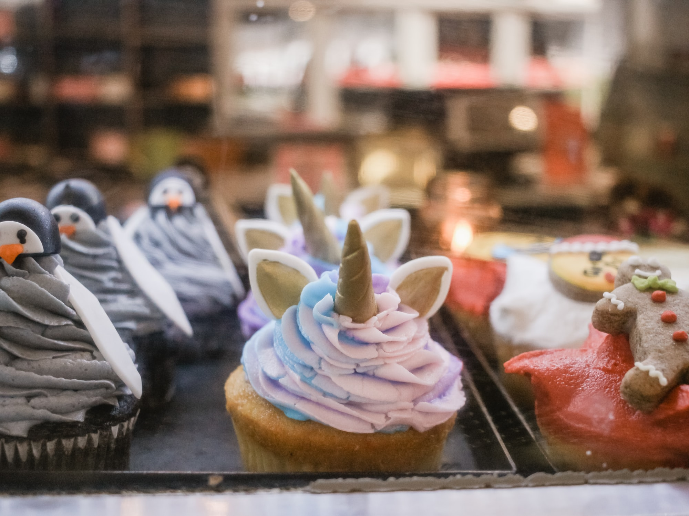

A friend of mine ran "[Inept Sorcerers](https://astralfrontier.itch.io/inept-sorcerers)" for three friends. I was not there, but she relayed events to me and gave me permission to post this recap. Here's my condensed version of her notes:

> The setting is a steampunk Victorian England. Magic items are common, but spellcasters are not. Mages have spirit familiars or pets, that cannot speak English (so directions can be misunderstood or misinterpreted). Mages effectively have a magical tattoo, indicating their first physical contact with their familiar.

I will say that "mages have Cutie Marks from when their spirit-animal friend first appeared" is probably the most adorable thing I've heard from this system.

> The three PCs are: Theodore (with a claw tattoo on his shoulder from Felix the owl), who wants to eat one of every sweet in the world, and uses darkness and divination magic; Silas the Complacent (with a feather tattoo on the leg from Franklin the peacock), who wants to own the biggest mansion in the world and who uses transmutation magic; and Ada of the Lace (with a duck foot mark on the foot, from Lovely the goggles-wearing duck), who wants gender equality and wields lightning.

As a software engineer, I'm happy for any shout-outs to [Ada Lovelace](https://en.wikipedia.org/wiki/Ada_Lovelace).

> Sweet CupNCakes, a local patisserie, is delaying its grand opening due to a missing shipment of sugar. Ada is impressed by Winnie, the owner, while Theodore is saddened by the loss of sweets.

> The team traces a witness named Smithie from the local docks to a tavern. He reports seeing the Sweet Tooth Pirates flying overhead in airships the night before, across the mountains toward an abandoned airship dock - a possible hideout for the gang.

> The team follows this lead and see the pirates' insignia: a gumdrop over two crossed peppermint sticks. Silas and Ada swap bodies (with attendant comedy) and Ada!Silas convinces some of the pirates inside (including Ethan, an NPC transplant from this group's previous game) to look for a missing cat. Silas!Ada shocks them with a cartoonish skeleton-revealing lightning bolt, taking care of the bulk of the pirates.

I should note for clarity that the players of Silas and Ada are blood siblings in real life, and the GM would not have allowed this to play out if it weren't essentially a light-hearted sibling fight, and/or an attempt to force a funny spell failure.

The notes say that the first half of the game went fairly smoothly, and come with some ideas about adjusting difficulty. I'll talk more about that at the end.

> The team confronts First Mate Floyd, another mage, and his parrot. The team used verbal banter and a magic-enhanced punch to take care of him. Then the Captain appeared, looking like a member of the [Lollipop Guild](https://oz.fandom.com/wiki/Lollipop_Guild) and packing two guns and a cutlass. She got disarmed by spells that turned her weapons into candy, so she conceded: "take the sugar and leave us the rest".

> The team returned the sugar to Sweet CupNCakes, then went to a coffee shop called Coffifi to nurse Theodore's caffeine addiction. Along the way they dealt with a huge lunch rush, created a huge coffee spill (and angering the crowd), then screwed up a clean-up attempt and made everything worse. Silas wound up conjuring coffee for everyone, averting a riot but getting the staff of the place upset.

> The group decides to go to a tavern because of course that will make everything better. A sexist company policy keeps a waitress from mixing her own drinks, and Ada deals with it via fire magic and a knee to the groin of the mustached manager. The waitress comes to work at Sweet CupNCakes. Meanwhile, a robot bartender named Baxter tries to nab the team for not paying for drinks they do get mixed, and one spell later, Baxter is discombobulated and roaming the streets in search of more alcohol.

> Finally, Silas follows up on a bounty at Coffifi for Elmer Stud, a jewelry thief. The money would be enough to buy a mansion! The team conjures a steam carriage and tricks Elmer into coming aboard. They use magic to transform his mask, create music (conjuring songbirds instead), and (as Elmer figures all this out and tries to escape) weighted blankets to hold him down, with increasingly comedic and inept results. The spirit animals cooperate to free Ada from the blankets, and she then uses the other blankets to roll Elmer up like a burrito. With additional conjury, the criminal is delivered to Sheriff Merrit in a carriage seat flown by songbirds...

> In the epilogue, Silas uses the reward money for a down payment on a mansion. Ada talks to the newly recruited waitress about her new job. Theodore is making a list of places to go for the next round of sweet adventures.

I asked for reactions to the system, problems, and other comments.

* One player: "why did we have to stop playing the game?" Response: "we have work tomorrow!"
* The taboos (e.g. "coffee" and "songbirds") were a fun part of the game. When they came into focus, they gave the game a specific mood - for example, the songbirds lending a sort of Disney-princess air to the proceedings because they _had_ to be part of the subsequent spells.
* The first half of the game didn't see much unexpectedness come from the magic system. More on that below. The second half, though, got pretty wild. It might just be luck of the draw.
* Collaboration between players and GM was positive and ongoing.

### Arcana Tuning

Currently, Inept Sorcerers gives you a point of Arcana for any roll yielding a 4 or less. Tuning this threshold, or adding (or removing) triggers that grant Arcana, can make the spellcasting system more or less risky. Examples:

* Set the threshold to 2 or 3, not 4 (increases the risk of spells across the board)
* Grant Arcana for fictional positioning, e.g. "I'm using my specialist magic so I get 1 Arcana" or "the countryside has wild mana, so Arcana triggers on 2-, while in the city it's 4-"
* Change the threshold based on tension in the scene (e.g. in a safe area, Arcana triggers on 4-, while in high-risk situations it's 2-)

Thanks to everyone who played the game and enjoyed it!

    