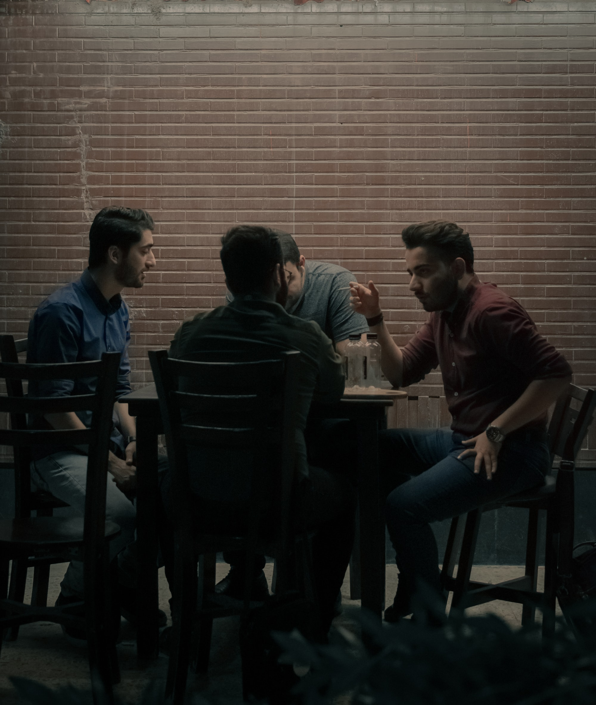

As my tabletop gaming experience has moved away from the traditional model, the way in which I experience the overall story of the game has become more diverse. Here are some ways I've engaged with a game, and the terms I use to describe it.

* **Canon**: this is whatever the group as a whole accepts as the fictional reality of the game. Who's alive, who's dead, who's wanted by law enforcement, and other important questions that point us at new plot. "Non-canonical" is a gradient: some things are very plausible what-if scenarios, others are nothing but comedy outtakes.
* **Cutscene**: any roleplayed interaction that happens outside a group session, but is still considered canonical. In my current games, this is usually written up on a forum, or done live in Discord text, as opposed to happening on a voice channel. In a play-by-post game, everything is effectively a "cutscene" by this definition.
* **Live vs. PBP**: "live" generally means people who can hear each other, if not always see each other. This is a game played in person, at the same place, or one played via Discord voice and/or Roll20 WebRTC. This is a series of sessions that typically last 2-4 hours. PBP or Play-by-Post is much more asynchronous, often with some minimum number of posts per day from each person.
* **Recap**: notes on what happened during a session. I usually record these in a bullet journal, or on a wiki or forum if I'm playing online. A good recap could be read back to the group at the start of the next session, to refresh people on what they need to remember.

I want to talk more about cutscenes and how useful they can be, which will happen in another post.

    