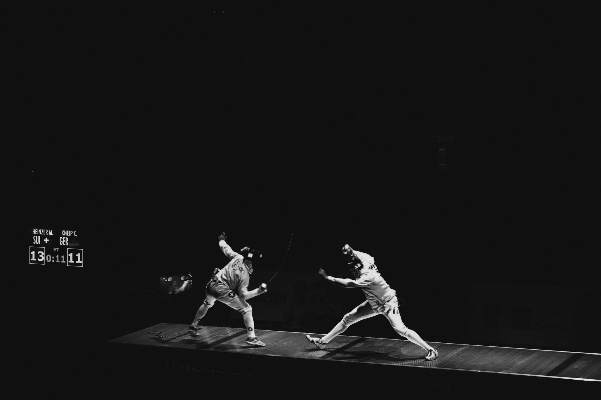

I'm thinking through how to bring more granular combat to flip-a-card, if that's of interest to a group. This isn't specifically that idea, just one way to accomplish it.

Everyone involved in a fight has a hand of 3 cards - as they level up, they get 4 or even 5 cards. These are drawn from a deck that has a good mixture of cards like this:

* Attack - you do a base amount of damage to your opponent (common)
* Defend - you reduce incoming damage by a base amount (common)
* Preparation - you get ready to do something big, like casting a spell (common)
* Riposte - do half base damage to anyone attacking you (uncommon)
* Taunt - you take the damage intended for one other person (uncommon)
* Critical - you score a critical hit, doing double base damage (rare)

These cards might come in specific flavors, or there might be some overlap with other types of cards (e.g. I have a Ranged or Reach weapon, I have Heavy armor, whatever).

To use these cards, lay down two face-down ahead of you. Resolve combat in some kind of initiative order. If you're targeted, you can reveal a tactics card that responds to the attack, and then discard it. On your turn, you can reveal any relevant cards and pick a target. Draw new cards to replace ones you use, and shuffle the deck as needed. Unused cards return to your hand.

Example: I'm acting first, and I have two Attack cards. I play those against my opponent, but he's got Defend and Riposte. So I do my base damage twice. Once it's reduced by his Defend, and once I take a counter-attack. This also means I've got no defense of my own when someone attacks me...

Individual cards might have special rules, e.g. I have to play Preparation at the top of the round, so everyone can see me winding up for a spell or critical or whatever might require Preparation. I'd need to stay out of harm's way, or have friends protecting me, for my prep to land.

What's missing? I want combinations - elemental attacks, sneak attacks, dirty tricks, coordinated defense, all kinds of interesting combat moves. I want people to chain together a combo of stuff, e.g. "if I play this card, on a hit I get to add on another card from my hand". At that point it probably inherits some qualities from traditional deck-building games like Magic, where you have an attack and block phase and all that.

    