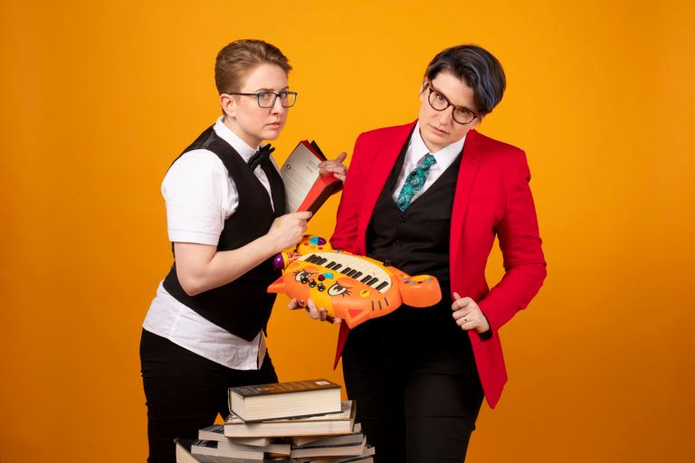
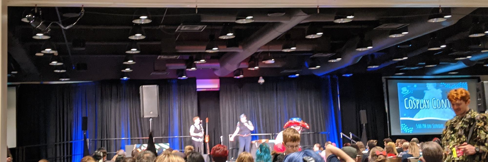
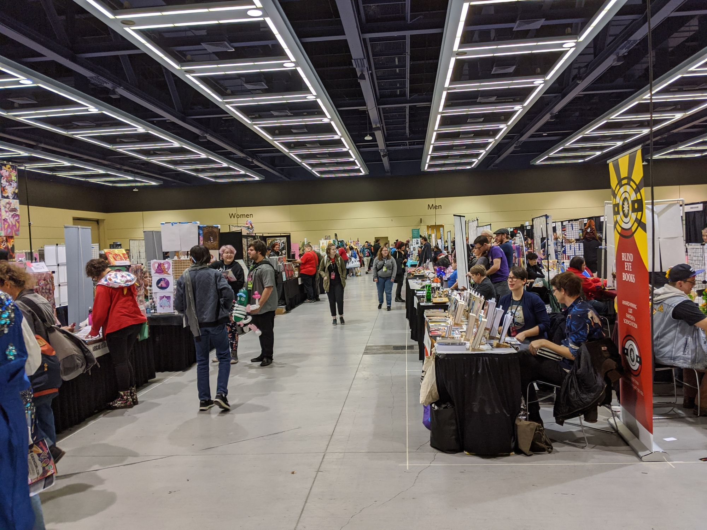
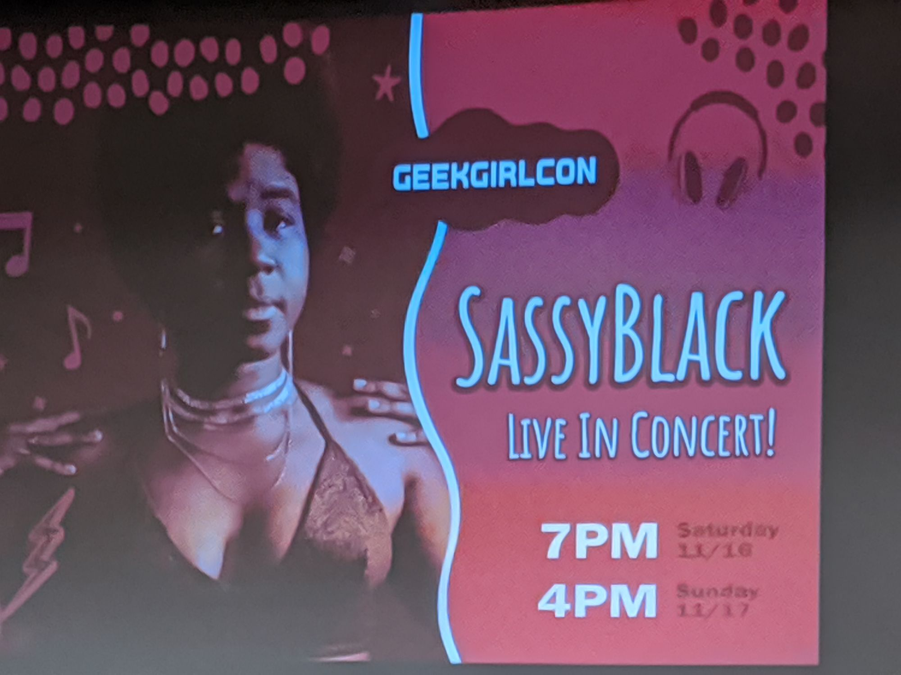

I didn't spend much time there - barely two hours. There was a lot going on and I was in more pain than expected, so I hit the exhibition hall, bought some merch, and bailed.

The biggest thing was getting to see these folks live on stage:

https://www.thedoubleclicks.com/

I bought all their CDs (and gave them to roommates) along with some extra stuff. They were a blast and I recommend anyone interested in nerditry and music to check them out.

I'm not going to post pictures of individual booths upstairs (as I was asked by one person "are you posting this online" and said no), but I got plenty of business cards and shared some of them with interested friends. Lots of neat art, books, and clothing options to be seen.

Banner image is a promotional photo found here: [https://www.thedoubleclicks.com/photos-2/](https://www.thedoubleclicks.com/photos-2/)

    