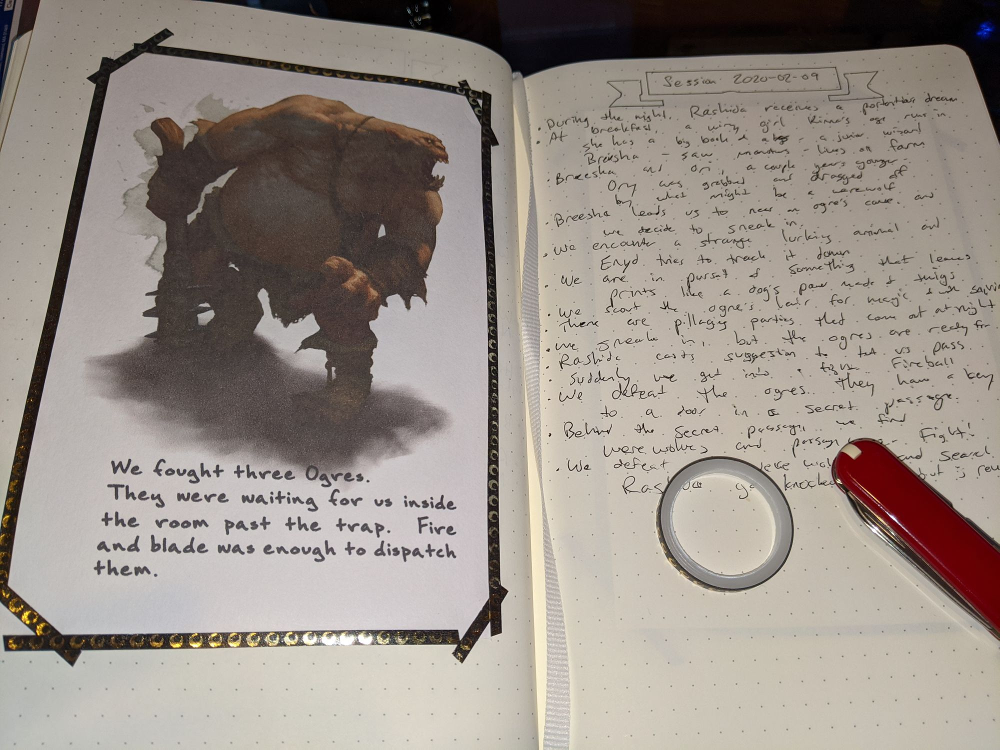

I keep bullet journals for the games I'm in. I use stencils, templates, bulleted lists, and so forth to provide organization and details. Sometimes it's more expedient to just download an image for what I want to depict, though.

To do this, I use 4x6 index cards (which fit comfortably into the [Leuchtturm1917](https://www.leuchtturm1917.us/) journals I use), affixed to the page with [washi tape](https://www.amazon.com/washi-tape/s?k=washi+tape). Previously I would download images and print them directly onto cards. But what if I wanted to produce a lot of cards, and automate any written annotation?

I ended up solving this problem with TeX. First, I downloaded this font:

https://www.1001fonts.com/brownbaglunch-font.html

I put the `*.ttf` file into a `fonts` directory. Then I created an `images` directory, and saved image files there. Then I created a `cards.txt` file like this:

```
636252770535203221
We fought three Ogres.\par They were waiting for us inside the room past the trap. Fire and blade was enough to dispatch them.
636252734224239957
Several of these creatures surrounded Rashida, and she fell! I do wish my friends would stay closer to me.
```

The lines alternate between a file name (minus the file extension) in the `images` folder, and a caption for the image.

Finally I created a `cards.tex` file like this:

```
% !TeX program = xelatex
\documentclass{article}
\usepackage[paperwidth=4in, paperheight=6in, margin=5mm]{geometry} % Print on 4x6 cards, vertically
\usepackage{fontspec}
\defaultfontfeatures{Scale=MatchLowercase}
\setmainfont[Ligatures=TeX,Scale=2.2,Path=fonts/]{BrownBagLunch}
\usepackage{microtype}
\usepackage{parskip}
\setlength{\emergencystretch}{3em}  % prevent overfull lines
\usepackage{textmerg} 
\Fields{\Image\Notes}
\usepackage{graphicx}
\graphicspath{{images/}}
\usepackage{tikzpagenodes}
\usepackage{varwidth}
\begin{document}
	\Merge{cards.txt}{
		\includegraphics[width=\textwidth]{\Image}
		\begin{tikzpicture}
		\tikzstyle{rockfact} = [%
		remember picture,overlay,shift={(current page.south)},
		execute at begin node={\begin{varwidth}{3in}},
		execute at end node={\end{varwidth}}]
		\node [rockfact] {\Notes}
		\end{tikzpicture}
		\newpage
	}
\end{document}
```

Basically, this says "print a series of 4x6 cards, read from a file called `cards.txt`, and for each set of records, include a graphic as wide as the text area, then anchor a text node at the bottom".

This isn't perfect yet - the text isn't aligned properly in the horizontal, isn't centered, and stomps on some of the images right now. But I think that's a matter of adjustment, not redoing my entire approach.

The result:




    