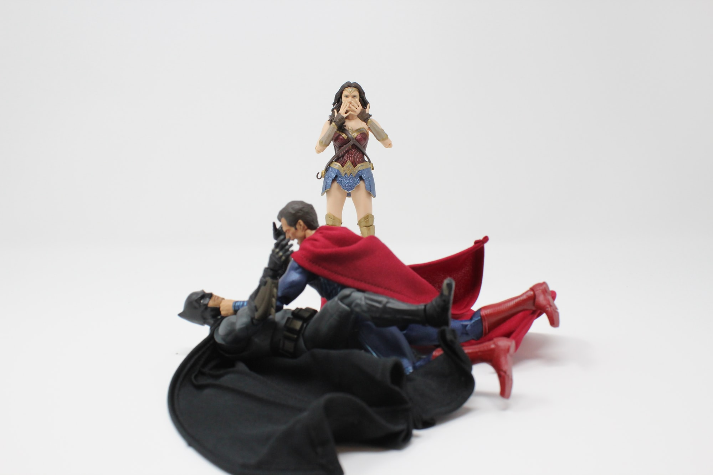

### Example

Nightsong, our ninja character from the design doc, has these levels: STR 4, PRE 8, DEX 8, INT 5, EGO 5, DEF 8, Martial Arts 3, Ninja Gadgets 8, Detective 3. She has the following complications: Hunted by Ninja Clan 3, Never Gives Up 4, Secret Identity 3, and Orphan Sidekick 5.

We'll have her fight a villain, Blaster of Paris. As an NPC, we're more interested in this character's combat-critical stats: Plasma Powers 10, Attitude 6, and Annoying 6.

### Page 1

Everyone has equal STUN, so the GM has Blaster go first. He wants to be all over this thing, so he's going to be in all 6 panels, spending END (now 27) to do so. Nightsong wants to see how this goes down, so she'll appear in panels 2, 4, and 6.

**Panel 1**: Blaster arrives in a busy city street and wants to bust some things up! He's going for a show of force with Plasma Powers 6, against the typical Presence 2 of the crowd. He'll spend 6 END (now 21). Both he and the crowd go for (3*level) effect, giving him 18 vs. the crowd's 6. "Do anything" is Very Common, so (18-6) or 12 points of effect translates to 3 levels. But a -3 level penalty when the typical civilian has 2 levels in everything means they're not doing jack.

**Panel 2**: Nightsong wants to establish surprise, so she uses DEX 8 (and spends 8 END, down to 22). Blaster doesn't want to be caught by surprise, and he's Annoying like that, so he spends 6 END (now 15) to resist it. He'll take the standard outcome of 6*3 or 18. Nightsong rolls 8d6, giving her a 25. "React in time" is a Common effect so Blaster will be at -2 (25 - 18 is 7, buying 2 levels) when she does attack. In the Panel, we look down from Nightsong's POV at the street, where people are fleeing the vindictive madman.

**Panel 3**: Blaster could try to Cancel the penalty, but he chooses not to (since he's saving his END for the attacks), so the GM adds a reaction shot of him looking suspiciously around, not seeing the shadows above. Nightsong, who doesn't appear here, gets 3 END back (up to 25). The GM also offers a terrain feature: Burning Cars 4.

**Panel 4**: Suddenly, shuriken! Nightsong is going to attack with DEX and Ninja Gadgets, spending 16 END (down to 9) for 16 levels. Blaster is going to use Plasma Powers and Attitude to tank it, spending 12 END (down to 3!) for 12 levels of effect, reduced to 10. He takes the standard outcome of 30 vs. Nightsong's 16d6 damage of 56, taking 26 STUN.

The penalty also naturally fades, as surprise was lost.

**Panel 5**: Since Nightsong isn't in this panel, Blaster of Paris can act freely. And he's going to run for it! He uses his powers to fly upward, out of reach of the hero and her deadly weapons. "I'll show you!" he bellows, aflame with plasma. Nightsong regains 3 END (up to 12).

**Panel 6**: With the lowest STUN, Blaster gets to declare what he's doing first. He's going to shower the ground with plasma bolts! He uses his remaining END (3) for 3 points of effect, and Nightsong spends 5 END on DEX to avoid being hit. Blaster's standard outcome is (3*3) or 9, Nightsong rolls 5d6 for a total of 23 (!). She is unhit.

Nightsong can't attack Blaster on the ground, and she wants to avoid being hit any further. She doesn't want to use her remaining END, but there's 4 levels of Burning Cars. Will the smoke from those cloud Blaster's vision, allowing her to conceal herself? The GM says yes. She rolls 4d6 for 19, giving Blaster a penalty of 6 levels to spot her (as a Common effect, 19 / 3 is 6).

Blaster might want to cede page 2 to Nightsong, allowing her to prep a plan to take him down, so that he can recover his END and STUN. She might spend that time leaping up an elevator shaft in a nearby building to reach his height, or devising a trick to get him to come back down. Alternately she might take action to help the civilians, call for support from a flying hero, or some other measure.

### Closing Thoughts

* The lack of passive armor means things escalate fast. I don't know if this is good or bad.
* Right now, the only way to take someone out is deplete their BODY (which doesn't come back for an Issue). This isn't a good look for cinematic comic-book fights. Instead, I'm going to suggest a rule (see below).
* I think declaring actions in ascending order of STUN is good - it gives the most wounded characters a chance to keep themselves in the fight. I'm pretty okay with this approach as opposed to, say, letting speedsters dominate initiative all the time.
* I don't have solid costs attached to some of the add-ons, like Wide Shot or Negate. I should give this some thought.
* Terminology really needs to be unified and fixed. "Standard effect" means something different in traditional Champions than I'm using it for here, for example.
* There's probably value in having an END cap per panel, similar to the "active point" maximums from Champions. Why cap END? Because I want people to generate extra oomph via situational levels and complications, which don't cost END.

### New Rule: Defeat Conditions

> When you enter a fight, you declare a defeat condition: what will remove you from the fight, either causing you to stop fighting, flee, pass out, be captured, etc.? If you don't have an answer, the default is "lose all your STUN". The defeat condition must be achievable in the fight, and it can be changed mid-fight with the GM's permission.

What I hope this will do is force players to come up with stakes for their characters. If you have no stake in the fight, the first person to hit you hard enough will knock you down. But if there's something you're fighting for, yeah, you might spend a Page recovering your STUN, but after that you can keep plugging. Example defeat conditions might be: "Lose a chance to steal the idol", "Have my sidekick kidnapped", and so on.

Blaster of Paris is mostly here to cause trouble, so maybe he goes down when he's lost his STUN. Nightsong, on the other hand, might not be defeated unless Blaster takes hostages or threatens a crowd of people (for example).

    