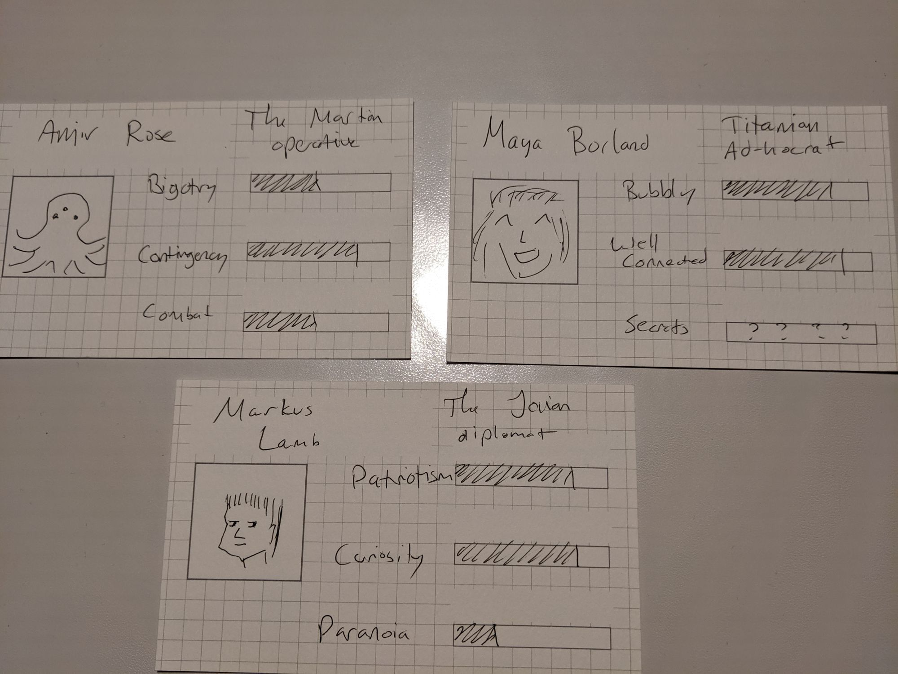

As a GM, I've been notably bad at giving NPCs life. I failed to name them or build them up as characters, beyond their immediate story potential. To combat that, I started writing up characters on 3"x5" index cards. I'd include the following information:

* A name (mandatory)
* A brief summary (e.g. "The Bad Guy")
* Two or three brief attributes (e.g. "Proud", "Bald", and "Money"), along with a rough rating in each
* An optional face sketch

The intent of these cards is to immediately suggest not only personality but also plot. Our bad guy is proud, sure. He has money, so that's how he'll do a lot of his bad guy stuff. But what about being bald? Maybe it's a sore point. Maybe it's a problem he's trying to solve. Maybe something else.

If I build my plots around the strong personalities I've written on the cards, I can basically remind myself (and my players) what's going on, just by dealing those cards out onto the table. And if I keep the cards in a deck, I both have recurring characters in this game, but a stable of interesting NPCs (or ideas for such) for future games.

    