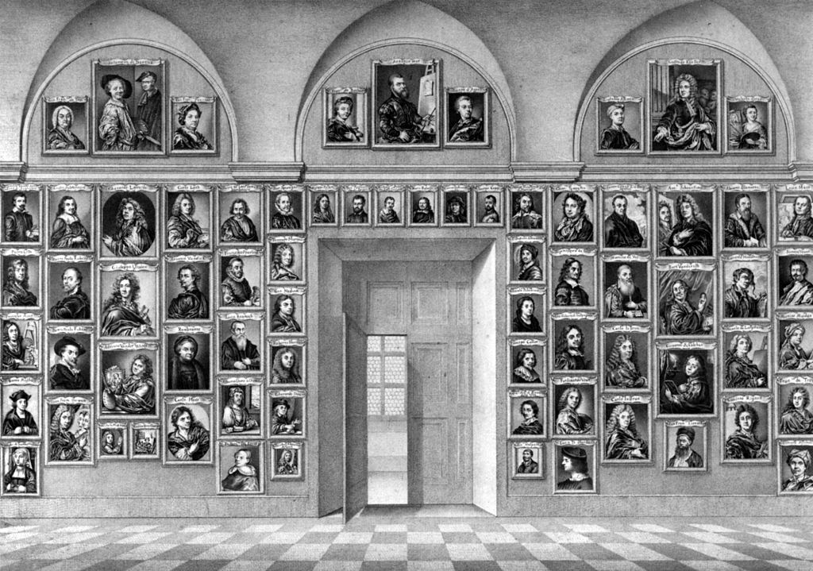

I feel like there's a gap in [city generation rules](/flip-a-card-city-construction-playtest),
and generally an opportunity elsewhere.
If you use [pole stars](/flip-a-card-the-dragon-prince/), you might find this useful as well.

This is a simple system to create **Faces**:
characters who embody, represent, or advocate for a given struggle or issue.
For example, if there's a conflict between rebels and an empire,
there's probably a couple of obvious Faces:
the Rebel leader and an Imperial commander.

How do we quickly generate Faces?

1. Pick an [emotion](https://astralfrontier.github.io/flip-a-card/tags/emotion) from the oracles deck,
   e.g. Ecstacy, Admiration, Terror, Amazement, Grief, Loathing, Rage, Vigilance.
2. Name the source or object of this emotion in the Face's life,
   e.g. "they feel Grief at the loss of lives under their command"
   or "they feel Loathing toward the Rebel scum".
3. Start with at least one _conflict_, either internal or external (see below).
4. If desired, add more conflicts. The "right" number of conflicts varies,
   but 1 makes a straightforward low-ranking individual,
   and 2-3 indicates someone with more story importance.

To create an _internal_ conflict:

1. Draw a new emotion card from the oracles deck.
2. Name the source or object of this emotion, just as before,
   e.g. "they feel Admiration toward an Imperial officer".
3. Relate this new emotion back to their primary emotion,
   e.g. "the Imperial officer was responsible for harming many Rebels".

To create an _external_ conflict:

1. Name another character (a Face, PC, or other character) or organization
2. Name a shared sphere of influence or interest they both occupy,
   e.g. "the military occupation of our lands".
3. Name a point of contention between them within that sphere,
   e.g. "the other Rebel commander is much more aggressive than I like".

Our interest in the Face as players is how we interact with the Face,
and their conflicts.
Ideally, the Face's conflicts will also tie back to the player characters' own goals and histories.

[Image source](https://commons.wikimedia.org/wiki/File:Medici_Gallery_of_Self-portraits_at_the_Uffizi.jpg)