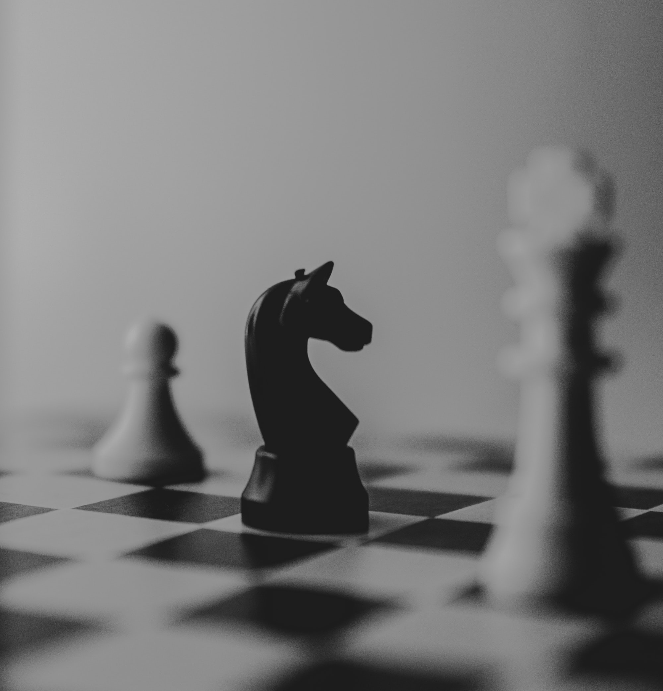

Similar to creating superheroes with the [P5](/creating-superheroes-with-the-p5-system/) System, you can create encounters, challenges, and fights with the A3 system. The goal of the A3 system is to keep the fight more interesting than "hit them until their hit points fall out".

The system breaks the fight into three parts:

* Antagonists: who is standing in the way of our heroes?
* Agendas: what are the things everyone in the scene wants to happen?
* Arena: where is the encounter happening?

An example: a group of superheroes wants to talk to the caretaker of a remote lighthouse, who has vital information. They will be attacked by a team of supervillains, who want to conceal that information. The Antagonists are the supervillain team. The Agenda for the PCs is "get the information", while the villains have "silence the caretaker" and the caretaker has "survive the villain attack".

You can build the encounter in any order, but start with the element that you have the best or clearest ideas about. For example, if your goal is to showcase a villain team, start with the Antagonists, while a fight that drives the main plot should start with the Agendas. If all you have is a location, let the nature and contents of the chosen Arena determine the Agendas and Antagonists.

    