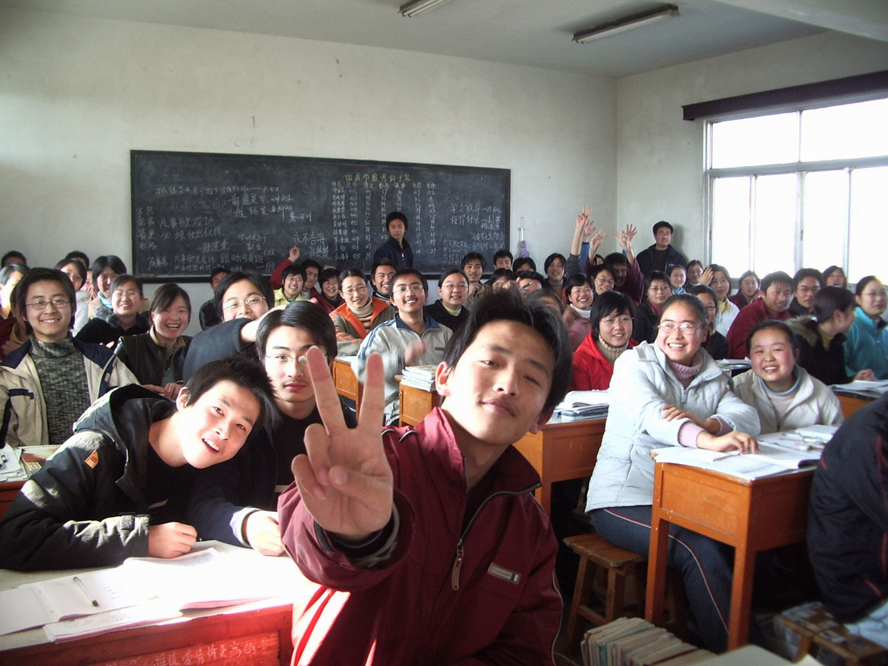

I created a simple system for [generating NPCs](/generating-silverline-npcs)
for the solo [Masks](https://www.magpiegames.com/masks/) game I've been writing.
However, I talked with a friend of mine who was finding NPC creation challenging.
Together, we worked out a system that took her at most 10 minutes
to come up with NPCs to which she could immediately give a voice.

Here's a combination of those two systems.

### Guiding Principles

1. Good ideas flow "downriver"
2. Surface details are always "downriver" from inner nature
3. Inner nature is always something recognizably and archetypically human
4. Try to answer questions by looping back to established material and characters

### Creation Process

1. Come up with a core Condition
2. Come up with quirks, behaviors, or other surface traits
3. Write a short narrative that connects the Condition to the surface traits
4. Start asking questions of that narrative: who? how? why?
5. Answer questions by looking for opportunities from nearby narratives

#### Core Condition

A character's "core Condition" is one standard Masks
Condition that this NPC effectively always has marked.
Roll a 1d6: on a 1 it's Afraid, 2 Angry, 3 Guilty, 4 Hopeless,
or 5 Insecure. Roll again (or twice more) on a 6.

#### Surface Traits

Surface traits are the NPC's personality, behaviors, and
anything else people tend to notice about them.

If you aren't sure about what surface traits they have, start here:

1. Roll 2d6. On a 2-5, they are bad at something. On a 6-8, they're okay. On a 9-12, they're awesome.
2. Roll 2d6 again. On a 2-5, it's scholastics, on a 6-8 it's sports or extracurriculars, and on 9-12 it's socializing or partying.

Add 1 to the rolls for preppy or popular kids, subtract 1 for nerds, introverts, or unpopular kids.

### Examples

**Brett**'s core Condition is Afraid. 
Brett's first surface trait is that he does stupid stunts.

Here's some questions that we can ask.
Some have been answered, while others can be filled in.

* _How does Afraid connect to stupid stunts?_ Just to prove he "ISN'T afraid".
* _Why does that matter?_ He got scared by some of his buddies during a sleepover during ghost stories and he's never lived it down, so now he has this thing about proving he's not a coward. The idea of ghosts still freaks him out, but he'll deny it with every living breath
* _What kind of stupid stunts does he do?_
* _Who goads him into doing stupid stunts because they know they can because this kid is a glutton for punishment?_
* _Was the ghost story true?_
* _What type of consequences have resulted from his stunts?_
* _Does he get in trouble at school? With his parents?_
* _Ever get hurt doing a stunt?_

**Carol**'s core Condition is Guilty.
Carol's first surface trait is that she's a star basketball player.

Here's the questions that came from that.

* _How does Guilty connect to basketball?_ she doesn't want to be, but her father always wanted to play basketball and never made the team She secretly wants to quit but she knows it would crush her father, and with how well she plays she might be able to get a college scholarship.
* _What would she rather be doing?_ She would much rather be doing an internship at a science lab.
* _What did her father end up doing instead? What does her mom think about this?_
* _Who knows that she wants to take the internship? What do they think about that?_
* _Why science? What interests her about the internship?_
* _Who is already in the science lab? How does she feel about them?_
* _Who thinks the world of her for playing basketball?_
* _How do they get along?_ It's awkward because they probably get along fine until sports come up, and then she's like "oh... yeah... sports..."

[Image source](https://www.needpix.com/photo/1307182/school-class-classroom-students)