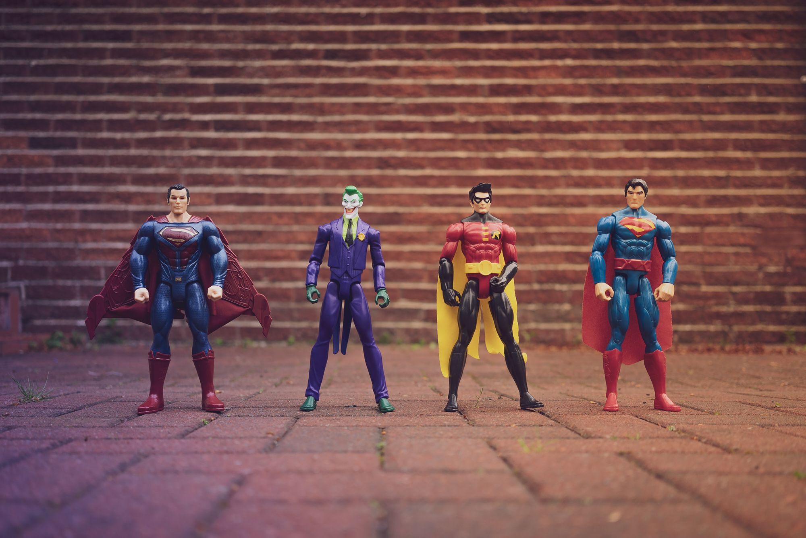

Superhero characters can be some of the most versatile characters in gaming. Mutated lab hamsters, aliens, robots made of Lego pieces, and animal-themed acrobats can all be part of the same team. But this diversity comes at a price: sometimes it's hard to come up with a fun idea, because there's too much to choose from.

Enter the P5 system. This breaks a character into five parts:

* Position: the role the PC is intended to play on the team (e.g. "heavy hitter", "protector")
* Past: the character's origin story, how they got their powers, where they came from, and so on
* Personality: who the character is, their motivations, quirks, or inner nature
* Powers: the special abilities the character possesses, including unusual technology or abilities shared by their species
* Problems: weaknesses, power limitations, personal failings or other vulnerabilities that cause trouble or add drama

You can create a character by filling these fields in with some kind of description, e.g. "Position: tank (a character who absorbs damage for the team)" or "Problems: troubled marriage and teenage daughter".

If you don't have any ideas for the categories, you can also pick an existing superhero or other character you like. For example, "Personality: Captain America". What should make your character unique is choosing different heroes for each of the categories.

For example, "Breakthrough" was a character I created awhile back. He was a former soldier with alien nanotech in his system, which made him strong and fast, but also forced him to return to his house every day (because an alien device was buried beneath it, and it recharged the nanotech).

* Position: Wolverine (hard-hitting regenerating melee fighter)
* Past: MCU Punisher (returning soldier)
* Personality: MCU Hawkeye (family man, balancing heroics with family)
* Powers: Bloodshot (nanotech)
* Problems: Cyborg (visible prosthetics and feelings of isolation)

While the character could be said to be similar to other "fast-healing soldier" types, he was still his own thing and was fun to play for that reason.

I hope this system is useful and interesting. Good luck with your heroes!

----

Image credits:

* Superhero figures: Photo by [Craig McLachlan](https://unsplash.com/@crrrrraig?utm_source=unsplash&utm_medium=referral&utm_content=creditCopyText) on [Unsplash](https://unsplash.com/s/photos/superhero?utm_source=unsplash&utm_medium=referral&utm_content=creditCopyText)

    