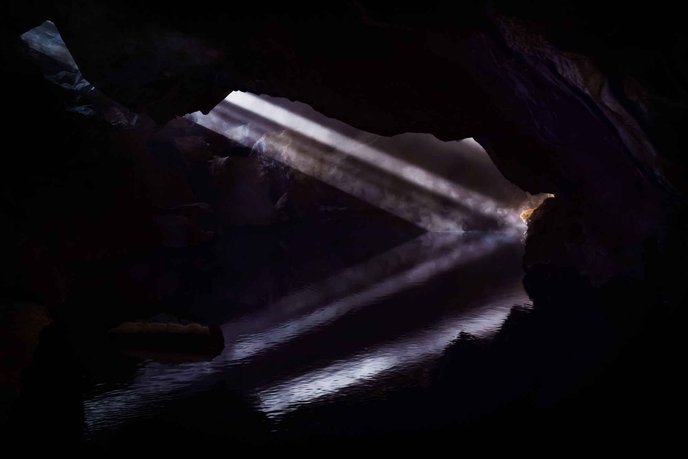

I ran Demigods for my Monday night group again. Here's some notes about the session as a GM, and some thoughts about how I ran this. The recap is here: [https://forum.menagerie.team/t/demigods-session-3/812](https://forum.menagerie.team/t/demigods-session-3/812)

My overall game is pretty sketchily plotted: Capture the Flag, your side defending, the bad guys attacking. To showcase the game itself, after the first session, I decided I wanted three assaults: magical, physical, and social.

We have multiple sessions, but only one of them that I know of with the Arcane's player present. So I made this one the magical assault, to let him do his thing.

Almost everyone has some tie to earth, the underworld, etc. so I decided I wanted the underworld involved. Wikipedia furnished me with a list of underworld gods and I picked Nergal (for reasons which will become clear later). If this were structured like a video game, he'd be the final boss, so I needed lieutenants and mooks (the rabasa and shades). We didn't have an opportunity for a fight against any sub-bosses, but that's okay!

I had a list of several creatures from the mythos ready at hand. I chose the rabasa because someone mentioned emergency provisions, and I knew from skimming articles that "sea salt" was a vulnerability for them, and I knew all about sea-salt chips (from work and elsewhere, everyone loves advertising it). So I put those things together to reward an apparently casual provisioning choice.

I did an image search of "Irkalla" earlier and saw someone was making a [game](https://www.kickstarter.com/projects/855767049/xas-irkalla) with that name, so I pulled up those images. The second one I found was the procession in the streets, so I let that inspire me to figure out what was next: some kind of dark ritual? What kind? Probably summoning one of the other big bad beasts I had pulled up in reading. What are all those guys doing huddled on the street? Presenting a social opportunity. And thus we had an adventure.

I did about 30-40 minutes of prep, mostly image searches and pulling up lists of gods and monsters to use as fodder. What actually went into the blender was based on you folks' character backgrounds, your choices (e.g. "let's pack lunch"), and whatever paid off some kind of earlier setup.

For example, the rabasa were described in the text I found as "vampires". Okay, so we've got the idea of draining life... sacrifice... hey, what if the shades in the City of the Dead are going to be a sacrifice of some kind to call forth the big monster?

Overall things I learned (or applied here):

* Your prep is everything the buffet has to offer. The players and the PCs determine what goes on the plate.
* Anything the players say is an opportunity. Listen and remember.
* How fun something is has nothing to do with how important it is. Even minor stuff can come back later or pay off, and players love talking to [Sam Smorkle](https://i.imgur.com/gHwyCao.jpg).

I did my best to swing the spotlight around to everyone, and I feel like I mostly succeeded.

    