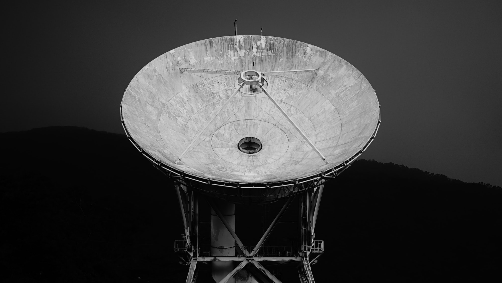
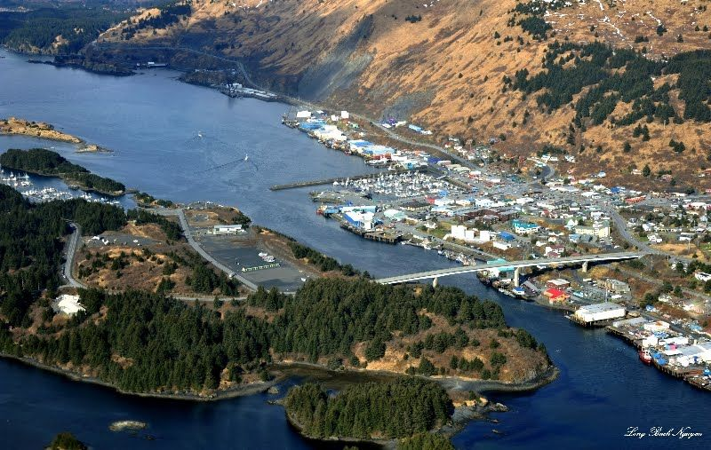
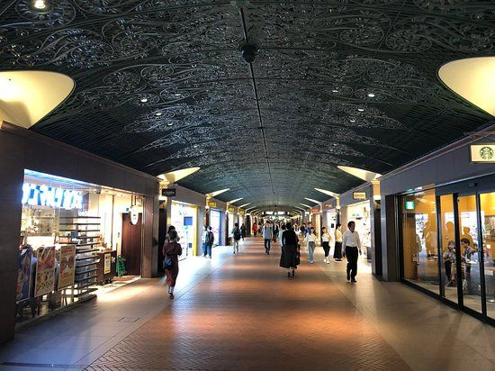
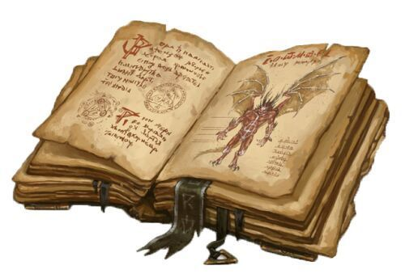
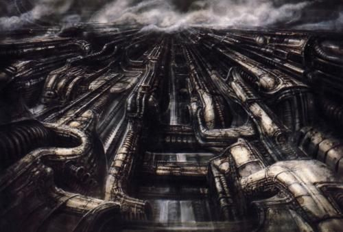
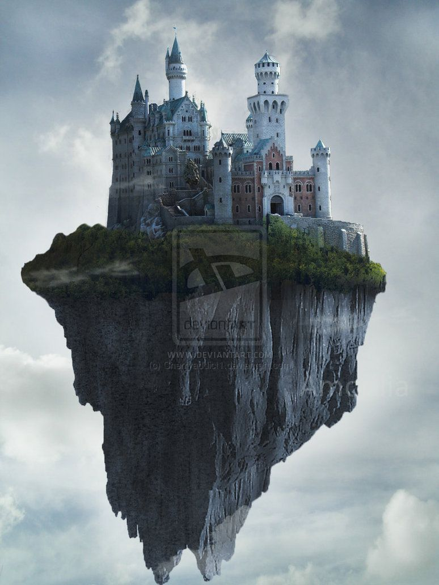

On Earth, knowledge of the attack was kept isolated. As we drove to the marina, we saw signs up on the mountaintop, from protesters or other people announcing that the invasion was happening.

To get to the marina, we had to take a subway system that was part of an underground mall. A lot of other cadets were there, in their uniforms. They were working so fast on getting people shipped out that the uniforms were incompletely made - I had to get some scissors and cut open the left sleeve so my hand would fit through.

Along the way, we studied our grimoires, or spellbooks, detailing the goetic demons we were fighting. There were six grades of them, in a grayscale color arrangement, from light gray (the weakest) to black (the strongest).

The marina was a cover - there was a boat, but it was more like a ship. It took people into isolated regions of Earth's upper atmosphere, to Giger-esque floating islands that served as the front in the war.

The cadets built shelters out of the aliens' own terrain, sitting shoulder to shoulder in extremely cramped and uncomfortable conditions, waiting for the call to mobilize.

We were equipped with very powerful beam weapons that were somehow intelligent or empathic. I had a large support-type cannon, that I used to carve a chunk out of the underground material to make our shelter more comfortable. In doing so, we opened up a secret underground warehouse of enemy units that looked like Daleks. I was worried we'd exposed ourselves, but none of the units were operational, and we were safe.

The final alien attack was against a castle we'd built in the uppermost atmosphere.

By this time, the cadets were equipped with gear to fly, and there was a dogfight against wave after wave of invading demon-aliens, centered on the castle.

Pretty wild stuff.

But what was at stake? In the dream, I had the sense that the invaders were actually a kind of magical being, or demon, or something, and we were fighting against both a physical and spiritual invasion. I'm reminded of the phantoms from the Final Fantasy Spirits Within movie, or the idea of fighting off "bad vibes" attacking Earth.

    