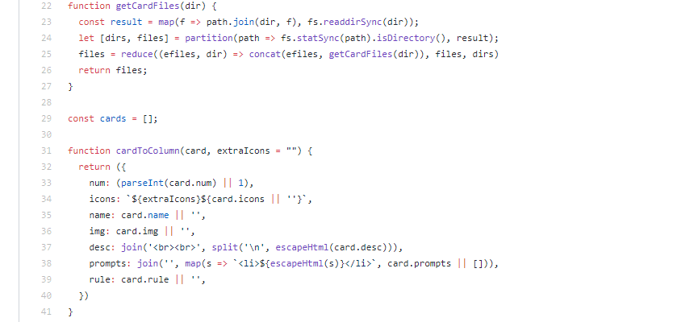

I wrote some basic Node.js scripting to parse YAML files for cards, and output a CSV that I can feed into nanDECK. This replaces the old Google Sheets download process, and lets me do some pretty awesome stuff. The Github repository is here: [https://github.com/astralfrontier/flip-a-card](https://github.com/astralfrontier/flip-a-card)

Example! Here's one of the new character cards:

```
- front: &Northerner
    name: Northerner
    icons: C
    desc: Snow-swept peaks and narrow valleys are your home.
    prompts:
      - Deal with or take advantage of cold
      - Survive sudden misfortune
      - Hide your emotions behind a gruff exterior
  back:
    <<: *Northerner
    desc: They say your heart is frozen.
    prompts:
      - Fail to enjoy life's comforts
      - Seem disinterested or distant
      - Make an expedient but cruel choice
```

YAML's ability to create "alias nodes", like `&Northerner` here, and then reference them with `<<: *Northerner`, means I only need to change the parts of the back side of the card that are actually different.

At this point I can tell my script to print these cards out in any order I want: "print order" (back N..back 1, then front 1..front N), "web order" (front 1, back 1..front N, back N), or whatever else I need. This also makes it easy to create custom decks, e.g. choosing from one of several types of character cards.

I'm asking for help from some folks who can do editing and review work on the text, but who also (hopefully) can submit actual pull requests via Github, if it came down to it. Later on, I'll work on better ways to collaborate on card creation (like a serverless deployment?) but for now, this isn't bad.


    