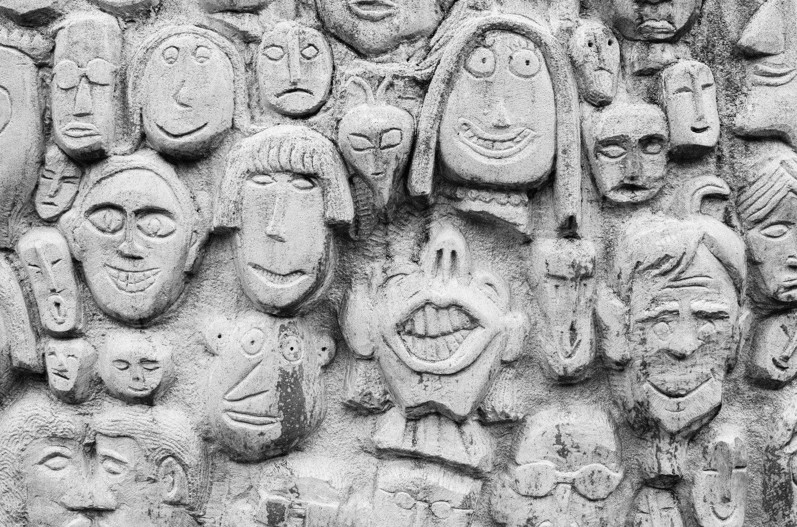

Like the [previous post](/flip-a-card-task-resolution/), this is a rundown of some options for an RPG fundamental: creating a character to play.

### Draw Three

Players have a few types of cards, depending on game, as described in the [Sample Cards](/flip-a-card-sample-cards/) post. For fantasy games, this can be heritage-role-drive, or something like species-role-drive for a science fiction universe. To create a character, pick one card from each of these categories, to play things like a Curious Elven Spellcaster or a Greedy Narbellian Smuggler.

### Archetypes

Characters pick an archetype, like "Archer" or "Princess", that comes with a few key cards (e.g. Bowshot, Befriend). This works more like a PBTA Playbook than an à la carte PC as above, but can be faster for new or indecisive players. Game creators still need to come up with these archetypes, but could do so by re-using character cards described under Draw Three.

### Aspects

You can start with a single card of your own creation, describing a high concept for your character, e.g. "Adventurous halfling merchant". Then, either add more cards as you figure your PC out, or create a few more up front, either on your own or in collaboration with other players during a character-creation session. This is a Fate-like approach to characters, and lets you play exactly what you like, at the cost of putting the creative burden on the player up front.

    