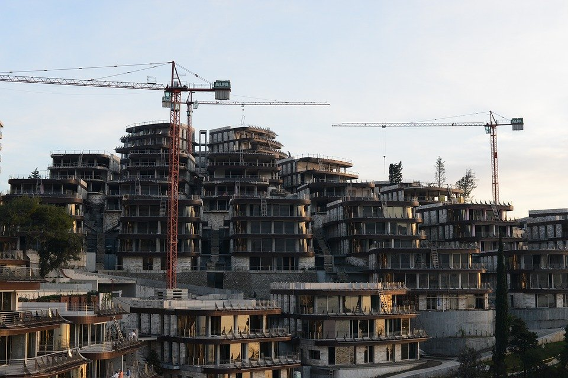
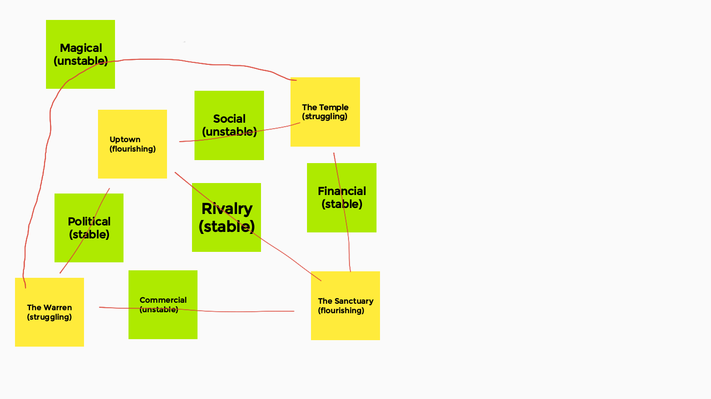

Since posting a [starting point](/flip-a-card-city-expansion-pack) awhile back,
I worked on a deck of cards for randomly generating a city.

I got the Neighborhood cards ready enough that I could try it out.
Unfortunately I didn't finish the Dynamic card text in time,
but I knew roughly what I wanted.

We started with three neighborhood and three dynamic cards.
You can see the specifics below.
We used Jamboard to arrange cards online, which worked out okay.
A better tool like Miro,
or a mind-mapping system that let us draw connections
that persisted as we shuffled stuff around,
would have worked better.

Overall, people thought it generated an interesting city.
I think the biggest compliment I got was
"hey, can we add more cards?"

----

Here's our notes on the city!

### Uptown - flourishing

#### What political and social systems support the neighborhood's position?

* Nobles from the surrounding lands gather here to rule. They bring their larger-than-life social structures with them, and that fuels the entire economy of the city.
* Artisans labor to create art for them and to hold elaborate balls and events for them.
* The artisans are ruled by a byzantine guild system to make sense of the money that the elite among them get.
* In theory, the guilds rule the city that only hosts the nobles. They select their leader, the effective mayor of the city, from a reincarnated line.
* The high burghers, made up of the heads of the most important guilds, hold the secret of the election. 

#### How is that power wielded, and for whom?

* "Mayor" - Upholds the laws of the city day to day, and is its ceremonial representative.
* High burghers - Negotiate city laws and administer justice for important people.
* Nobles - Rule their own lands. Their privilege extends into the city, but the city's laws apply to them.
* City infrastructure - bailiffs, guards, etc. execute the will of the mayor and high burghers.

#### How does someone become accepted by Uptown?

* Guild folks are accepted by ascending their organization's individual systems.
* Nobles' reputations depend on their conspicuous consumption and audacity.
* Unattached artisans and artists (only when their work isn't covered by a bonded guild) earn favor by their performance and patronage.
* Noble sponsors can elevate people beyond their normal station, standing by them--patronage is a commitment. 
* Commoners are basically never accepted. They can be in the neighborhood to do their work, but if they don't offer unique service to someone in power, they'll always be peons.

### The Warren - struggling

Old town. Buried under the new uptown district.

#### Has the city forsaken itself, or fallen prey to outside influence?

* The denizens of the new Uptown area willfully disbelieve that the Warren is a thing.
* Their cast-offs live there, but they live nomadically.
* The Warren is a pop-up city with the city. The dirty remnant of the first story of the city. 

#### What secrets do the inhabitants furtively guard?

* An entire counter-culture apart from the noble displays above.

#### Does the Warren bristle at visitors, or hunker down and wait for them to leave?

*  They seem to pretend like nothing is amiss, while waiting to see if the newcomer is 'cool' or not.
* If they are shitty, the warrenites will just...wander away.
* If they are cool, then they are given the proper introduction.

### The Sanctuary - flourishing

#### Who lives here? Why do they live here specifically?

* Clockwork artisans. They eschew the guild system, and arose as a discipline after the formation of the great guilds.
* They have their own internal structure, and if they find aptitude in you, they make it hard not to join.
* Clockwork is the Tai Chi of engineering.

#### What is it that separates the Sanctuary from the rest of the city?

* Inside the ancient walls of the city.
* The current city is largely outside of the walls that bounded the city in antiquity.
* The walls are mostly intact, and can be fortified with effort.

#### What sustains the sanctuary and its peoples' lifestyles?

* Their unique skills set them apart and are always in demand.

### The Temple - struggling

#### What belief system or systems were practiced here?

* Hierarchical. Promotes displays of wealth for the glory of God.
* That fueled the ridiculous noble excess.
* The canonical text of the church is a growing set of letters from the hierophant. More recent gospels have become more political and less fundamental.
* "The theological equivalent of Gerrymandering".

#### What motive, such as greed, corruption, or apathy, stands against them?

* The excess of the nobles led them away from the church in all but name. Their patronage has dried up leaving the church lacking in funds.
* The well-intentioned church folks have basically abandoned the Temple for smaller flocks in the Warren.

#### How has a lack of faith helped the city? Hurt the city?

* The "true" clerics have made an impact on the Warren.
* The hollow leadership of the Temple continue to preach prosperity gospel, driving the wedge between the rich and the poor.

[Image source](https://pixabay.com/photos/city-construction-summer-2457460/)