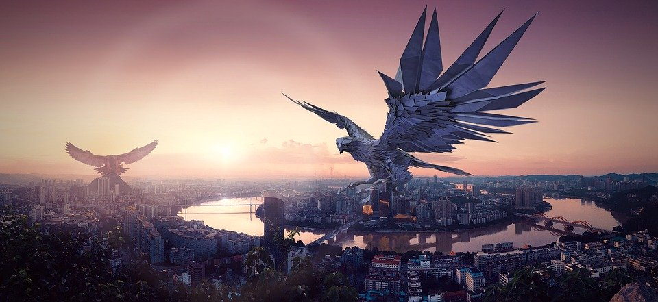

I'm already planning three expansion packs for Flip-a-Card:
The Dragon Archipelago, The Scraplands, and some kind of clockwork/magitech city.
The first two have a distinct feeling for me, and are big enough to be replayable.
But instead of presenting a single city, complete with map and NPCs and everything,
what if I gave people tools to create their own city, via cards?

So imagine that we have two decks of cards, called Neighborhood and Dynamic respectively.

Let's come up with some typical Neighborhood cards:
the **Boulevard** (stores and eateries and so on),
the **Harbor** (where ships come in),
the **Marketplace** (commercial shops and vendors),
the **Sanctuary** (a walled-off city within a city),
the **Temple** (a religious area),
the **Underground** (sewers, tunnels, or anything else subterranean),
**Uptown** (a geographically elevated area), and
the **Warren** (a rat's nest of alleyways).

Each Neighborhood card has a front face (prosperous) and a back face (oppressed).
There will be appropriate prompts and questions that ask you to flesh these places
out in better detail, such as "what religion is practiced in the Temple?"

Here's our Dynamic cards:
**Criminal** (theft, assassination, etc.),
**Commercial** (business activity),
**External** (activities originating outside the city),
**Financial** (money and valuables),
**Magical** (arcane goods and services),
**Material** (mundane goods and services),
**Political** (power, influence),
and **Social** (status, fashion, the populace).

Each Dynamic card has a front face (stable) and a back face (unstable).
Like Neighborhoods, appropriate prompts and questions appear on the cards.

### Creating a City

Your goal is to attach Neighborhoods to each other via Dynamics.
You can do this in a chain, connecting N-D-N-D and so on.
You can arrange Neighborhoods in a triangle or pyramid,
or any other shape where Dynamic cards can be added
to show relationships between them.

Once the cards are placed, interpret the results according to which face is showing.
Two Neighborhoods connected by a Dynamic have a relationship with each other.
If one Neighborhood is prosperous and the other is oppressed, for example,
it's logical to say that the first is responsible for the second's condition
due to the dynamic that exists between them.

Once you've established some part of a city,
you can repeat the process and detail other areas.
Eventually you can connect your ideas together,
forming a city as simple or as complex as you like.

The shape of the cards doesn't have to match the city's actual geography.
You can toss cards carelessly onto a table to create a layout
for the city, or arrange it based on the dynamics you established.

### Example City

We'll draw four Neighborhood cards and arrange them in a triangle,
with a fourth card at the center.
The cards at the points of the triangle will have Dynamics relating them,
and each point will have another Dynamic with the central card.

Our Neighborhood cards are:

* the Sanctuary (prosperous), at the top
* the Boulevard (oppressed), at the bottom left
* Uptown (oppressed), at the bottom right
* the Marketplace (prosperous), in the center

Our Dynamics are:

* Sanctuary and Boulevard: Criminal (unstable)
* Boulevard and Uptown: Material (unstable)
* Uptown and Sanctuary: Financial (unstable)
* Sanctuary and Marketplace: Magical (stable)
* Boulevard and Marketplace: Political (stable)
* Uptown and Marketplace: Social (unstable)

The Sanctuary seems to be a hotbed of interesting stuff - criminal and financial dealings, with some magic thrown in.
The Boulevard deals in criminal, material, and political matters.
Uptown is where to find material goods, money, and high society.
And the Marketplace is the magical, political, and social hub.

It sounds like the truly powerful live in the Sanctuary, a sort of gated community
sealed away and probably guarded from outside interference, of which there is plenty.
Outside of that, the city is probably somewhat lawless, with the Boulevard playing home
to power brokers and people willing to do anything for a gold piece.
Uptown is where the wealthy merchants go to enjoy their fortunes.
They're happy to have made their money their way,
unhappy that the cutthroats of the Marketplace could take it away from them if so inclined.

The overall picture is that of a wretched hive of scum and villainy,
where anything can be bought for a price, ready to tear itself apart
if the big dogs decide to start a fight.

What cities can you come up with, using this same system?
You can use a site like [random.org](https://www.random.org/lists/) to sort elements of a list.

[Image source](https://cdn.pixabay.com/photo/2018/12/20/22/52/fantasy-3886947_960_720.jpg)