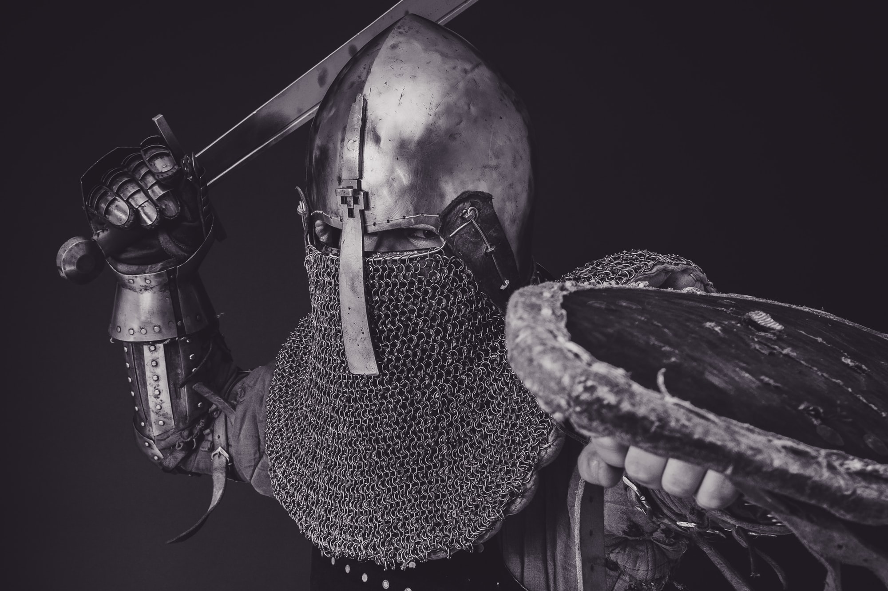

After a fight begins, what does it take to end it? Combat systems exist to answer that question. How does it work when all we can really count on is cards?

### Damage

The usual answer to the question of pacing a fight is a damage system. "If you fail or the other guy succeeds, you take damage", goes the logic. "Take enough damage, and you die, are removed, whatever."

One of the stock card types is "conditions". Characters can be Wounded, Exhausted, Poisoned, or whatever. None of these imply removal from a fight, but they can indicate what a PC is or isn't capable of doing in battle.

NPCs or challenges might take conditions as well, or have a standard list of conditions that they are capable of taking before being defeated, as with the PBTA game Masks. Alternately, institute a rule like "if you succeed at an attack, you do 1 harm", and assign a hit point track.

### Stakes

Another way of pacing combat is to determine what's at stake for each side, and measure progress toward those goals. For example, a band of adventurers might have goals like "loot the treasure", and monsters guarding it might have goals like "keep it safe". In that case, "the treasure" is a stake, and might be represented by a card - whether the PCs are favorably positioned depends on which side of the card is facing up. Specific actions in the fiction might flip the card back and forth. For multiple stakes, add multiple cards.

### Phases

Another way to pace combat is to apply more structure to the encounter. This works best when you have a situation that is relatively inevitable - a dragon attacking a village, for example. In that case, PC actions will advance the situation from phase to phase.

Example phases:

1. The dragon is in the air, near the village. It can only be engaged with ranged weapons or magic. If this doesn't happen, it will have the advantage when attacking the village.
2. The dragon descends on the village and tries to start burning it! PCs must fight fires, fend off the beast somehow, or lead it away.
3. The dragon flees the site, either back to its lair or into some abandoned area (if the PCs can lure it to one), and must be battled in earnest.
4. In its lair, the dragon unleashes its greatest fury, and must be brought down with everything the characters have!

This style of combat is best when some kind of defeat feels like the only dramatic possibility, but the particulars of that defeat are what the group wants to discover. In this case, you don't need any extra cards to represent the combat, only an understanding of what phases are involved.

    