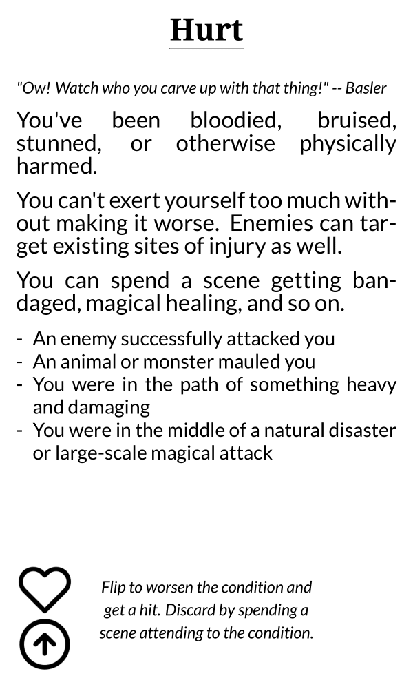
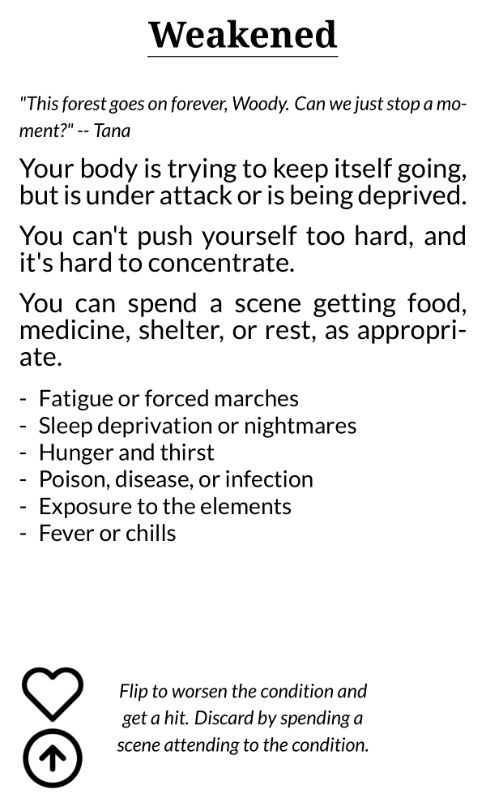
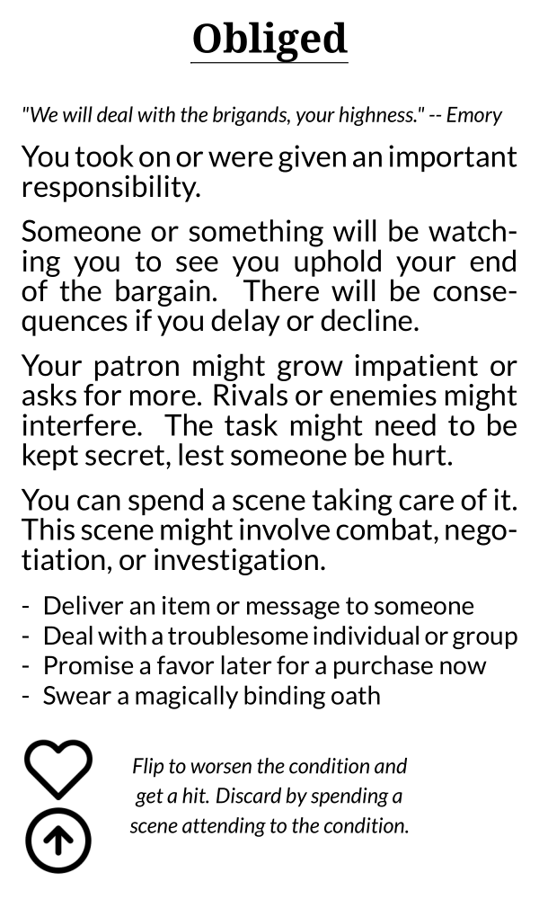

The cards are online here: [https://astralfrontier.github.io/flip-a-card/tags/condition](https://astralfrontier.github.io/flip-a-card/tags/condition)

These are the top-side cards, representing a lesser version of the condition.

Each of the cards has several elements:

* The title of the condition
* Flavor text, right now based on the [POV characters](/flip-a-card-pov-characters/) I wrote about
* Rules and examples for applying the condition to the fiction
* Icons (the heart for conditions, the up-arrow for topside cards)
* The rule on flipping or discarding the card

The biggest point of feedback I got was: "tell us how this condition affects the fiction". That drove a lot of the rewriting and expansion, and also helped me ground the cards in examples.

A bigger point for me, personally, is that the cards I'm writing now feel a little disconnected from any greater context. If I'm creating a reference game, I should create it around a solid framework. And what I realized I most want to do is resurrect Grand Adventure and Talispire, and its hopeful and fun feeling.

You can compare these cards with the original versions (in YAML format) if you look at the file [here](https://raw.githubusercontent.com/astralfrontier/flip-a-card/3c951d2cd2668b7566913a5e22973d791e6d2d38/card-data/02-conditions.yaml).
