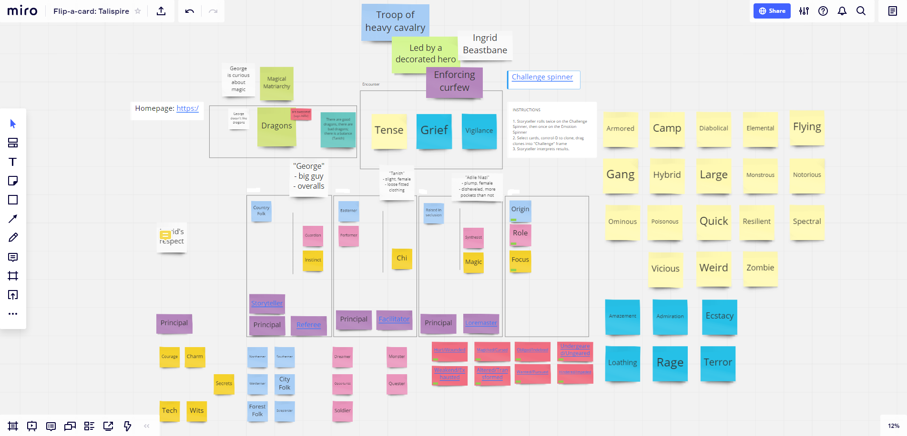

I ran a game of Flip-a-card for three people. The fourth had to bow out due to headaches, so we went ahead.

I used [Miro](https://www.miro.com/) to manage the logistics of the game. The free tier allows you to create three boards. I created play areas for the players, plus an "encounters" section, plus copies of the standard cards. It felt a little like overkill, but I wasn't sure how best to proceed.

Following the instructions, we assigned the four GM roles to players: Facilitator, Loremaster, Storyteller, and Referee. I took Loremaster and Referee initially, one player took Storyteller, and the other took Facilitator.

We established a new thing for the game: **campaign issues**. This is a list of 1-3 things that the PCs will have an opinion about. We'll use campaign issues to figure out where to take the game, and also to lend structure to early encounters. To start with, we chose "Dragons", a common fantasy trope.

We started creating characters. We all drew randomly, but also put cards back that we found unsatisfying. The result was three PCs: "George", a big strong farm worker whose farm had been burned by dragons; "Tanith", an easterner with martial arts and a knowledge of dragons both good and bad; and "Adile", a plump wizard-in-training from a convent for magicians who adored dragons.

During the game, we had three encounters, two of which were generated randomly:

* A camp of soldiers on the road, enforcing a travel curfew as they kept an eye out for dragon incursions, led by Ingrid Beastbane. The PCs had to persuade the group that they meant no harm, and we had several scenes of interaction.
* A flying dragon-hybrid, indicating that foul magic may have been at work on the dragons. We hid from the dragon using magic and trickery.
* A social encounter at the castle - our original destination - where we helped the King and Queen (leaders of the military and magical effort respectively) create a plan to stop the dragon menace by stopping the evil magic responsible for instigating it.

We left the story there. The logical next step was to go enact our plan, and possibly help the soldiers at the camp we'd encountered earlier. The whole session took about 3 hours to finish - 45 minutes for character creation, about 15 minutes for breaks, and about 2 hours of play.

### System Comments

This is a mixture of my own comments and playtest comments.

* There was no discussion of the world in which this game would take place. I arbitrarily suggested a high-fantasy type setting, but the game rules should make this an explicit question to ask. This should happen before campaign issues or characters are discussed.
* Campaign issue cards were useful, and would be more useful in a multi-session game. It's not necessary to mandate different viewpoints on issues, as that will hopefully arise on its own. PC positions on campaign issues must be distinct but not divisive - you must still be friends, even if you disagree.
* Character creation helped avoid choice paralysis. The character cards were inspiring without being limiting, and the characters were able to act as the players envisoned them.
* Condition cards are a vital addition, letting you get a success when your own abilities are exhausted.
* More clarity is needed around posing and meeting challenges - what are the stakes? I've since made changes to address this.
* Like characters, the encounter cards were useful in coming up with ideas. The specific cards we used need some tweaking and adjustment.
* The Storyteller GM role was a challenge, as the Storyteller's own PC generally receded into the background. This was anticipated, and is generally accounted for in GM-less games like Monsterhearts. It can be more of a challenge in a party-based game.
* The current GM role cards feel clunky right now, but that might be because this style of gaming is so different. Lack of real-world social cues (as we did not play with video, and two of the players didn't previously know each other) might be responsible here.
* The Storyteller role ought to include delegation for playing specific ECs to other people.

The overall impression is that the game is in a "beta" stage of readiness. The basic idea seems to be validated. What we're doing now is polishing and refining specific elements, like GM roles and encounters.