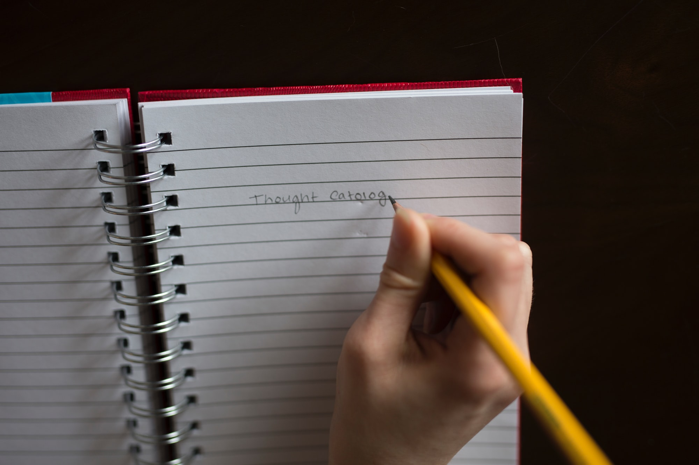

See [part 1](/flip-a-card-solo-playtest-part-1/) and [part 2](/flip-a-card-solo-playtest-part-2/) for the actual recap. In no particular order:

* I feel like I got a story arc done. Could Lee keep on going? Sure. Making him clear conditions gave us another 1-3 noncombat scenes to play through, and that's what condition cards were meant to do.
* Lee technically never failed to meet a challenge. At any time as a player we could say "nope, I got nothing" and see where the GM/other players/whoever want our story to go. In a solo play, I don't have other players to contribute ideas, so I opted for conditions instead.
* There are definitely people who want to use the dice as an oracle. This game felt much more like a Choose Your Own Adventure, where control of the narrative at every moment came at a cost, than (say) a PBTA game where you roll to find out.
* That said, the game easily supports that style of play with just one added card.
* Randomly drawing cards for challenges was definitely fun. The Hybrid Ogre set up a bunch of other stuff, including - totally unplanned - the idea that elven magic might have made the Ogre and could unmake it. I feel like this part of play, while a convention rather than a rule, made for a good substitute.
* I felt like "the elven lands are dreamlike because of this mist to which elves are immune" was neat world-building, and that let me take the Magicked condition later.
* A friend commented that the story felt like it hung together pretty well, and that I had a talent for making such things happen. My big fear is that the game as it is now only works with that talent - that it won't be generally interesting to play if you're not already good at that.

    