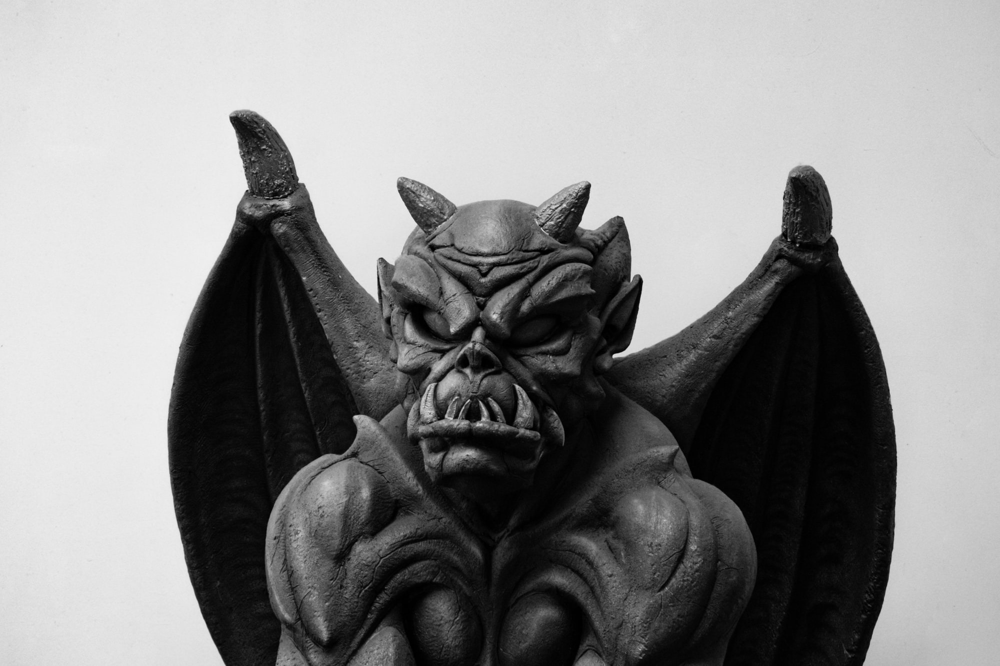

Previously I'd thought about doing two types of encounter cards: the "main" encounters, like "Kobold" or "Ogre", and the modifiers like "Large" and "Camp".

Right now, I think I want to do away with those "main" cards entirely. You'll draw a couple of modifiers, then answer a few key questions:

* What motivates this encounter? Draw an Emotion card, or pick from a list (e.g. Aggression, Territoriality, Desperation)
* What are some "monster moves" the encounter can do? e.g. breathe lightning, scatter the party like leaves, create illusions, whatever
* What do the commoners call this creature? What do the sages name it?

What I don't like about this is the second step - monster moves. To me this is the sort of thing that cards ought to be great at determining. So I might come up with something like a list of monster types - animal, aberration, you know, the usual D&D monster taxonomy - and suggestions for abilities can appear there.

For example, I drew two cards from the [list](https://astralfrontier.github.io/flip-a-card/tags/modifier): Diabolical and Hybrid. I drew Admiration as a motivation, which says "Admiration, Trust, or Acceptance. With Ecstacy: yields Love With Terror: yields Submission."

A couple words jump out at me here: Love and Submission. I can imagine someone turned into a half-demon hybrid for the sake of love, or alternately someone with a demonic curse who's been forced into subservience.

At this point, the Diabolical and Hybrid cards should have lists of moves, or inspiration for moves. I'd ask the table for monster names. The Horned Horror? The bat-winged shadow? The players don't have a proper name for it yet, but perhaps there's a diabolist's grimoire somewhere that does? Or at least an online name generator.

Either way, the PCs see a black shadow swoop over their camp one night...

----

You can try it yourself. Here's a Wheel of Names for encounter cards:

https://wheelofnames.com/view/h8c-zfu/

And here's the emotion cards:

https://wheelofnames.com/view/v6s-z6x/

    