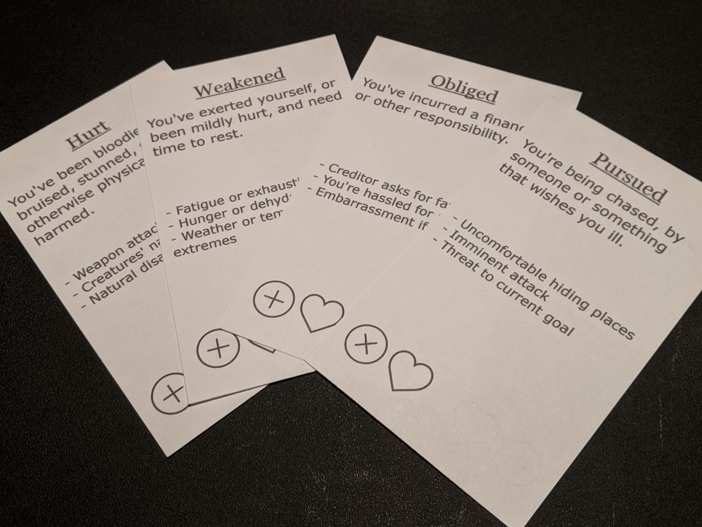

That's how they look, hot off the press of my OfficeJet 8600 Pro.

I had to adjust my script a little bit:

```
[all]=1-{(name)}
[headerfont]=Georgia
[standardfont2]=Consolas
[standardfont]=Verdana
CARDSIZE=7.62,12.7
PAGE=7.62,12.7,PORTRAIT,HVEO,#FFFFFF,[all]
MARGINS=0,0,0,0
LINKMULTI = num
LINK = cards.xlsx
FONT = [headerfont], 20, U, #000000
TEXT = , [name], 0, 0, 100%, 20%
IMAGE = , [img], 0, 20%, 100%, 40%, 0, P
FONT = [standardfont], 14, , #000000
TEXT = , [desc], 5%, 15%, 90%, 30%, left, wordwrap
FONT = [standardfont], 12, , #000000
TEXT = , [prompts], 5%, 45%, 90%, 38%, left, wordwrap
ICON = , T, plus.svg
ICON = , B, error.svg
ICON = , X, like-1.svg
ICONS = , [icons], 0%, 83%, 40%, 20%, 20%, 10%, 0, PN
```

I switched from Consolas to Verdana for the body font, and added the MARGINS directive. I did this after printing my first batch of cards and realizing I had forgotten the 1cm margin that nanDECK automatically adds.

The choice of fonts was influenced by accessibility. Georgia is readable as a header, and Verdana is a generally okay font for some dyslexic readers (from the studies I've  found). I also ran the PDF past a friend with a form of dyslexia and she said it was readable.

The result looks pretty good on 3x5 cards. The printer can't automatically print on both sides for me at this size, so I had to alternate odd & even pages manually. It'd be easy enough to either write a script that reslices the PDF for me, or just sort my original spreadsheet in eventual print order.

The next steps would be to fill out the rest of the deck described earlier, starting with a few cards outlining the rules, including the meaning of the card symbols.


    