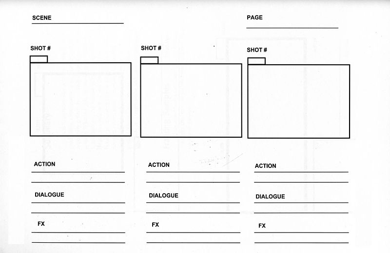

A "scene" in a movie, theatrical play, or television show introduces some characters,
sets up a source of tension for them to negotiate, and then lets them settle it.
Scenes in RPGs do something similar.
The scene is decided by the players at the table,
along with the game rules, rather than a group of scriptwriters.

### Lifecycle of a scene

A scene starts when _something is at stake_, or there's a _pressing question_,
and _PC choices are how we resolve it_.

A scene ends when _the stake is settled_, _the question is answered_,
or _the circumstances have changed_, and
_there's something that propels the PCs toward a new scene_.

Each of the GM roles are involved in setting the scene up. These steps can happen in any order.

* The Facilitator confirms the stakes or the question with the group
* The Loremaster establishes the time and place for the scene, including details like weather
* The Storyteller establishes any non-PC participants in the scene, including adversaries
* The Referee establishes any special rules for handling the scene

The Facilitator and Storyteller confirm with the group as a whole when the scene feels ended,
by asking if there's anything else any of the PCs or ECs want to do with the scene.

### Genre conventions and safety tools

Sometimes, we play to find out what's going to happen next.
But often, we have some kind of assumption, stated or not, about what can or can't happen.

For example, if a peaceful village is under threat of being razed by an army, or poisoned,
or enslaved, a lot of gamers will feel that this threat _actually happening_
is not something they're comfortable with. That's perfectly okay, and should be respected.

The way to respect it is to _change the stakes or the question_ that drive a scene.
For example, we can go from "will the village be annihilated" to "what does it cost to save the village".
The challenge of trying to stop the event can be plenty exciting (and dangerous).

Similarly, if having the PCs cool their heels in a dungeon for years isn't interesting,
a question like "do we escape the dungeon" can be rephrased as "how do we escape the dungeon".
The PCs might encounter a prisoner who has a way out but needs their help to enact it,
or they might trick the guards, or the cavalry might arrive, or the dungeon itself
might even be damaged somehow (via earthquake or flooding), making the escape perhaps
more dangerous than the stay.

### Building scenes from encounter cards

It's not always clear what the PCs should have to deal with next. Examples of when this can happen:

* When the game has just started, and nobody's sure what should happen
* When an encounter feels like it should logically happen, but the players don't have a specific idea of what
* When the PCs are en route (either literally traveling or between major story goals) and some surprises, interruptions, or complications feel appropriate

In this case, you can create scenes from the encounter cards.

1. The Storyteller draws two encounter cards at random
2. The Storyteller draws at least one oracle card, such as an emotion card
3. The Storyteller interprets the result of the draw, by thinking about what kind of stakes or questions would result
4. Commence the scene

The emotion card suggests the dominant mood or feeling the scene should project.
The encounter cards tell us more about what the character(s) or situation(s) in the scene can or will do.
The goal is to get the players thinking about specifics. If any card doesn't feel right, it's okay to discard and draw,
or just outright pick (or create) a card.

### Example stakes and questions

* We need to reach the castle to warn the king
* What's the chieftain really planning?
* We have to escape the dungeon
* Why were these villagers rounded up for arrest?
* We want to find an old adventurer who knows about this amulet
* Which of these three spirits can we trust?
* We're trying to locate a farmer's lost sheep in a dangerous forest
* Can we get across the mountain pass in time?
* We need to scout the area for bandits
* What does the dragon want in exchange for the sapphire?

### Example scene

The Storyteller draws "Tense", "Camp", and "Vigilance".
They interpret this as a camp of soldiers on high alert,
guarding the road from some unspecified menace.
The scene can now begin with a couple of key questions or stakes:
"are the soldiers going to let us through?" and
"what are the soldiers guarding against?"

[Image source](https://upload.wikimedia.org/wikipedia/commons/thumb/f/f5/Storyboard_Template.jpg/800px-Storyboard_Template.jpg)