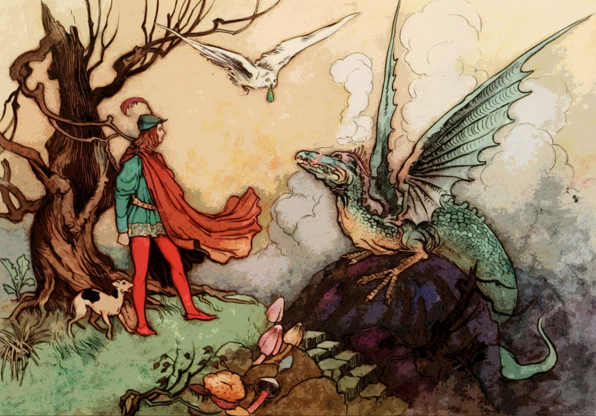

My [playtest session](/flip-a-card-playtest-april-19/) introduced a new thing: campaign issues. These are talked about in step 4 of the [Quickstart](https://astralfrontier.github.io/flip-a-card/quickstart/).

Rather than explain the rule itself, I want to talk about its origin: the Netflix show, ["The Dragon Prince"](https://www.netflix.com/title/80212245).

"The Dragon Prince" emerged from the same creative team that gave us "Avatar: the Last Airbender". Same quirky teenage characters on a journey, same conflicts between teams, same imperialist powerful father figures, and so on. But DP brought some internal tension to the cast that Avatar didn't have. When I watched the show, I wanted to understand how that tension happened.

It seemed to me that the first season revolved around two ideas: "dark magic" and "Katolis and Xadia". We're able to talk about the principal cast in terms of how they relate to these two ideas.

* **Rayla** _hates_ dark magic and _has a duty concerning_ Katolis and Xadia. She's supposed to be an assassin, but has regrets and reservations, and her story is that she's tied to a brewing conflict.
* **Callum** _is curious about_ dark magic and _doesn't know his place in_ Katolis and Xadia. He's the King's son but not his heir, and he feels uncertain about where he belongs.
* **Ezran** _distrusts_ dark magic and _doesn't understand the problems of_ Katolis and Xadia. He's the presumptive heir to the kingdom, but still acts like a kid.

We can look at a second group of characters:

* **Claudia** _practices_ dark magic and _doesn't get involved with_ Katolis and Xadia. She doesn't see the larger political situation as anything but background to living a life as her father's daughter.
* **Soren** _keeps his distance from_ dark magic and _wants to safeguard_ Katolis against Xadia. As a fighter, he has little to no interest in magic.
* **Lord Viren** _has mastered_ dark magic and _wants a war between_ Katolis and Xadia. He acts as a Katolis patriot, using any means necessary to safeguard the kingdom.

Each of these characters has their own quirks, goals, personalities, and abilities beyond these positions, of course. What their positions on the issues do is give us a starting point for their relationships. For example, we can predict that Callum (curious about dark magic) and Claudia (practices dark magic) should probably have a scene in which the topic comes up.

After a terrifying incident, Rayla, Callum, and Ezran find themselves fleeing the castle, with Lord Viren assigning Claudia and Soren to go after them. We can see that their personal feelings about current events will draw them into conflict. And going forward, some of them might change their views. For example, will Callum feel better about dark magic, or reject it? Will Soren revisit his views on Katolis and Xadia? Will Ezran grow into his responsibilities?

I've already seen Seasons 2 and most of 3, so I know the answer of course.

[Image source](https://www.publicdomainpictures.net/en/view-image.php?image=189408&picture=dragon-prince)