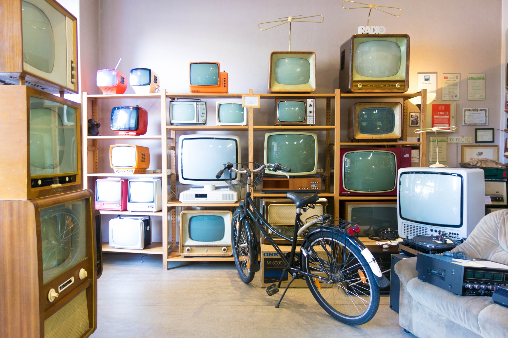

When you [live in the Crates](/life-in-the-crates/), life can be hard. Fortunately, I've got plenty of fun things to do!

There is a gang of kids about 9-12. When I say "gang", I mean "gang", like "street gang with knives and stuff", only they don't carry real weapons. They call themselves the Stabbers. They're play-acting at it. We all kind of play along too. The leader of the Stabbers is a girl named **Jacey**. She asks me for cool supervillain stuff, like monologue, and I tell her what I know. In return she sometimes brings me some of the candy the gang collects as toll for passing through their turf.

Netflix is really big around here. A few people have accounts and they share those, or just let people come over and hang out on the couch, like a movie theater attached to your home. People will drop in during a series, and a friend will catch them up on what's going on, then tag out to go do something. The guy whose place I usually visit is called **Ed**.

We like shows with low-class working heroes, we laugh at corrupt-cop dramas, and we watch those big expensive special-effects shows. There's a lot of fun Asian and Indian shows too. The stand-up comedy is great. We'll tell each other the jokes we hear.

I spend some of my time in my other identity: "the **Iron Goblin**". That's the name they give to whoever or whatever - spoiler alert, it's me! - sneaks around at night, fixing pots and pans, sharpening knives, and doing other metal stuff for people. You know those stories about "[the Elves and the Shoemaker](https://en.wikipedia.org/wiki/The_Elves_and_the_Shoemaker)"? It's exactly like that, but I'm not an elf, and it's not shoes. Make sense?

Aside from that, I like doing decorative metal-sculpting. Nice fences, iron flowers, statues, anything that looks nice and adds a touch of class to the neighborhood. It's a way to keep in practice with my powers. It's something new for me, doing things that's not useful for fighting or crime, but people like the stuff I've created. I can't tell anyone about it, of course.

All of this feels like it's just passing time, like I'm waiting for something new to change in my life. I know there's a new way to live, I just know nothing about it. So I'm doing whatever I can think of, and seeing how it feels. What am I going to do after I leave school? Once I thought I wouldn't live that long. Now, I don't know. So, everything is exciting.

    