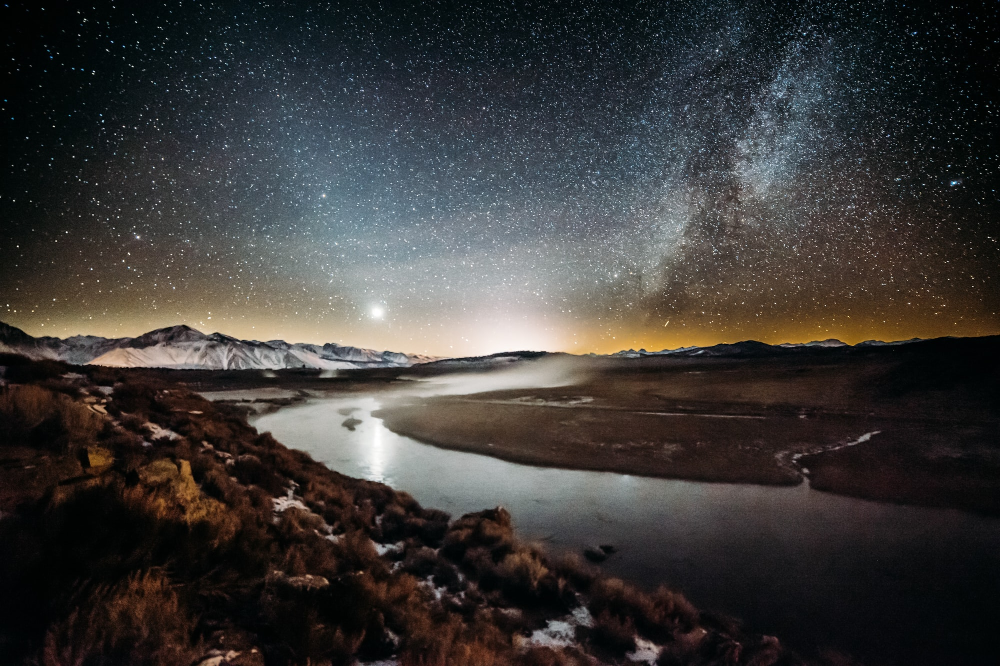

If given free rein to run any setting or world of my choice, for a group of invested players, what would I run? It goes by genre.

### Science fiction: Song of Eden

The Song of Eden universe is more mystical in mood than traditional hard scifi. It has a reasonably well thought out FTL system, numerous human civilizations and "alien" humans, galactic mysteries, history. It has living starships, augmented-reality warriors, science religions, angry cities, and more.

### Fantasy: The Wake

The Wake is a world where the mundane and the dream-world have intersected. People struggle to survive and prosper even when the rules of the world can sometimes be subjected to dream-logic. Monsters, mysteries, and magical items called "dream drops" are the most familiar intrusions into the normal, but literally anything is possible.

### Horror: Crossbreed

A “fusion AU” - a combination of many fictional franchises into a single chronology - based on the theme of biology. Viral infections, nonhuman creatures or half-human hybrids, giant monsters, and more. PCs would play biologists, CDC specialists, people with unusual powers, monster hunters, and more.

### Others

I'm still developing other settings, including:

* Pelaga - underwater fantasy adventure
* Other Fusion AUs - Falken's Matrix, Attack From the Stars
* Vessels - community-driven superpowers inspired by Dogs in the Vineyard
* Helping Hand - a superhero world featuring defenders of life
* Talispire - a "classic fantasy" with some inverted tropes

    