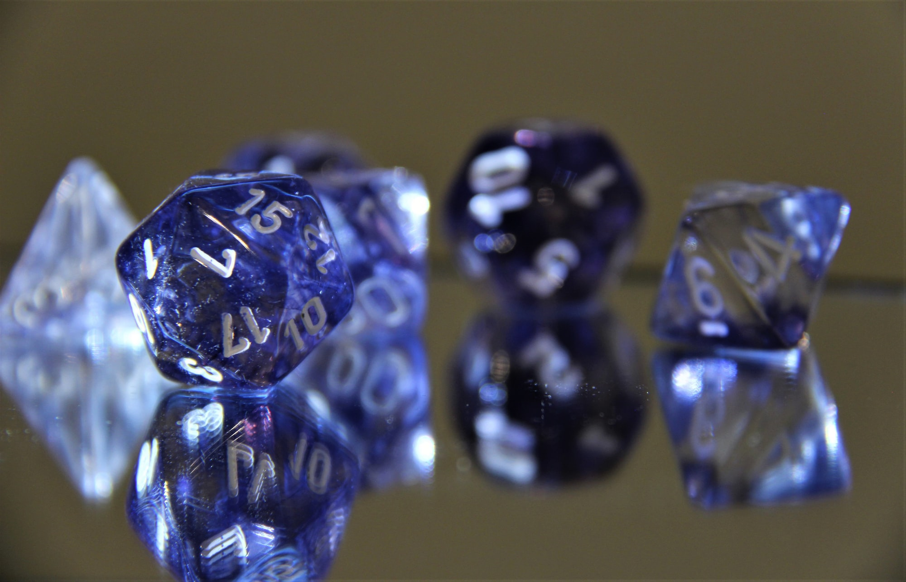

Links to the games I've created, or are developing and playtesting.

### Published

* [Blood, Loss](https://astralfrontier.itch.io/blood-loss) - a solo story game about grief
* [Inept Sorcerers](https://astralfrontier.itch.io/inept-sorcerers) - a game about casting spells, but not well
* [Legally Distinct Kaiju RPG](https://astralfrontier.itch.io/legally-distinct-kaiju-rpg) - playing Gamera movies

### Playtest Ready

* [WITCH](https://drive.google.com/open?id=1UZrAawUPipLQubwBcNdxClH6JohEH7hZ) - a Forged in the Dark game about cute witches

### Layout Ready

* [Red Rock Mountain](https://drive.google.com/open?id=1PNS7XZfqp73l54PjwGYYWxcBI3lvB1ljtlW8sD8VcZU) - a solo story game about justice and journeys

### In Development

* [The Candidate](/the-candidate/) - "For the Queen" in American politics
* [Champions Lite](https://drive.google.com/open?id=106Wa591CzAyqeiwYJX8hu2YsBGFWTDCqgam5MQP6GlM) - turning the venerable Champions into a more narrative game
* [Flip-a-Card](/tag/flip-a-card/) - a skeleton for creating games on index cards
* [Mad Mechs Fury Road](https://drive.google.com/open?id=1ho2GrXRL8Aye5-1yA1cC0Y2aEGcln2o2dZTMSMZvaFc) - neurodivergent rebels vs. the megacorps - probably superceded by Retropunk
* [Quarto Decimo Novum](/tag/quarto-decimo-novum/) - the world of FFXIV for Genesys
* [The Wake](https://drive.google.com/open?id=18jjQeNOPrpC9IflDulSaHQ50QGk2yx2KESFk2UmNOIo) - a world where the material and the oneiric have merged

### Experiments

* [A Long Time Ago](https://drive.google.com/open?id=1iLUfAGAoNJz3vYBGDIqRel08Im-Trla5z4Y7J3r-dZo) - an experiment in a dice system, for Star Wars
* [Death by Misadventure](/death-by-misadventure/) - an asymmetric GM-less game about haunted dungeons
* [Instant Superheroes](https://drive.google.com/open?id=1Oc612ppGqxXMXNBuROmKN2HHSTES2kAjUnetHQt486w) - an experiment in a single-page superhero system

    