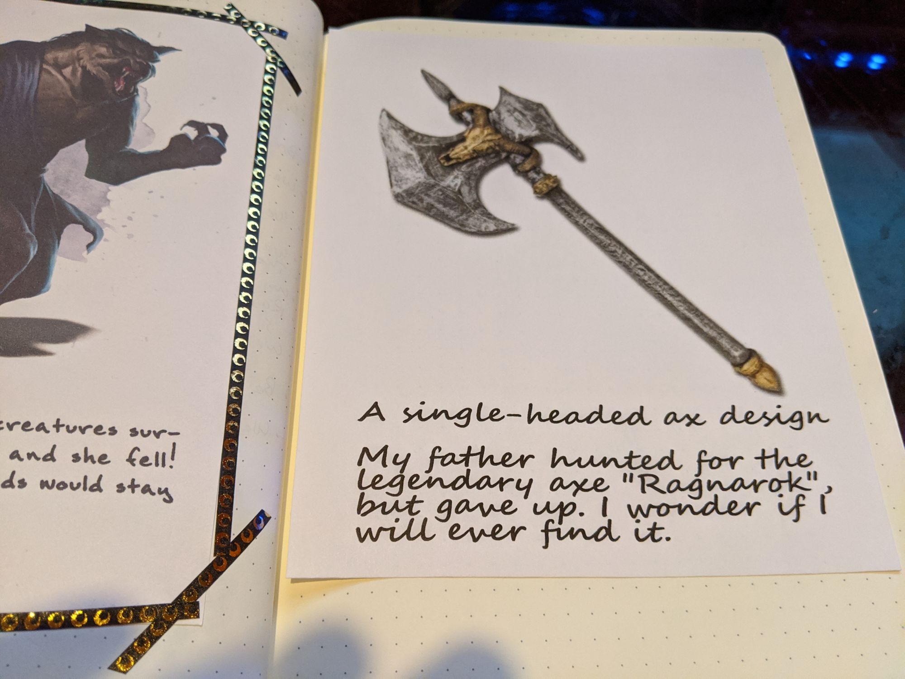
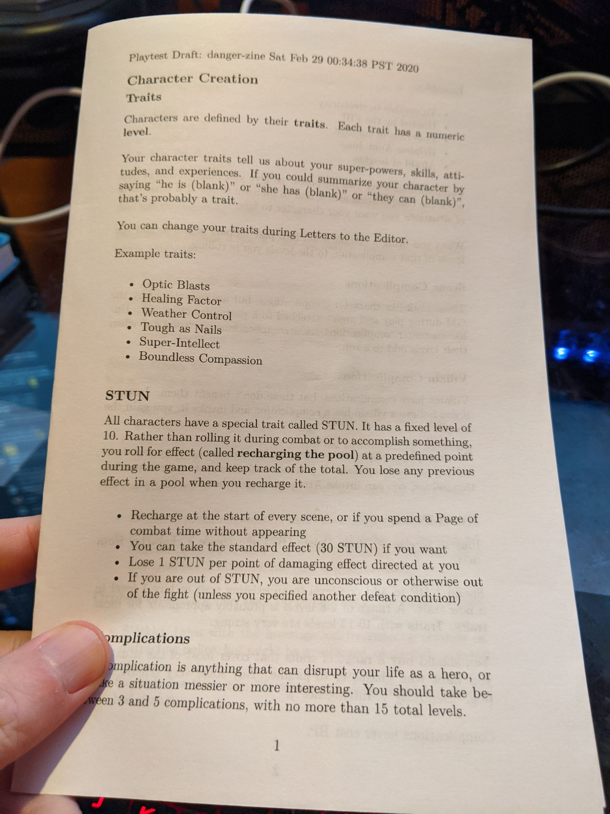
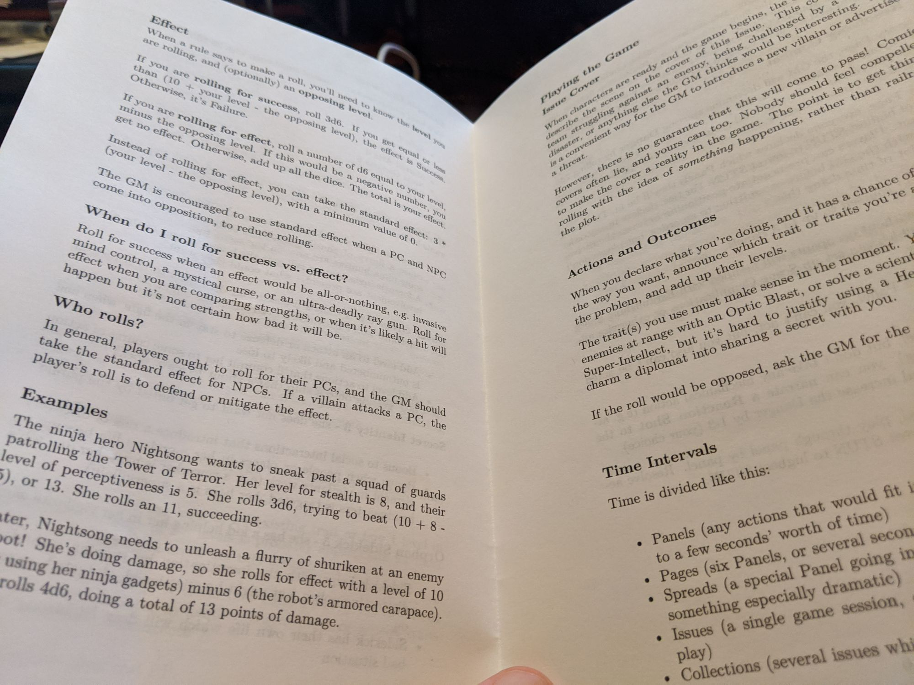

I did some work on supplementing my D&D bullet journal with printed sheets, instead of 4x6 cards, using a paper cutter. I used a glue stick to adhere it to the page. Here's what it looks like.

And here's a "zine" style printed RPG.

    