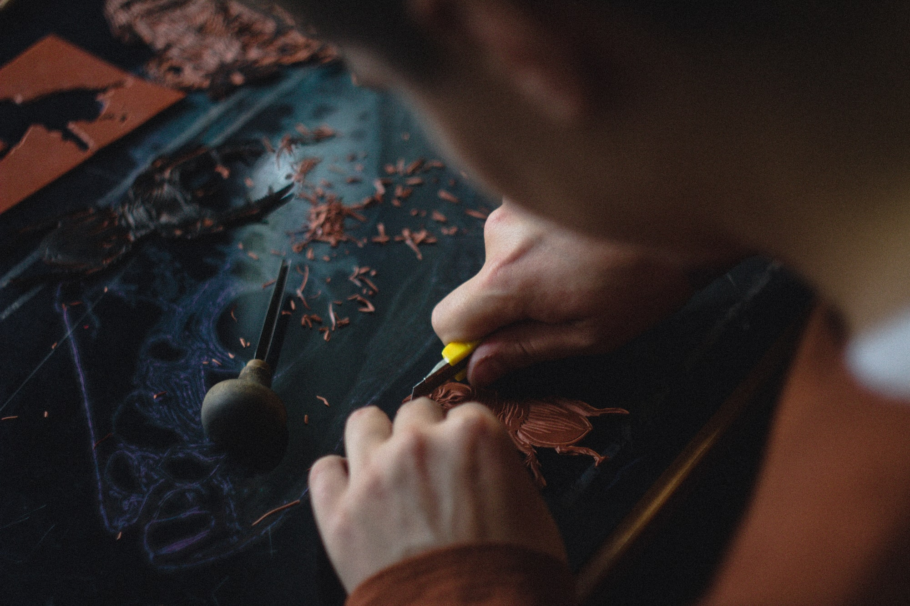

The Witch+Craft rules feel (to me) very much like FFXIV's crafting system, or something from other MMOs. There's optional rules for "gathering", there's techniques that crafters use in the process of making projects, there's normal vs. high-quality materials, and even the various specialties feel like they align.

I'm going to talk about this mapping, and use it to illustrate how to pull stuff from FFXIV into Witch+Craft. I'm also going to talk about community crafting.

[FFXIVCrafting.com](https://ffxivcrafting.com/) is a great resource for a lot of the questions we'll be asking here, so I'll be referring to it.

### What can I make?

Let's start with the [equipment calculator](https://ffxivcrafting.com/equipment). Rock, our barbarian blacksmith, wants to help make stuff for his friends, including a Druid, a Bard/Cleric, and a Sorceress. FFXIV currently level caps at 80, where world-destroying challenges are the norm, so we can calibrate FFXIV to D&D levels at about 4:1. Our characters are D&D level 5, so we'll look for level 20 gear.

We'll make something for our Sorceress, but what? In FFXIV, the sorcerer equivalent would be a Thaumaturge, or Black Mage (BLM). [BLM gear in the level 20 range](https://ffxivcrafting.com/equipment/list?BLM:20:1:1:0) includes items like "wind brand", "ash mask", "cotton halfrobe", "brass ear cuffs", and "brass wristlets".

What's the [wind brand](https://ffxiv.gamerescape.com/wiki/Wind_Brand)? It's a one-handed tool, resembling a rod or scepter. In D&D terms, it would be an [arcane focus](https://www.dndbeyond.com/equipment/arcane-focus). How is it made? The FFXIV recipe calls for aldgoat skin (leather), an antelope horn (to provide the structure of the item), alumen (alum, a salt used for preparing the leather), and a wind rock ("An uncut, unpolished stone imbued with aetheric wind energy"). The wind rock is crafted into an item called "the Eye of Wind", and serves as the centerpiece of the item.

Brass wristlets are a form of armor, but could somehow channel magical energy (called "aether" in the game) - for example, there's a version called "[aetherial brass wristlets](https://ffxiv.gamerescape.com/wiki/Aetherial_Brass_Wristlets)". These are crafted from a combination of brass ingots and brass rings, so we'll need to obtain and then alloy copper and zinc ore.

### How can I make it?

The game has given us some ideas about base materials. Let's map that to Witch+Craft media. The Eye of Wind calls for a Crystals specialist. Brass is Metals. Leather is Textiles. If Rock uses Metals, he'll want someone who works with Crystals and Textiles. We'll say that none of his teammates work with both of these, but that _someone_ can work with all these media.

This time, we'll use the "crafting generalist" rules on p. 13. Everyone's proficiency is +3 right now, so they get (3/2, rounding down), or 1d6 crafting dice to start with. They can only gain 3 preparation benefits, and add tool proficiency and ability scores.

We're making stuff that interacts positively with magic - maybe - but isn't specifically magical, and assign a DL of 3 to both projects. The DC is thus 20.

For preparations, we'll try to use high-quality materials in both cases. Rock will harvest ore from near the faeries' homes, hoping that some emanation of magic (but not too much) will make it into the finished wristlets. Along the way he might have to deal with the fey creatures' own whims, or risk a magical effect leaping to him. Meanwhile, the Druid shape-shifts into an antelope of her own and seeks out a stag, asking for its blessing and a gift of a horn. She is asked in return to do some favor for the herd, and the party as a whole assists with this effort.

We'll gain the assistance benefit for both projects, as everyone's helping out, and the generosity benefit applies too, as these are gifts. Relevant stats are +3 and the proficiency bonus of +3 means we're rolling 4d6+6 on both projects.

The first roll gives us 3,4,1,5, for a total of 19. The second roll gives us 6,3,3,5 for a total of 23. This means the wind brand was not successfully assembled - it would have had one flaw already, and the "desperate measures" variant rule, giving a bonus by taking more flaws, isn't worth it. The wristlets at least were a success, and the single 6 yields a boon. What should it be?

A d10 yields a 3. The general table on p. 171 gives us a minor boon: "it can be used to reflect light". The metals table on p. 178 gives us "the object emits a pleasing tone when used or struck". The general boon sounds more practical, so we'll go with that.

The group regrets that they couldn't present the Sorceress with a new arcane focus this time, but the brass wristlets are nice to look at. With more dice and hence more chances for a 6, they might have eventually had a boon stack high enough to justify a magical effect!

### Community Crafting

FFXIV's disciples of the hand often interact with each other, as many of the more complex recipes require ingredients from different disciplines. A single item can call on the services of a carpenter, leatherworker, and alchemist, for example.

Witch+Craft offers the assistance preparation for crafters working together, as well as requiring base materials that could come from several types of media. In addition, the trade-class rules allow people to take techniques that improve the effects of assistance, for example by letting people take the benefit multiple times. Our wind brand was a simple example, but more complex examples - like a rune-scribed and iron-shod wooden wizard's staff, topped with a crystal - could call for three or four different media, requiring cooperation.

    