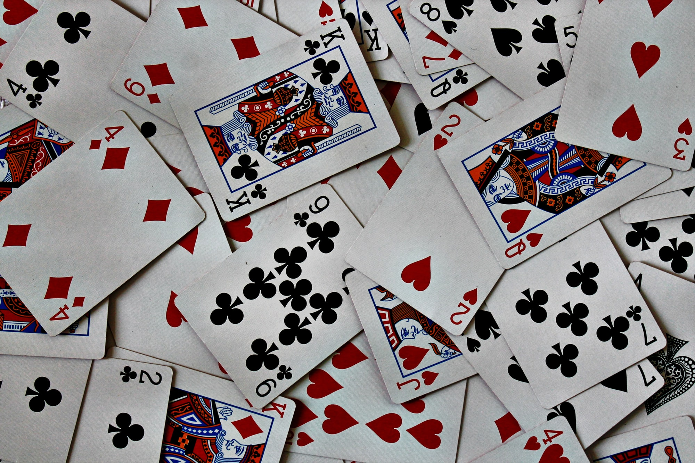

One thing I like about Genesys is the six-outcome system: you can generate success, failure, triumph, despair, advantage, and trouble off the dice, and once you learn to read the tea leaves, it flows easily.

Is there an easy way to generate a similar, probably simpler, version of the same idea?

Imagine you have a hand of regular playing cards, with a pile to draw from. You can play one card, the GM (or an opposing player) plays one card, and you draw one. Extenuating circumstances let you draw another card. The rules are:

* Hearts mean success, diamonds mean advantage, spades mean failure, clubs mean trouble
* Success and failure oppose each other, advantage and trouble oppose each other
* When cards are opposed, treat it as a card of the higher face value's type, with a value of (higher value - lower value)
* Resolve cancellations downward by face value
* Net success, failure, advantage, or trouble is the highest value of the corresponding suite

This might sound like a lot, so some examples.

Example: I play 8 of Hearts, GM plays Queen of Spades, and I draw 9 of Hearts. The Queen of Spades wins against the 9 of Hearts, leaving (12 - 9) or 3 failure. My 8 of hearts turns into a net success of 5 (8 - 3).

Next hand, I play 5 of Diamonds, the GM plays 6 of Diamonds, and I draw the 5 of Hearts. That's success 5, advantage 6.

Final hand, I play 9 of Clubs, GM plays 5 of Clubs, and I draw the 2 of Spades. That's 9 trouble (the highest of the 5 and the 9), and 2 failure.

The numbers are basically "magnitude" - they don't have to mean anything specific, but they could.

Cards ought to be played face down or simultaneously to prevent people from gaming the system - in other words, I ought to place a success where I want to get a success, not because I know the GM has dropped a failure on me.

### Character Statistics

How would you incorporate this into a system with character stats?

Let's say that I declare a maximum hand size of 5 - you can hold that many cards at once. You have PBTA-style stats, ranging from -2 to +3. To use this system with that kind of stat spread, we'll say that I can play (positive stat) cards from my hand, the GM plays (negative stat) cards from their hand, and one card always randomly drawn.

So if I have a stat of +2, I can play any 2 cards from my hand, and draw one. If I have a stat of -1, the GM plays one card, and I draw one.

    