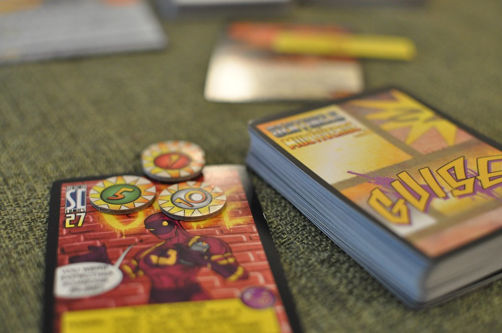

I'm going to talk about how I've found the "Champions Now" experience, now that it's officially out and for sale.
I wasn't a fan when I [first wrote about it](/2019/01/22/recent-playtests-sv-and-cn) and I'm still not,
but now that it's not considered beta any more, I feel more solid talking about why not.

First, I'll talk about how I've found ways to play it successfully.

### Champions Now as D&D

The closest comparison I can make to this version of Champions
is Dungeons & Dragons, 4th edition.
while D&D4e was the "MMORPG edition", it codified a lot of the rules that eventually feed into 5e:
standardized representations of class abilities,
the idea that cantrips ought to be reusable tools for casters (at-will powers),
and a focus on simplified combat rules.

Like D&D in general, Champions Now is intended to be a curated RPG experience.
Unlike the Champions and Hero systems before it,
you aren't expected to be able to play high-powered heroes, fantasy wizards,
or anything else that falls outside the narrow focus of
"typical comic heroes of the 60s, 70s, and 80s".
D&D is similarly good at delivering small-unit tactics
in a strongly Eurocentric fantasy setting, and nothing else.

### Attrition-Based Superheroes

Champions Now also follows D&D's attrition-based model for combat.
If you run out of KO, you're unconscious.
It doesn't matter that Aunt May is in danger or not -
there's no mechanical provision for heroic actions under pressure,
for example.
If you run out of Endurance to spend on your powers, you won't
be using your powers (unless you start spending KO).
And Endurance and powers are priced such that you'll quickly run out
if you use your powers for more than a full cycle of combat turns
(3-4 Phases).

Since your initiative is based on Speed and DEX, your END costs and REC rate are fixed,
and you spend END whether or not your attacks land,
combat is similarly about as deterministic as D&D.
You know when you'll go relative to everyone else,
how many attacks you can launch before you're exhausted,
and so on.

Based on all this, I feel like I've had more success
in our Champions Now sessions by playing tactically.
The specific tactics I've found useful are:

- It's better to lure someone else into an attack strategy, if you can effectively dodge or otherwise no-sell their attacks, and wear down their END
- Like D&D, it's more effective to focus your fire - pairing off for 1:1 fights is mechanically a bad idea
- Entangles, Flashes, and Recoveries represent moments of vulnerability that should be exploited for coordinated attacks
- "Crowd control" and battlefield management powers, like Concealment and Force Wall, are great
- Similarly, and much like D&D, specific positioning and distance matters

At this point, the Champions Now advocate might say,
"hey wait a minute! Shouldn't you be focusing on the fiction?"
Fair question. I'd say that I am, because my character's fictional goal
is "be a hero" and that means "rescue civilians" or "stop supervillains".
The way you achieve those fictional aims,
using _these particular rules_, is to play tactically,
and leverage attrition in your favor.
Let me talk about some of the specifics there.

### Fiction vs. Tactics: Focus Fire

Generally, you'll take Champions Now villains down fastest,
every time, if you do the following:
get them entangled or flashed (or wait until they take a Recovery),
then make a coordinated attack to KO them.
Some villains will be objectively harder to take down than others,
whether due to powers like Desolid, or just high Defense.
High DEX helps somewhat, but it doesn't matter during
a Recovery or Entangle, where your Defensive value drops to a fixed value of 6.

And because a Recovery takes a full phase,
there's no way to say "I run behind the pillar and catch my breath"
without spending two Phases to do it - and you may only have 3 to 4
Phases total during a turn.
To keep your effectiveness up, you'll tend to either Recover in place,
and hopefully you're a ranged attacker so you can do so from a safe distance
(but see below on why blasters still want to be up close).
During that time, you'll be vulnerable.

### Fiction vs. Tactics: Positioning

All ranged attacks come with attack penalties based strictly on range:
you're at -1 per 3 hexes of distance.
It follows that you want to be close to your target,
because a missed attack roll is expensive.

Some games use arbitrary distance measurements (e.g. Close, Near, Far).
Other games, like Masks, don't make range a factor at all except in the fiction
("I don't think Pharos's eyebeams should be able to shoot to the Moon").
You can still draw maps for such systems, but you typically don't have to.
As a result, they place much less emphasis on tactical play and maneuver.

Because of this emphasis, moves that disable someone's ability to hit at range
are effective - moreso because they're typically fire and forget.
Spend END once, and there's a barrier or cloud or something that's good for several segments.
An opponent who can't overcome your barrier is frozen out of that part of the fight.

### Conclusion

A lot of games that have rules that harmonize with each other.
I feel that Champions Now pulls me in two directions.
It clearly wants to be a game where you narrate cool things
and we throw some dice and 70's comics organically emerge.
But at the same time, the actual rules for combat
give us a specific way to play.

I'd love a game where "you're fighting to defend the civilians in your care"
or "your friends believe in you" or
"you're battling with emotional problems" came with mechanical support.
An example of where this should happen is Presence Attacks.
Unfortunately, even these are strictly proscribed.
You are penalized for being in combat (the place most of them will apply),
and the only reliable way to boost your effectiveness
is to exhibit a superpower (fair enough), or.... use violence.
There's no bonus for trying to de-escalate a situation,
or bring your Situations into play as motivators,
or do anything but cow villains into submission.
And the effect of a PRE Attack isn't long-lasting behavioral change,
but.. a brief edge in a fight. A tactical advantage.

Ron Edwards has insisted that his "two statements" are requirements to talk about character mechanics,
but that doesn't seem to be the case.
Compare to a game like Masks, where the curated experience
is that others' opinions matter strongly to your PC,
and there's a mechanic like Influence that directly upholds that principle.
And if I said "hey how do I make my Masks PC better at doing something to someone",
one answer would be "take Influence over them for the +1".
Ah, but how do we take Influence over a villain...? Thereby hangs a tale.
In such a game, the way you get better mechanically
is to produce more interesting fiction.
Here, it's the reverse.

If forced to choose between tactically wise combat choices,
and things that seem cool and appropriate (but will fail miserably or get my PC killed in battle),
I'm going to choose tactical play.
I'd just prefer a game system that doesn't make me choose at all.

[Image source](https://www.flickr.com/photos/cfiesler/17269012115) by Casey Fiesler, licensed under CC-BY 2.0