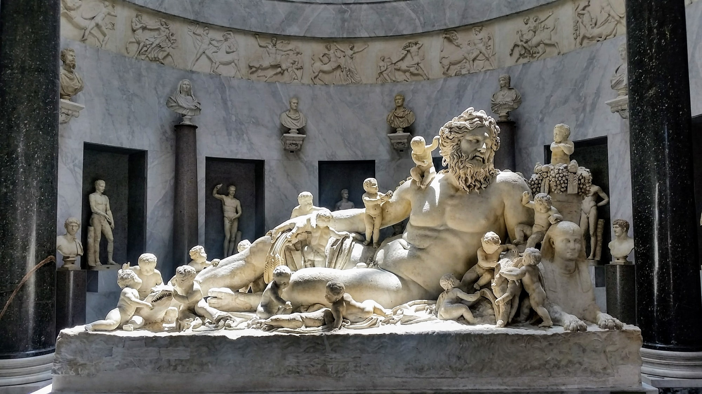

The Demigods game's [About page](https://demigodspbta.com/about-1) says this:

> Demigods is a magical realism role-playing game set in the modern day. All of the gods are real and every belief system is correct—all at the same time. In this fictional world the gods exist because humans imagined them into existence. At least a dozen different sun gods are pushing, pulling, or being the sun, while that same sun is a giant fusion engine ninety-three million miles away. Multiple truths! All at once! Lean into it.

So right away I'm pulling from the following touchstones:

* The [World of Darkness](https://www.worldofdarkness.com/) games where multiple overlapping conspiracies and power structures were the norm, and the most powerful beings operated from the shadows. I'm not a big fan of some of the things White Wolf has done with the line, but I'll accept the influence it's had on me as a gamer.
* The [Iron Druid Chronicles](https://kevinhearne.com/novels/), admittedly not my favorite thing ever, but still (to me) a step up from the Dresden Files in terms of "mouthy dude in a world where Everything Is True". Also a much more positive tone, generally.
* I'm going to make an admission here. I haven't watched, or read, "[American Gods](https://en.wikipedia.org/wiki/American_Gods_(TV_series))". I'm aware of it. I know what it's about. But I haven't partaken of it. But I'm confident that this is relevant too.
* [Oh My Goddess!](https://en.wikipedia.org/wiki/Oh_My_Goddess!), the classic magical-girlfriend manga and anime series. A bunch of pretty freeloaders moving in with one mortal schmuck is a potential Binding, and I think it's a good counterbalance to the much darker earlier suggestions.

What do the quick-start rules tell us about the setup of the world? The impression I get is this:

* The gods need mortal agents to keep dipping into the well of human belief, to solve problems, and so on
* Demigods _as a group_ aren't normally a thing, because they start snarling Fate up when they interact
* _These_ Demigods are an exception, because of the Binding that happened, and that by itself sets them apart, makes them useful, and so on

This suggests espionage, conspiracy, magic-vs-mundane, and similar plots. I don't feel that a full-on World-of-Darkness-esque doom and gloom setting is appropriate, though. The art from the playbooks is colorful, adventurous, full of youth and ambition and life. So in that sense it can also draw from something like [Masks](https://www.magpiegames.com/masks/), where the impressionable junior characters are being pushed around by their short-sighted seniors.

So who are the bad guys? The quick-start doesn't give you any obvious villains. Fate isn't a god, but a universal principle you can't really fight against (or can you..?) There's no anti-Gods, no Excrucians, no Technocracy. Mundanes literally can't see your divine attributes and will rationalize away any displays of power, so they're useless.

You can always designate some gods (or whole pantheons) as the bad guys, and whether you pick the gods or the plan first is up to you. Alternately, you can let the PCs drive the action, and figure out who's the opposition based on their goals. Either way, I think the important thing to prep here is knowledge of a few existing pantheons, along with some interesting non-standard pantheons ("American Gods" and its New Gods, or forgotten mystery-cult deities, or...).

A couple of visual inspirations:

* ["Legendary Visions" by Genzoman](https://www.deviantart.com/genzoman/art/Legendary-Visions-Artbook-195658065) - anime-esque renditions of gods and famous figures in mythology
* "[Incantation](https://www.youtube.com/watch?v=mFR19X6GSVg)" by Delerium, where beings of fire and ice interact

More specific planning and prep soon!

    