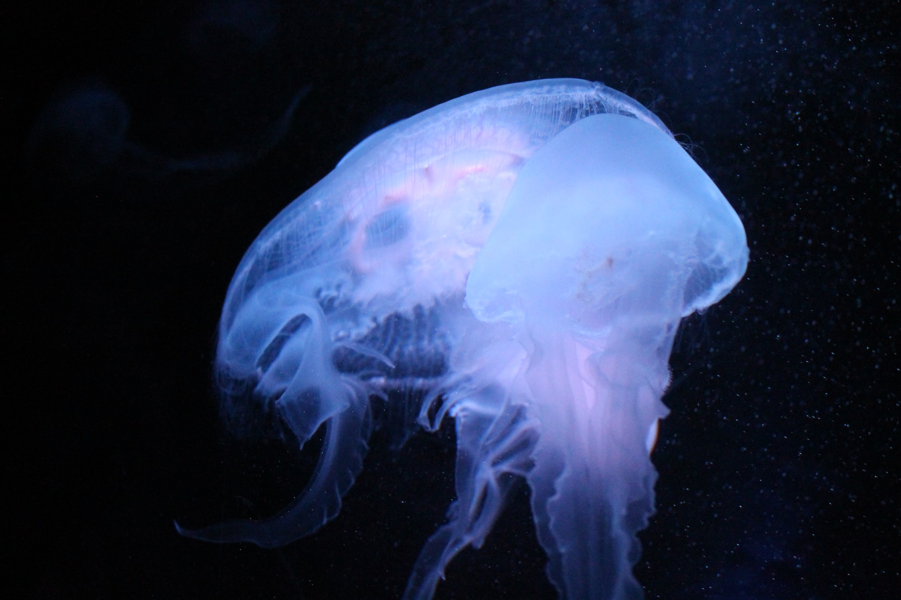

A friend prompted me (in [this](https://twitter.com/GraypawnTweets/status/1211092828593348608) tweet, reproduced here) thus:

> A procedurally generated Space Alien creation mechanic.  I'd prefer system agnostic, but I'd dig a version that yields mechanical components for a set design, too.  But I'd love to see how you build a process for generating unique aliens in an s-f setting.

I'm going to give a shout out to [GURPS Space](http://www.sjgames.com/gurps/books/Space/) for its realistic treatment of star and planetary system design. If you are looking for a good (if complex) way to populate a realistic universe from outward in, this is what I'd suggest. That said...

My premise is that for scifi, hard or soft, it's enough to define _how aliens make us, as human beings, react to their differences_. In other words, what's "alien" about them anyway?

### The Process

To answer that, we're going to present a few tables, and have you roll dice for results on those tables.

* First, decide how "alien" these aliens are. Do you want people with rubber foreheads, in the vein of Star Trek? Roll 1d6 on the Human Experience table. If you want stranger creatures, but still ones where interaction seems convenient enough a la Star Wars, roll 2d6. For really weird Pournelle & Niven aliens, roll 3d6.
* Second, roll 1d8 on the Human Reaction table. This answers how humanity views the aliens' version of that quality. To add more nuance, roll a second time. If you roll two traits that "overlap" according to the table, that is the result; otherwise, human reactions are mixed.
* Third, answer the all-important question: "why is this the way it is?" Some notes are included on the tables to help you.
* Fourth, and optionally, repeat this process to generate more traits. You can stage down the dice, e.g. roll 3d6 once and then 2d6 once for an alien with one notably weird feature.

Examples will follow the tables.

**Human Experience Table**

1. **Culture** - arts, music, ideas about beauty, etc. Example: aliens who see in the infrared or hear in the ultrasonic, might have very different or imperceptible art forms.
2. **Living environment** - living below ground, in water, or in terrain typically considered inhospitable to humans. Living only in (or never in) cities.
3. **General appearance** - space elves are pretty, space orcs aren't. Do they remind us of cats - or bugs? Do they occupy the Uncanny Valley?
4. **Economic values** - how do they value cooperation vs. competition? Is labor, property, form vs. function, etc. different for them? Is "money" foreign to them?
5. **Social values** - do they have views about honor, propriety, religion, that differ markedly from ours? Do they have common attitudes toward other races? Do they have (or reject) social classes?
6. **Sexuality & family** - are they monogamous, polygamous, or something else? Are there only two dominant sexes? Are they a single-sex race, like Mass Effect's Asari? How do they ensure diversity of traits (or genes)?
7. **Anatomical construction** - do they have more (or fewer, or different) limbs, manipulators, or other appendages? Are they digitigrade, plantigrade, or entirely legless? Do they have wings? Gas bags?
8. **Moral values** - how do they view proscriptions on killing, theft, and other activities? Do they see something as moral that we don't? Do they have acts that we can't imagine? Are some moral acts incomprehensible to them?
9. **Physical or emotional nourishment** - do they eat or drink like humans, or absorb nutrients through the soil like plants? Are they solar? Powered by radiation? Do they need touch and companionship, like humans do? Do they sleep, or sleep at all the way we do, or on a similar cycle?
10. **Communication** - aliens that speak oddly to us, that don't communicate words or concepts the same way we do, or that communicate in ways we can easily misunderstand. Do they use scent, metaphors, telepathy, or something else? Do they _always_ lie? Do they speak in pairs?
11. **Life support** - do they breathe the same air, find the same temperature ranges comfortable, etc.? Is there an element they need in their atmosphere? Where can they live that we can't? Where can't they live?
12. **Reproductive function** - do they clone themselves? Are they parasites that need other organisms to function?
13. **Metabolic basis** - are they something other than solid creatures, e.g. gaseous creatures in space? Are they crystalline, that grow naturally rather than by actively consuming something?
14. **Life cycle** - how different are they from the infancy - youth - maturity - senescence process? Do they go through stages like caterpillars to butterflies? Do they renew themselves like jellyfish? Something else?
15. **Logic and cognition** - humans can reason about their world, but have [cognitive biases](https://en.wikipedia.org/wiki/List_of_cognitive_biases) such as wishful thinking. Do these aliens have other biases, or fewer? Are they perfect reasoners - or do they thrive entirely on emotion - or something else?
16. **Foundational emotions or instincts** - we are drawn to feed, defend ourselves, reproduce, seek shelter, avoid harm, and so on. We feel key emotions like joy and fear. How are these aliens different in that regard?
17. **Conception of mortality** - creatures on Earth die, and humans are aware of our mortality. What would aliens be like who were functionally immortal, or who couldn't realize this? Aliens who experienced cycles of reincarnation (biological or otherwise), with or without intact memories, might be very different.
18. **Foundations of consciousness** - our understanding of how we apprehend the universe, the experience of being a person, the idea of a single "I am" - might be different for these aliens. Is there a true hive mind, for example? Shared consciousness? Is every alien body host to a consensus of multiple minds? Or is something weirder going on?

**Human Reaction Table**

[Plutchik's Wheel of Emotions](https://www.6seconds.org/2017/04/27/plutchiks-model-of-emotions/) gives us eight basic emotional states. Individual humans will have their own opinions, but this suggests the majority view.

1. **Terror** - fear, apprehension, nervousness. Overlap with Amazement: Awe. Whatever this is, we don't like it.
2. **Amazement** - surprise, distraction. Overlap with Grief: Disapproval. Oh my stars, would you look at _that_? Have you ever seen such a thing?
3. **Grief** - sadness, pensiveness. Overlap with Loathing: Remorse. That's no good, man. Why does it have to be that way?
4. **Loathing** - disgust, boredom. Overlap with Rage: Contempt. No. Just no. I am noping out of here. Eww!
5. **Rage** - anger, annoyance. Overlap with Vigilance: Aggressiveness. We have to put a stop to this! Are you kidding me?
6. **Vigilance** - anticipation, interest. Overlap with Ecstacy: Optimism. Hmm, something to keep an eye on. Pay attention.
7. **Ecstacy** - joy, serenity. Overlap with Admiration: Love. Ohh, so cute! Graceful, beautiful! I can't get enough of how they do that.
8. **Admiration** - trust, acceptance. Overlap with Terror: Submission. I really like that about them. Why can't we be more like that?

### Examples

I wrote a script that lets me roll on multiple random tables in a reasonably complex way. You can find it on Github here: [https://github.com/astralfrontier/randomtables.git](https://github.com/astralfrontier/randomtables.git)

The particular script I wrote for this process is here: [https://github.com/astralfrontier/randomtables/blob/master/aliens.yaml](https://github.com/astralfrontier/randomtables/blob/master/aliens.yaml)

We'll generate three random alien races, one human-like, one more alien, and one very weird.

> How alien are your aliens? Rubber-Forehead Aliens (e.g. Star Trek)

> Quality: Sexuality & Family

> Reaction: Admiration

Why do humans admire this? We'll say this this species has pheromones that encourage a docile atmosphere among genetically similar individuals - like airborne antibodies for anger. As a result, the family home is always well-behaved and calm. Siblings don't squabble and pair-bondings are stable. Of course, such people can bicker with their neighbors or coworkers, and might need other outlets for anger (such as economic or military conquest...)

> How alien are your aliens? Moderately Weird Aliens (e.g. Star Wars)

> Quality: Communication

> Reaction: Grief

A race, perhaps like the [Elcor](https://www.youtube.com/watch?v=5USn_CT_DpY) from Mass Effect, whose whole mode of speaking sounds depressed (or depressing). Their body language, vocal inflection, and so on give people a strong impression that they are unhappy, despite this not being the case. As a result, perhaps they think of humans as puppy-dogs, because the ones they meet seem so eager to please and cheer them up.

> How alien are your aliens? Really Weird Aliens (e.g. Niven and Pournelle)

> Quality: Anatomical construction (limb count, etc.)

> Reaction: Vigilance

A species with a highly variable body plan - whether amorphous or simply very diverse among individuals - might make us, as a species, wonder what's going to happen next with them. Can these aliens evolve natural weapons? Are they shape-changers, capable of looking human? Can their forms produce unanticipated forms of natural beauty or art?

Finally, a complex example, rolling multiple times:

> Quality: Anatomical construction (limb count, etc.)

> Reaction: Loathing

> Quality: Moral values

> Reaction: Grief

> Quality: Culture (arts, music, etc.)

> Reaction: Vigilance

This is a species of bug-like aliens. They look yucky and give us the creepy-crawlies, and that's why we got into a war with them. Since then they've become committed pacifists, apparently seeking to atone for whatever wrong they did to us, and their cultural values (harm no living thing) are a constant reminder to us of our own faults. They've taken to preserving their old ways of life through music, dance, and performance art, and human beings are quelling their guilt through a new appreciation of these styles.

### Next Steps

If the questions this process makes us ask ("why are things this way?") are still too difficult to answer, or there's too little information, we can put together another table, filled with common elements or generic prompts that might be relevant to our setting. Example:

1. Comparison with an Earth animal
2. The last conflict
3. Public Relations efforts
4. Territory rights
5. Culture heroes
6. Gross misunderstanding

If necessary, roll on such a table to see if it makes the question easier to answer. Creating other such tables is left as an exercise for the reader.

 This work is licensed under a <a rel="license" href="http://creativecommons.org/licenses/by-sa/2.0/">Creative Commons Attribution-ShareAlike 2.0 Generic License</a>.

    