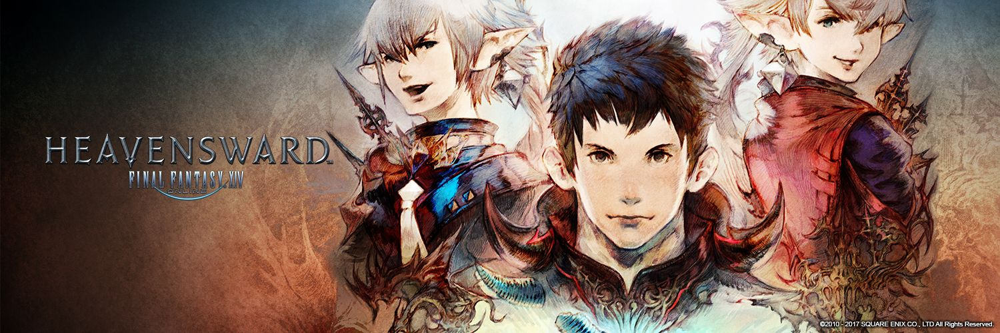
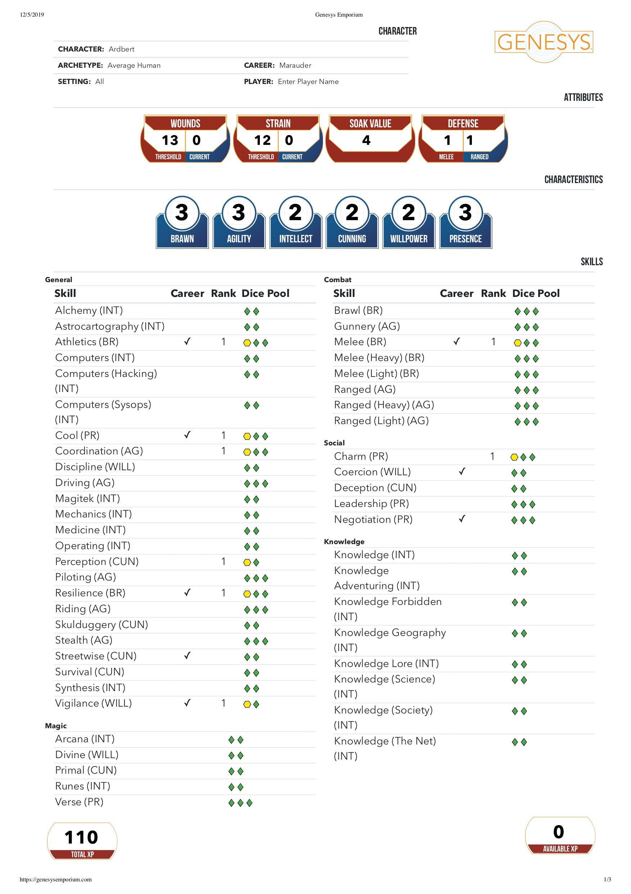
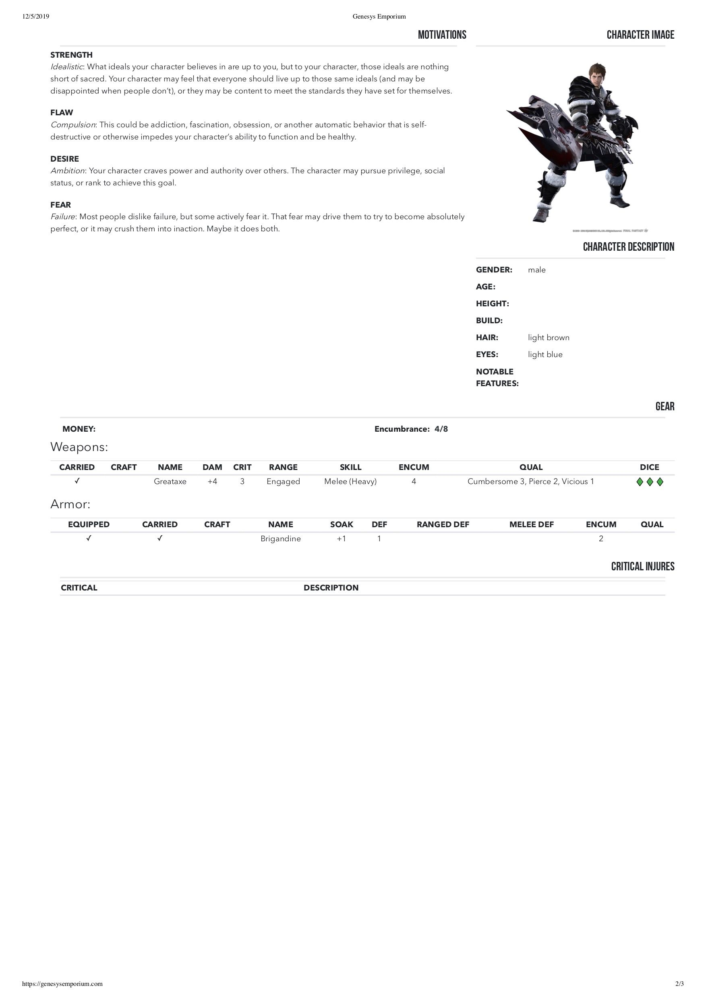
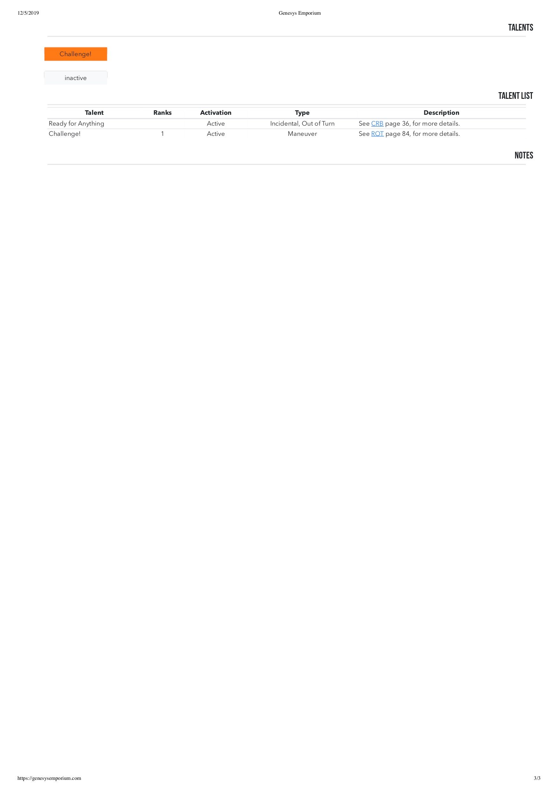

Here's a sample character: [Ardbert](https://finalfantasy.fandom.com/wiki/Ardbert), a young Marauder on a mission. He is a natural, compulsive hero, and can't stop helping people, even when it puts him in danger.

Image sources and credits:

* The banner image is from the [FFXIV Fan Kit](https://na.finalfantasyxiv.com/lodestone/special/fankit/twitter_kit/)

    