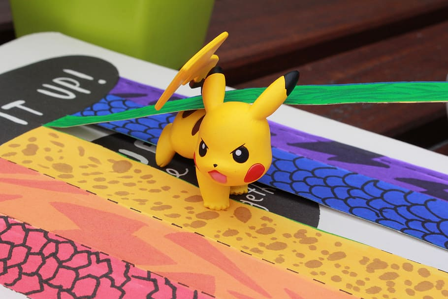

> **Familiars of Terra** is a tabletop roleplay game set in Terra, a fantasy world in which every person has an animal familiar. As a heroic Seeker you travel the lands with your familiar healing the devastation of a war which left nations scarred and people scattered. Be a beacon of hope ushering in a new era for Terra. Help restore the land to its former beauty, bond with your familiar and discover your joined destiny, become a hero people will sing about for years to come!

> If you love young adult fiction like _The Golden Compass_, _Wild Magic_, or shows like _Digimon_, then **Familiars of Terra** is for you! Mechanically we’ve taken inspiration from our favourite games like _Blades in the Dark_ and _Monsterhearts_ and a few card based games like _Pokemon_. Combining our favourite media and games with our passion for cool animals has created a unique card-based game.

It's a friend's birthday and he invited a few people to two days of gaming. For the first day, we played [Familiars of Terra](https://www.angryhamsterpublishing.com/fot/).

The non-combat mechanics are very straightforward: there's five traits (Agility, Awareness, Charm, Might, Wits) that you and your familiar animal both have. Take the top card from a standard 52-card deck, and if it's equal to or under the trait, you succeed. Opposed checks add a card reveal to an attribute, and the higher value wins.

Combat is much more involved, typically only between familiars, in the style of Poke'mon battles. Players hold a hand of cards, and play cards face-down, applying familiars' powers as appropriate. The cards are mutually revealed, and the loser (whoever has the lower total) takes damage. Familiars have a suite of powers that affect the card game - for example, my PC's Sparrowfalcon has "Charity 2", meaning I can add a card from my hand to someone else's check on their turn.

My character, Ruffres the Counselor of Ratha, Seeker of Heroism, joined up with two other PCs, each with their own relevant titles (to commemorate past achievements), trophies (unique items with special properties), and familiars. Two small villages had a problem with their water supply, and things were getting tense. Our mission was to bring emergency water supplies, then find out what was wrong with the springs.

Along the way, we played a friendly competitive familiar fight with one of the PCs' old acquaintances, a band leader and his group. This was our first exposure to the mechanics and it felt pretty rough on us.

Things picked up when we arrived at the villages. All three PCs had some unique contribution to solving the two angry mobs confronting each other, and we quickly took the situation in hand. We also found a child in one of the villages whose familiar had gotten lost - or kidnapped. With the villagers grudgingly cooperating at last, we turned our attention to the water pump, and the engineer who had reported the problem. She had been threatened into compliance with the villain, whose secret objective was the pumping station.

We found the pumping station itself was home to several "hybrids" - a mad mixture of human and familiar, bred for military purposes - and the villain's real goal was to acquire control of them. While the birthday boy's PC dealt with the main villain, the rest of us took on his fire-using boar familiar. With some power changes and level-ups from before, we tag-teamed the boar expertly, and won the day.

The end of the game had us (as the audience) discover that the stolen familiar was being used by the military, but on a positive note we made peace with the villages, found a way to hopefully save the hybrids from a life of slavery or madness (and at the same time revitalize the villages themselves), and save the lives of everyone else.

### System comments

Familiars of Terra's combat system feels like it got the bulk of the attention, and even then, there were uncertainties or ambiguous rules that we had to resolve for ourselves. The rest of the system feels like an early effort, but it's interesting and has promise. If your thing is solving problems by throwing a Poke'ball at them, this is definitely a fun game. The combat system has strong tactical elements, and if you prefer cool narration to thinking through your next move, you might not enjoy it as much. Fortunately, it had a mixture of tactics and fiction that I found appealing.

Image source and credit:

* Banner image: [https://www.pxfuel.com/en/free-photo-xhbhm](https://www.pxfuel.com/en/free-photo-xhbhm)

    