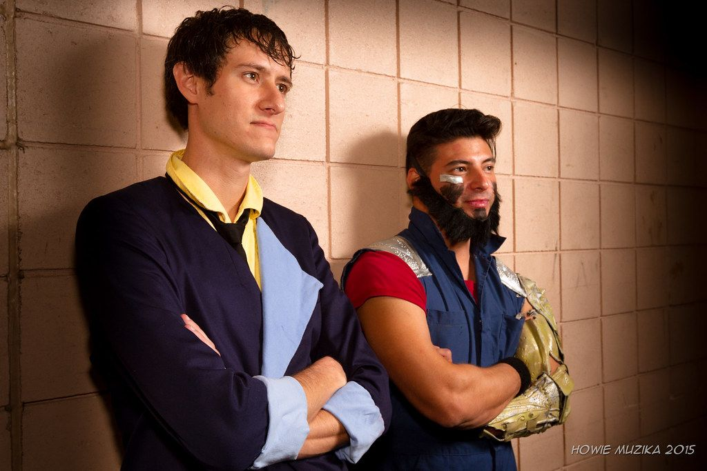

I was in two games today, one that I ran and one that I played.

### Genesys

Following [Knights of Antares](/recap-knights-of-antares/) last week, I brought the same people back and said "no pregens this time, let's build a world some characters". It started out slowly, as choice paralysis dominated, but it clicked increasingly quickly.

Here's what they came up with for a world: "Neon Detective Agency 2050", a Kafka Light cyberpunk world. The concept is "cyberpunk noir detectives take on high-tech sports betting", with privatized cops, tech scavengers ("the street finds its own uses"), and of course the usual cyberpunk megacorps. Everyone is plugged into an ubiquitous augmented reality (AR) network, and although surveillance is everywhere, Big Brother Isn't Watching. Instead, what rules is a hyper-complex mass of data, and the systems that extract meaning from it - King Algo.

The players gave me two PCs: Marcus Granger, a 43-year-old cyborg bounty hunter, and Vision, a 24-year-old hacker. I joked that the players gave me [Spike and Jet](https://www.deviantart.com/macerider/art/Cowboy-Bebop-Spike-and-Jet-452476474), but effectively that's what they came up with.

We'll run the actual session this Monday, which will probably start with the murder of some e-sports figure's online avatar, and see where that goes!

### Demigods

One of our usual Masks players was out for the session, so another volunteered to run [Demigods](https://demigodspbta.com/), a PBTA game similar in concept to [Scion](https://en.wikipedia.org/wiki/Scion_(role-playing_game)).

We came up with three characters: Kal, an Arcane child of Finnish bard-god [Väinämöinen](https://en.wikipedia.org/wiki/V%C3%A4in%C3%A4m%C3%B6inen), Lysandra, a Celestial seeker of justice blessed by both Ares and Aphrodite, and Joan Crawford, a Reaper with thematic similarities to Daredevil. The scenario was predefined by the GM, but we spent 1-2 hours coming up with characters. Our unifying theme turned out to be Judge Aaron Stone, a Harvey Dent-style justice-loving judge, and we all had some connection through the court system.

The scenario itself: Zeus's 3000th anniversary, with a gift give-away, orchestrated by the pantheon of Entertainment. We were effectively on a divine reality show, and got through two contests: a battle against Legally Distinct Cerberus (a dog with four heads), and an egg-eating contest (unfortunately the eggs were [Arachne](https://en.wikipedia.org/wiki/Arachne)'s). My character (Kal) managed to punch the dog in the face using Hercules, and used magic effectively on both contests. The other characters brought in their themes pretty well, helped also by our tendency to roll 7s on everything.

We stopped due to time constraints, but agreed we'd continue this for another session if our Legacy/Doomed is AWOL once more.

My verdict on Demigods is that it's interesting and I'd like to see more, and I'll probably suggest it at some point to the Monday night group. The playbooks were versatile and colorful, the mechanics were simple, and the quick-start was only three pages.

Image credit:

* Spike and Jet cosplay from [https://www.flickr.com/photos/howiemuzika/20087822240](https://www.flickr.com/photos/howiemuzika/20087822240)

    