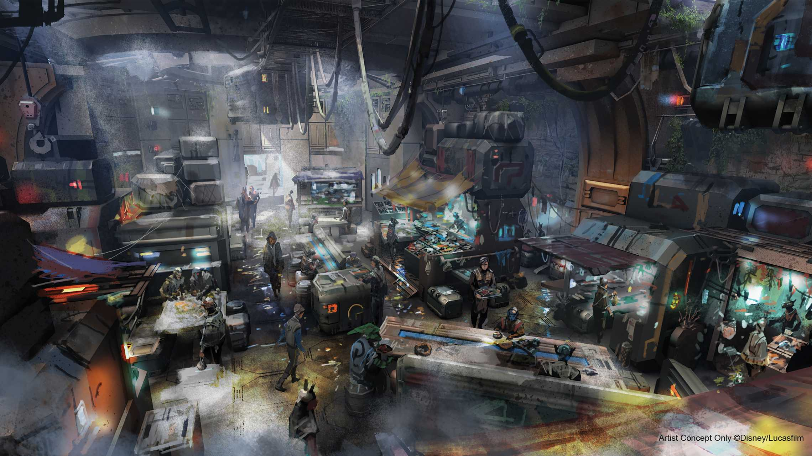
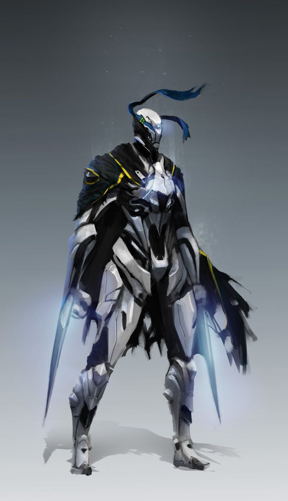
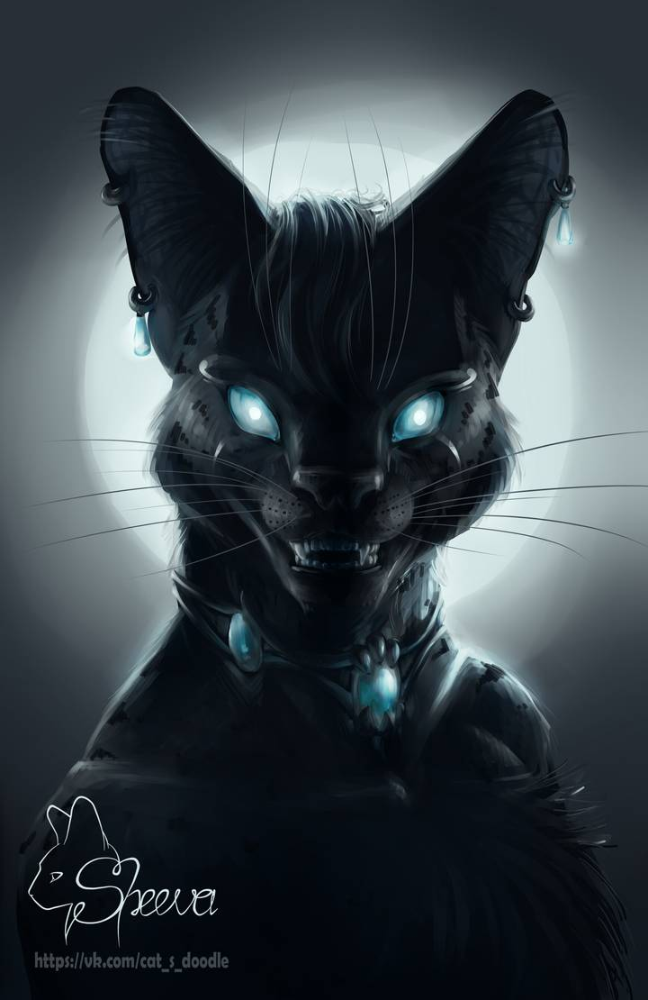
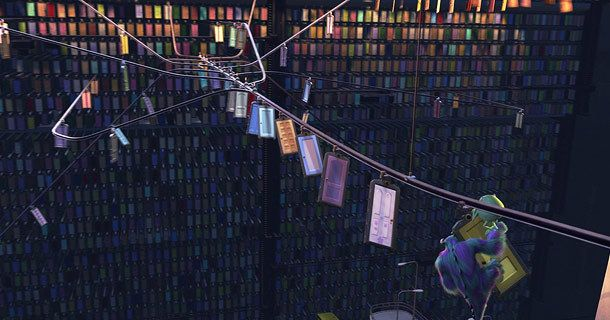
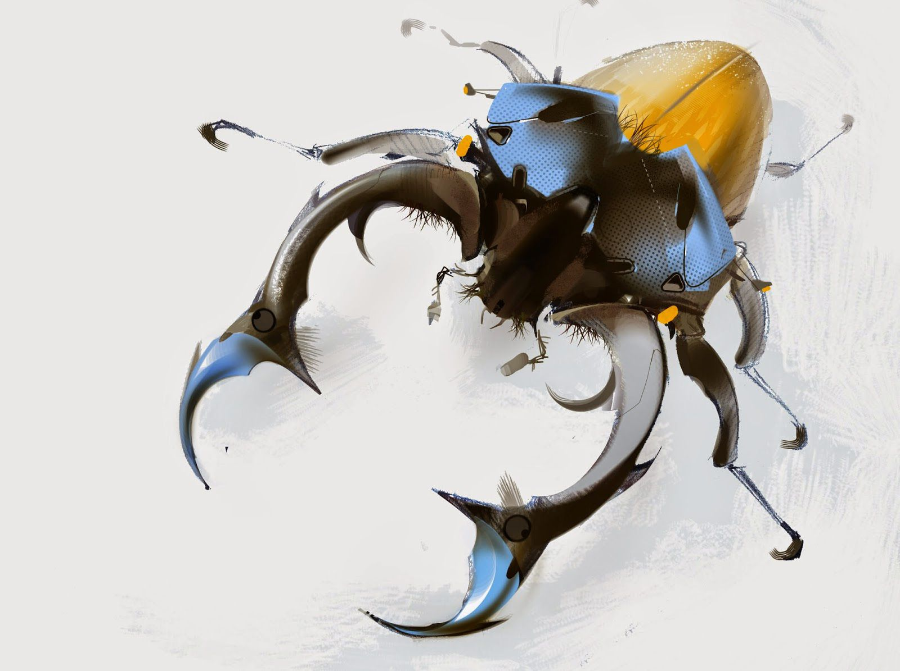
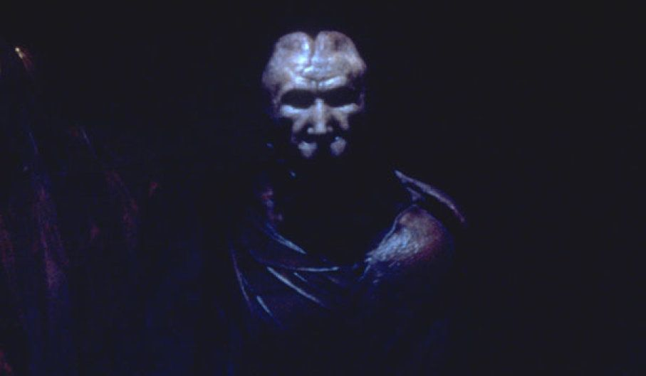
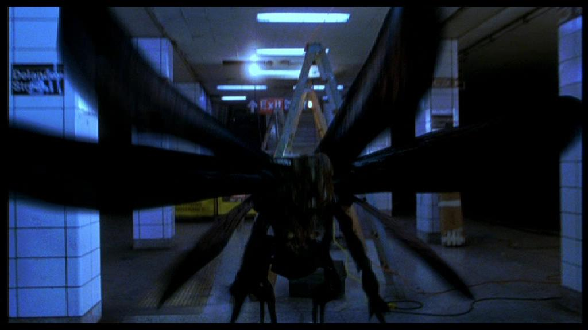

I ran a one-shot today for two players, using the Genesys system. The game was pitched as "Knights of Antares", a scifi adventure in a distant city-sized space station. I left open a lot of the particulars, although I did create a collection of pregenerated PCs for players to tinker with.

The players picked two of the pregens: Mercer, an apprentice space knight, and Fang Alpha, an uplifted cat that's now a living weapon. They were both escorting Professor Chloe (who created Fang) through the markets of Antares, a rough port of call for traders and criminals.

A group of toughs accosted the group at the bar, and we got through a demo of the combat system. As expected, the minions were dispatched pretty fast (and pretty fun). But the team spotted a figure making a getaway - Sly, the bounty hunter!

Because the station was in microgravity, people got around via a variety of methods: pedwalks, skyhook systems like in "Bioshock Infinite", and more. The bounty hunter led them on a merry chase across this webwork of motion, at one point kicking people out of a gondola (who were then saved by Mercer Spider-manning his way to them), and later stealing an air-car (with Professor Chloe hijacking a robot taxi to pursue). Mercer took control of the cab, Fang surfed on the roof, the pair rammed Sly's air-car, and Fang made a dramatic leap from vehicle to vehicle! The chase took a turn into an unused side tunnel, where Sly's car crashed and the pair interrogated her.

Sly had been hired by an alien weaponsmith named Koskov, from a race of beetle-like beings called the Junitaur. The pair resolved to track down Koskov and get them off their backs.

During a shuttle ride, the three characters discussed what could really be done. Professor Chloe offered the option of running away, but neither Fang nor Mercer (for their own reasons) liked this outcome.

Koskov's private estate was on another station in the system. The interior was alien and mysterious. Mercer tried to convince the creature that Fang wasn't the weapon he wanted - by throwing essentially a ball of yarn on the floor and letting Fang's cat instincts kick in. While Fang was humiliated and angry at this, Koskov refuted the argument another way: releasing bio-engineered insect soldiers to attack the professor. Fang dispatched these easily, and realized what Koskov really wanted: beautiful things, creations that others would find appealing, or that could blend in. The alien was not an amoral arms dealer, but someone with a heart (however misplaced).

In that moment, the Professor offered to stay with Koskov, helping him build bioweapons more suitable to his goals. Fang refused to accept this, and defied the professor, saying she wouldn't accept such an outcome. With this, Mercer appealed to Koskov: "this is a person, not a weapon", realizing that past his own arguments and impetuous plans, his code of honor and sense of rightness wouldn't allow this either. The alien conceded, allowing the party to leave unharmed.

As an epilogue, Professor Chloe continued her work, with Fang as her assistant. Mercer was reprimanded for some of his actions by the council of space-knights, but was recognized for his compassion and resolve by a senior mentor.

Overall, the game was a success. People had fun, the action flowed well, the dice gave interesting results, and the mechanics kept up with the story without getting in its way. I don't know that we established any kind of sequel hook or continuation here, but as a one-shot, it did its job.

    