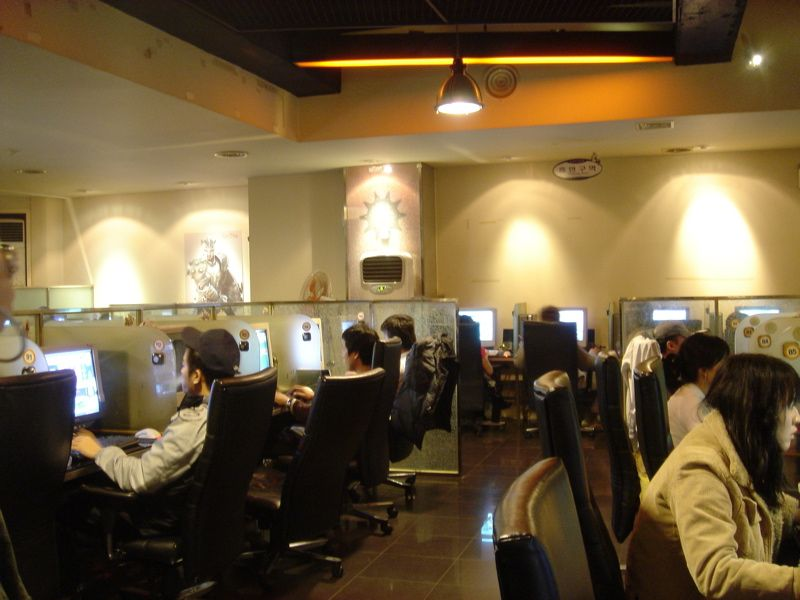

This is the session that was planned in [this recap](/recap-genesys-and-demigods/).

"Thirteen days ago, King Algo decreed that a new game called RoboLAM was the recommended online form of entertainment, and people flocked to it. Today, a client named Miss Kitty wants you to investigate the murder of her RoboLAM avatar. It happened 15 minutes ago."

So began a Kafka Lite cyberpunk noir adventure. Things started slowly and ramped up pretty fast, as cyborg bounty hunter Granger and young hacker Vision teamed up to investigate. Because some of the action overlapped, I'm going to cover what I consider the highlights in no particular order.

* Miss Kitty identified very closely with her character, and ended her interview at the office with "Like and subscribe!"
* Vision tried to hack himself a RoboLAM account to investigate. This triggered the expected cyberpunk megacorp response squad, prompting the team to leave their office. But the response squad didn't come to murder everyone. They picked the lock of the detectives' office, answered calls while the PCs were out, and even made coffee. It was very calm.
* Investigation into likely parties (and the need to evacuate the office) led the PCs to a [PC bang](https://en.wikipedia.org/wiki/PC_bang) called "The Waterfall" - but not a physical one. The decorations, signs, and entertainment only existed in augmented reality. Real drinks were available, but basically it was a [temporary autonomous zone](https://en.wikipedia.org/wiki/Temporary_Autonomous_Zone) parked in the equivalent of LA's sewer system. The reason why it was there? There was an exposed fiber-optic trunk that the owners tapped into, to let the gamers play.

* Vision jumped into RoboLAM from the gaming space to find people setting up advertising and a party around the corpse of Ms. Kitty's avatar, and talked to one spectator. During that time he spotted an anomalous observer on the scene - someone already in the physical space with them. This was Fanta Boy, so named for his preferred online endorsement. Granger shook him down, and learned that a rival megacorp, and the Mob, were trying to muscle popular gamers away from RoboLAM.
* Drones appeared! Rather than shooting deadly bullets, they fired paintball pellets with DMSO and a soporific drug. Vision hid himself behind a growing pile of unconscious teenage gamers, and Granger's revolver picked off the drones. Vision tracked down their controller, standing nearby, and the pair ran him down.
* Granger interrogates the Mob drone-operator, "Tiny", who is more than willing to talk - as long as he can live-stream the conversation back to his boss in the Mob, to give himself some credibility. Tiny fesses up to the whole scheme (the Mob, and the rival megacorp, hacked the server to kill Ms. Kitty).
* The detectives update Ms. Kitty with the news - her character is gone, but at least the guilty parties are going to face _some_ kind of justice. She decides to parlay her current situation into new-found fame as an "online murder victim", someone with a close brush with the Mob and a story to tell.

All in all it was weird, silly, somehow blending all the themes together into an adventure that somehow worked.

### System Comments

This was a combat-free session, although there was some shooting and physical action. Vision's player rolled a lot of failures on his hacking attempts, but all of them generated some Advantage, which was parlayed into a tip-off for Granger's more physical skills. I was able to improvise 100% of the session - there weren't even any villain stats (although I was prepared to come up with some if necessary).

Most PBTA games have some inciting incident or strong kick-off. A game like this doesn't come with that built in, but I tried to open with a strong bit of narration and see where that took the group. It also helped that the PCs were willing to lean very heavily into their tropes and take their personalities to their logical conclusion.

Image credits:

* [https://commons.wikimedia.org/wiki/File:Korean.culture-PC.bang-01.jpg](https://commons.wikimedia.org/wiki/File:Korean.culture-PC.bang-01.jpg)
* [https://commons.wikimedia.org/wiki/File:Los_Angeles_River_Bridge_B%26W.jpg](https://commons.wikimedia.org/wiki/File:Los_Angeles_River_Bridge_B%26W.jpg)

    