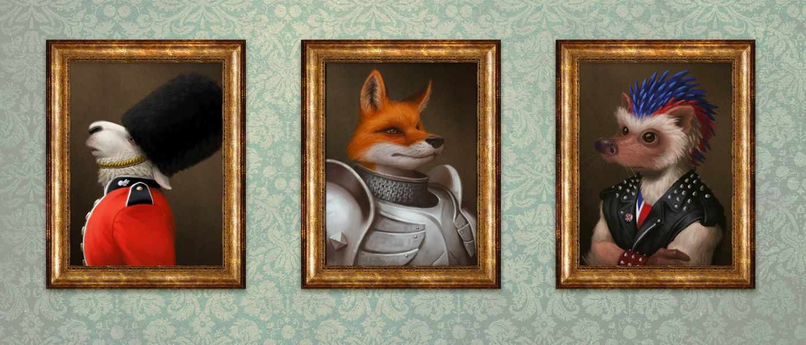

For Sunday, we played [Tales of Timberwind](http://lumpley.com/index.php/window/installment/136), currently in early access. Given it's from the Baker clan, naturally it's a PBTA game.

The premise is anthropomorphic animals having fantasy adventures in a series of "acres", or distinct geographic areas. It feels like a niche Cartoon Network television show - there's violence and looting, but also beauty, nature, and fun.

Since a lot of PBTA feels similar, I'm going to cover what separated this game from others for me.

* There are no shrink-wrapped playbooks - instead, it does something I've liked for awhile, which is letting players pick a couple "careers" and a "home acre", which then give a menu of moves to choose from
* Instead of a big menu of gear, you start with some basics, e.g. a "class 0" weapon like a sword or traveler's outfit. You can upgrade the class of an item, which adds new capabilities from a list. For example, my turtle merchant/squire started with a pretty good polearm weapon, plate armor with pockets (worn on his shell), a mysterious old sword, and a large traveling cart with a built-in bunk.

* The game comes with a _lot_ of basic moves, perhaps too many to be well managed, and had some gaps we found confusing (for example, what does a prey animal roll while evading pursuit?)
* Although we didn't explore it, the harm-and-death system seems a lot more forgiving than equivalent rules from other games

I'm interested in seeing where this system goes once it becomes more production-ready. For talking animals, it makes for lighter fare than Mouseguard or Redwall, and I like the whimsical, weird atmosphere it seems to present.

Image source and credits:

* [_"British Animal Portraits"_](https://www.behance.net/gallery/33852200/British-Animal-Portraits) _by Ian Dale is licensed under_ [_CC BY-NC-ND 4.0_](https://creativecommons.org/licenses/by-nc-nd/4.0/?ref=ccsearch&atype=rich)

    