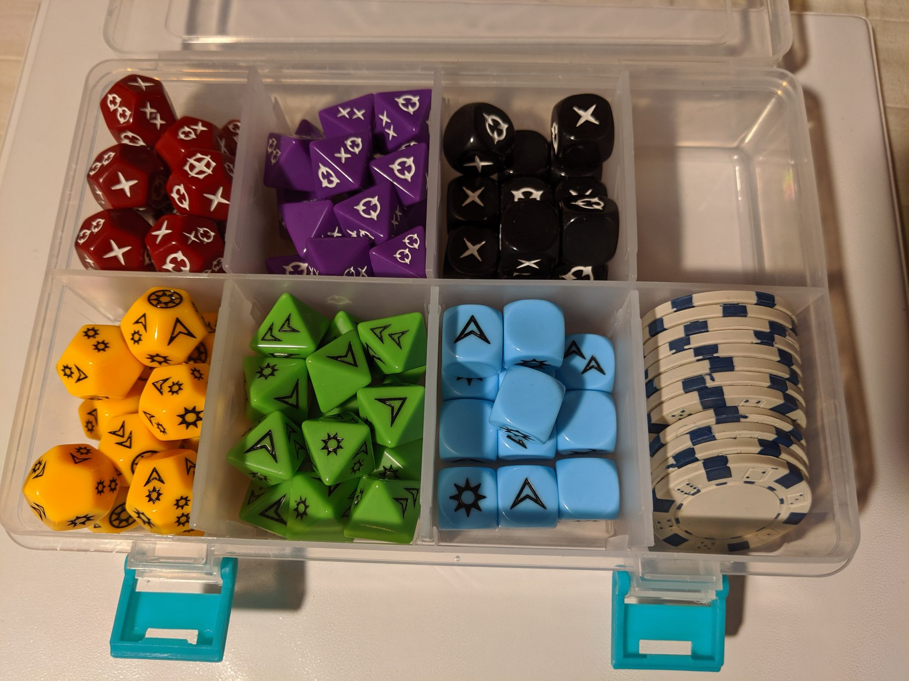

Many gamers I know prefer the PBTA or "Powered by the Apocalypse" [suite of games](http://apocalypse-world.com/pbta/). While I have enjoyed several PBTA games, their tendency to be about a specific set of characters in a specific setting doesn't give me the freedom to come up with something original. So I've started playing and running Fantasy Flight Games' Genesys system. But can Genesys capture some of the mechanical quirks that make PBTA interesting? Maybe. I'll talk about one here, and think about others soon.

### Player-Facing Dice Rolls

A key feature of most PBTA games is that GMs (or MCs, or ....) don't roll dice. Players roll, and the dice determine good or bad outcomes. When the GM makes a move that would challenge the players, there's typically a "defy danger" or "take a powerful blow" move that represents resisting the worst consequences of that move.

In Genesys, NPCs can act and their rolls are made by the GM. These mirror the rolls players make for their PCs, and NPCs have their own stat blocks similar to those of PCs. This is normal for traditional games. But the Genesys dice mean we can have players roll for NPCs too. Keep in mind that this method will change the odds slightly.

1. When opposing an NPC, the GM doesn't roll the NPC's dice. Instead, hand the player challenge dice equal to the NPC's proficiency dice, difficulty for ability, and setback for boost dice
2. If an NPC initiates action a PC could resist, the PC rolls the relevant skill (Resilience, Cool, Coordination), with translated dice as before
3. Rather than combat checks going against a difficulty, use the NPC's most relevant ability (e.g. Melee vs. Melee), and translate the dice accordingly
4. Failure on the PC's attack roll effectively means the NPC hit them instead - apply damage and other effects as normal

Example: Dart (Brawn 2, Melee 1) crosses swords with Sir Blackheart (Brawn 3, Melee 1). Dart has two bonus dice coming to her. She gets 1 proficiency die (her Melee), one ability die (her Brawn - her Melee), 1 bonus die, and 1 challenge die (Blackheart's Melee) and 2 difficulty dice (Blackheart's Brawn). She rolls two successes and one advantage, enough to get a hit! If instead, she'd rolled one advantage and three failures, Blackheart would have hit her, effectively getting three successes on an attack roll of his own.

This system, as it stands, doesn't use the Defense stat well. Being good at defense ought not make you better at attacking, so it's not appropriate to incorporate it as boost dice into the PC's own attack rolls. I'm going to keep thinking about this.

    