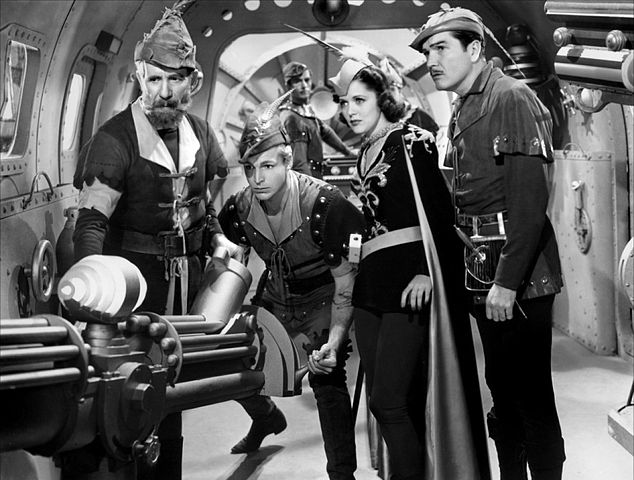
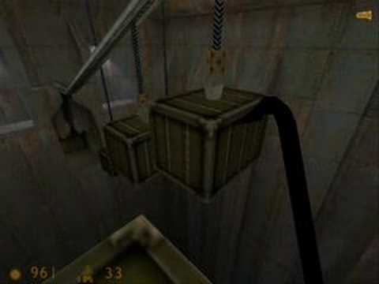
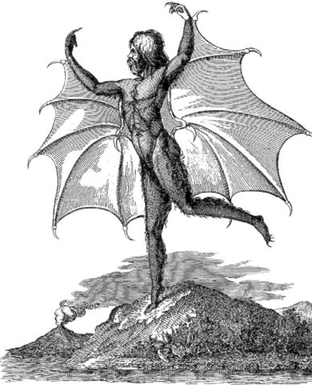

Sunday was the second session of a Genesys game mixing Arthurian fantasy and Flash Gordon technology.

Our heroes:

* Sir Bedevere, a brave and capable knight of Camelot
* His squire Luffadon, whose name we have trouble remembering so we just call Squire
* Dart the would-be knight (with a malfunctioning rocket pack)
* The recently joined Simon the Psionic Druid

Racing back to Camelot with a rescued captive in tow, we crash in a section of jungle. We need to repair the ship, and Simon knows of some kind of high-tech facility nearby (via his empathy with plants). One dissolve wipe later, we're doing a dungeon crawl in a lab with ten floors.

The biggest danger in the place is the horde of genetic horrors created by magical manipulation. We sneak past some in an underground forest area, but encounter a test chamber apparently meant to test agility: platforms suspended over water.

The good news: it's not hard to get to a big central platform that's more stable than others. The bad news: there's bat people.

In the first exchange, Sir Bedevere fended off the bats but lost his sword in the water. Dart threw him her sword, then dived into the water to retrieve it. Bedevere wore down the bats with wounds, and Luffadon and Simon both did damage in their own style. Several of the rolls didn't succeed, but the characters making the attempt were able to pass bonuses to other characters. Even Dart, who didn't strike a single blow against the enemies, contributed by arming the knight and turning on the chamber's floodlights, which inflicted a penalty on the bats.

We ended the session there, with the Squire seriously wounded. Bedevere took a solid hit but his heavy armor plus Parry talent took that down to only 1 wound.

### System Comments

The mixture of success vs. failure and advantage vs. trouble continued to yield interesting results. In PBTA terms, it felt like the combat was a ton of 7-9 results. The failures drove interesting actions (e.g. Dart diving for the sword) as I hope they would.

Our GM got by with minimal prep, using stock adversary stats from the main book. Next time, he said he'll probably create more specific enemies. I look forward to seeing what he comes up with.

I think the game continues to allow us freedom to improvise and mess around with the environment - for example, the Squire pulled one of the hanging platforms with him to use as cover, then later tied up one of the bats with the cable and dropped it into the water. These were resolved with simple opposed rolls, as you'd expect.

I think the only weirdness that we encountered was that rolls sometimes yielded "null" results - no net successes or failures, or things like that. PBTA always gives some kind of decisive outcome, but also doesn't give the rich variety of outcomes that Genesys can produce.

----

Image sources and credits:

* [https://commons.wikimedia.org/wiki/File:Flash_Gordon_Conquers_the_Universe_(1940)_2.jpg](https://commons.wikimedia.org/wiki/File:Flash_Gordon_Conquers_the_Universe_(1940)_2.jpg)
* [https://www.youtube.com/watch?v=rcypfn6nl0g](https://www.youtube.com/watch?v=rcypfn6nl0g)
* [https://commons.wikimedia.org/wiki/File:1836_the-great-moon-hoax-new-inhabitants-of-the-moon.png](https://commons.wikimedia.org/wiki/File:1836_the-great-moon-hoax-new-inhabitants-of-the-moon.png)

    