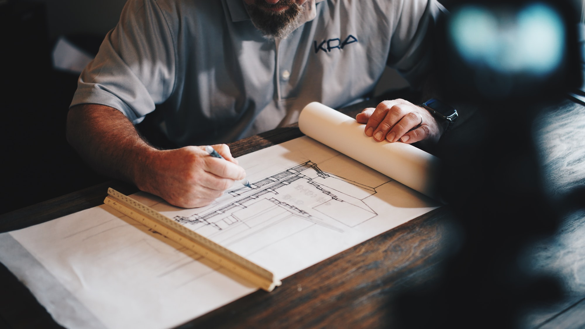

Here's a team of numbskulls.

### Blaster of Paris (Bronze generation)

"Sacre Bleu Up!"

**Drive**: to become rich and famous  
**Conditions**: Insecure, Hopeless  
**Moves**:

* Blow stuff up with plasma powers
* Support another villain by ratcheting up the violence

An assistant at a science lab. He received plasma-generation powers in a lab accident. He wants to be a great supervillain, but lacks imagination. For now, he's content to blow stuff up under the direction of a smarter leader. Unfortunately, this team doesn't have one…

**Team relations**: obeys Rubble Rouser; follows orders from Flying Buttress or Madhesive; doesn't really notice Intern; likes Super-Grandma.

### The Flying Buttress (Silver generation)

"I'm your 'arch' nemesis!"

**Drive**: to rebuild Halcyon City's buildings in his image  
**Conditions**: Angry, Insecure  
**Moves**:

* Effortlessly demolish nearby structures
* Patronize the kids like a typical 50's TV dad

A former architect who's angry at superheroes for always knocking buildings down. He lost his mind and decided to knock everything down, in the hopes of rebuilding it all to his own standards. He has the classic flying-brick powers: super-strength, durability, flight, and so on.

**Team relations**: thinks Blaster of Paris is a useful idiot; paternal attitude toward Intern; thinks Madhesive is weird but likes his glue's applications to architecture; the conservative to Rubble Rouser's liberal.

### Intern (Modern generation)

"Listen, I just work here"

**Drive**: to stay employed by any means necessary  
**Conditions**: Guilty, Hopeless  
**Moves**:

* Turn the tide with as little effort as possible
* Strike someone's heart with a cutting remark
* Show up at inconvenient or annoying moments

Brought into the team to provide support, Intern gets by thanks to memes, sarcastic quips, disinterest, and a powerful telekinetic and telepathic power suite. She's not committed to the villains' cause, but she is getting paid so she's loyal.

**Team relations**: Gets much of the practical work done for the team, but doesn't get along with any of them except Super-Grandma.

### Madhesive (Silver generation)

"I've got you in a sticky situation, hero!"

**Drive**: to demonstrate the usefulness of glue  
**Conditions**: Angry, Hopeless  
**Moves**:

* Force the heroes to unstick something or someone
* Create frustratingly effective barriers or obstacles
* Expound on the thousands of uses for glue

A former chemist who huffed a few too many glue fumes and lost his mind. He decided glue could solve the world's problems and set about developing the perfect formulation. Now, he uses superheroes as guinea pigs to test new formulae. He has a specialized non-adhesive suit and a glue gun, and can use his glue to create swing-lines, bridges, walls, or other simple shapes.

**Team relations**: Thinks he's the leader; treats Intern halfway decently; likes Super-Grandma but wishes she'd take things seriously.

### Rubble Rouser (Bronze generation)

"Watch for falling rocks!"

**Drive**: to force people out of cities by destroying them  
**Conditions**: Angry, Guilty  
**Moves**:

* Direct her rocky minions in coordinated assaults
* Rearrange any area with significant earth or stone
* Turn property damage into a weapon

A former construction worker and firebrand who lost her home in a super-battle. She has a body made out of concrete, with a hard-hat shape on her head, and can animate any kind of rock into constructs or servants.

**Team relations**: Thinks Flying Buttress is square but thinks she can influence him; wishes Blaster of Paris would grow a spine; likes having coffee and chats with Super-Grandma.

### Super-Grandma (Gold generation)

"Oh that outfit looks cold, dear. Can I knit you a scarf for it?"

**Drive**: to avenge herself on modern capitalism  
**Conditions**: Afraid, Insecure  
**Moves**:

* Make, bake, or obtain domestic comforts
* Walk unscathed out of anything
* Zero in on unhappiness

A former superhero with invulnerability who was bilked out of her life savings and inheritance by banks. Now she works with supervillains to overthrow the capitalist system, but she also restrains them from causing too much harm, and will make sure everyone on the scene is taken care of.

**Team relations**: Likes everybody! They're such dears.