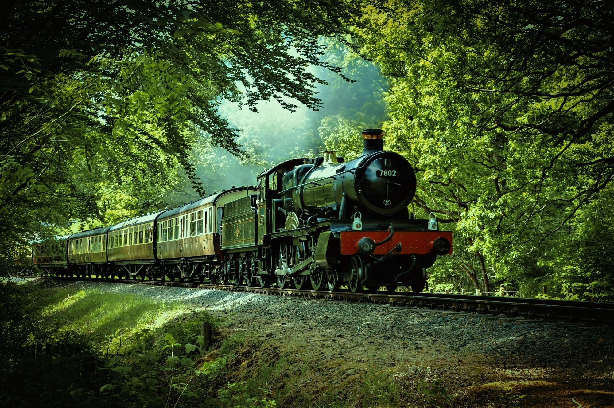

This is an optional rule for "Fellowship", 2nd edition.

Your Fellowship begins with access to a Fleet: a vehicle, set of vehicles, or other mobile conveyance. The Fleet is large enough to accommodate the Fellowship and all its companions, and will expand later to accommodate new members.

Define what the Fleet is, how it works, and what limitations on motion it might have. A steam locomotive with several cars; a set of large wagons; magical or technological airships; a castle that crawls about on its own legs; a fleet of ships that can sail the seas (or the skies); a fortress or town that disappears from one place and reappears in another; and so on.

Fellowship moves are adjusted as follows:

* In general, when you leave a community and anyone or anything joins you, they become part of the Fleet. Any community you leave is considered to have **representation** in the fleet. This lasts until the last Bond with that community or its members is lost.
* Dedicated to the Cause: the Small Army takes up residence in the Fleet and can defend it.
* Ghost Town: the fortifications, riches, and ghosts are attached to the Fleet.
* Granted Nobility: at the recipient player's option, the resources and staff of the villa join the Fleet instead.
* Minecarts: replace this move with the following. "The Fleet is upgraded or outfitted by dwarven craftsmanship, allowing it to rapidly reach other dwarven settlements, or any other settlements the dwarves are particularly friendly with". Decide if this means a better system of rail lines, a giant drill-bit that can pierce the Earth, special airship mountings, and so on.
* The Pleasures of a Nomadic Life: the community joins the Fleet en masse.

Once per session, anyone in the Fellowship can interact with a represented community in your Fleet to gain the benefits of leaving that community, as long as nobody in the Fellowship currently enjoys that benefit. For example, you can't continually receive extra bodyguards via Royal Protection, but if all current Bodyguards leave the Fellowship (for whatever reason), you can gain new ones as though you'd revisited the community. Play through the interaction, and describe what the community or its members might need or want in exchange.

From time to time, the represented communities will also approach the Fellowship with their own problems, with the expectation of assistance. Representatives can leave the Fleet when their last Bond has been lost as well.

    