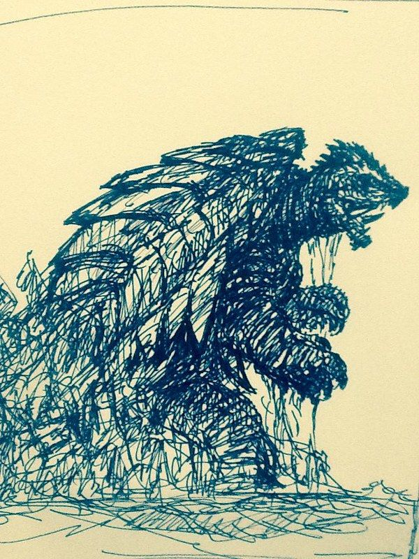

1. One player is the Kid. They narrate for themselves, the monster, & all NPCs.
2. All other players create a Civilian, Scientist, or Military PC.
3. Everything the Kid says in-character about the monster is true. Nobody else knows this at first.
4. Determine at least one B-plot (cameraman in love with pretty science assistant, etc.) before play begins. This must involve at least two non-Kid PCs.
5. When anyone hatches a plan, describe it and roll 1d6. If you spent a scene advancing any B-plot or introduced drama to the existing plot, add +1d6 to the roll per distinct contribution. Look for the highest roll on any of the dice.
6. On 1-3 it fails, a player from another faction (e.g. Scientist when a Military player rolled) explains why it failed.
7. On 4-5 the monster develops a new bullshit power, making it moot.
8. On 6, mark 1 HP off the monster. Monsters have 3 HP.
9. Once the monster is at 0 HP, it is killed, driven off, etc. Resolve any lingering B-plots.
10. A new player becomes the Kid in the sequel. Devise a threat for this monster to fight. Repeat.

Examples of how to add drama for bonus dice:

* a Scientist horribly mangles the science
* the Military brags about the power of their new weapons
* a Civilian interferes with a plan for some venal motive (road construction, fish sales, etc.)
* the Kid is allowed to run wild through an off-limits area.

 This work is licensed under a <a rel="license" href="http://creativecommons.org/licenses/by-sa/2.0/">Creative Commons Attribution-ShareAlike 2.0 Generic License</a>.

Image source and credits (**not** included in CC license):

* Banner: [https://www.flickr.com/photos/gameraboy/46928316911](https://www.flickr.com/photos/gameraboy/46928316911)

    