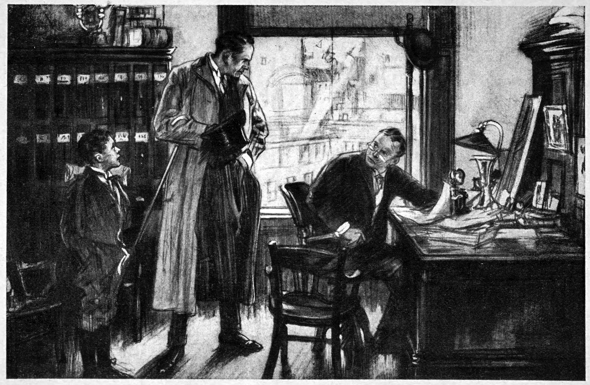

How do you improvise a murder mystery?

I thought about doing a hack of [For the Queen](https://forthequeengame.com/), and I had a few ideas on subject.
I think I like this option the best:

"There's been a murder, there's a Great Detective who's on the case, and you are all murder suspects."

The Great Detective is some brilliant investigator in the mold of Sherlock Holmes or Poirot.
They may have some assistants, and may have a friendly or contentious relationship with the police.
Everyone _could_ be guilty, but they will unfailingly find out who _is_.

The design of the game should follow these principles:

* The game begins with a murder
* Any player can introduce clues or complications that implicate some or all of the cast, but may never conclusively provide the identity of the murderer
* For longer-play games, deal a second murder card into the deck
* The concluding card is the review of evidence, and revelation of the killer (who will be in the room)
* The actual identity of the murder must be arrived at by consensus

In addition, I'm using a modified version of the [Fair Play Whodunnit](https://tvtropes.org/pmwiki/pmwiki.php/Main/FairPlayWhodunnit) rules, updated for modern sensibilities and sometimes inverted for the game.

1. The criminal must be a member of the assembled group and must be present at the end
2. All supernatural or preternatural agencies are ruled out as a matter of course.
3. Not more than one secret room or passage is allowable, and such a passage may only be in a house or building for which it is appropriate by age or purpose.
4. No hitherto undiscovered poisons may be used, nor any appliance which will need a long scientific explanation at the end.
5. The identity of the criminal must never be assumed or established purely on the basis of race, sex, creed, or other social group membership.
6. The detective may never have an unaccountable intuition which proves to be right.
7. The detective must not himself commit the crime.
8. The detective must not light on any clues which are not instantly produced for the inspection of the players.
9. Any assistants must be at best an extra set of eyes and ears for the detective; they may not perform deductions which help the case.
10. Twins, and doubles generally, must not appear unless we have been duly prepared for them.

The next step for this design is to watch old detective movies, extract the tropes,
and write prompts that will ideally produce those tropes.

[Image source](https://commons.wikimedia.org/wiki/File:Page_221--The_Adventures_of_Detective_Barney.jpg)