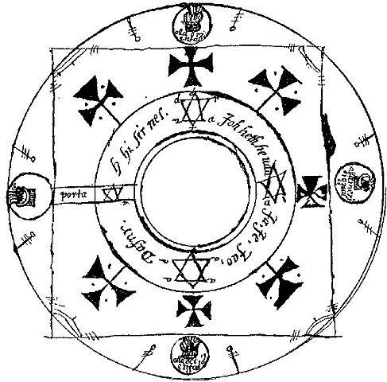

I have three ways forward with Inept Sorcerers. Two of them are things I can do on my own. The third I'd need an artist's help with, or at least a lot of trial and error.

### Spell Cards

This largely reuses the existing spell words/cards from Inept Sorcerers, but removes the costs and dice. Instead, characters have a "Law" stat and a "Chaos" stat. These two stats would sum to some fixed value for all characters.

Characters would cast spells by drawing cards from a face-down deck. They would keep drawing until they could cast an intelligible spell (e.g. with at least one noun and one verb).

Aside from while spellcasting, characters' Law stat indicates how many cards they can hold in a hand at a time, and their Chaos stat gives them some number of discards and optional redraws of cards. For example, a player with Law 2 and Chaos 2 might draw the Fire and Animal cards. They choose to put Animal into their hand, and draw more cards to pair with Fire. They could take one more card and put it into their hand (for a total of 2). They could also discard and redraw any two cards.

This replaces the randomness of dice with the randomness of cards. The design also means that many more cards are needed for real variety than are in the current design.

### Elemental Balance

In this model, spell cards/words have a positive or negative score, representing a tendency toward some axis like Law/Chaos. "Unleash" might be a +Chaos card, while "Control" might be a +Law card. Characters can cast any spell they can construct, but unless the net score is zero, some kind of twist or unexpected outcome will result, as with the current design.

The net score needed might also fluctuate - for example, in a Law-dominated area, a spell might need to be extra Lawful to work out. Or perhaps the reverse is true, and spells must contrast with some ambient energy to gain Power.

### Spell Diagrams

This is the one I don't feel qualified to do, but I feel would be the most fun.

The idea is that there'd be several diagrams, from simple to highly complex, with "nodes" or "focal points" at various points along a series of lines.

The idea is that you'd put down tokens for magic effects at these nodes, and follow a trail from start to end to see what your spell does. There'd be rules, like "all nodes must be full", and no diagram would ever be quite simple enough to make an easy spell happen. Individual nodes might also have constraints on them (e.g. "no celestial elements" or "no nouns"), providing a sort of game-board experience.

Image source and credits:

* The Key of Solomon diagram: [https://commons.wikimedia.org/wiki/File:Key_of_Solomon_magic_circle.jpg](https://commons.wikimedia.org/wiki/File:Key_of_Solomon_magic_circle.jpg)

    