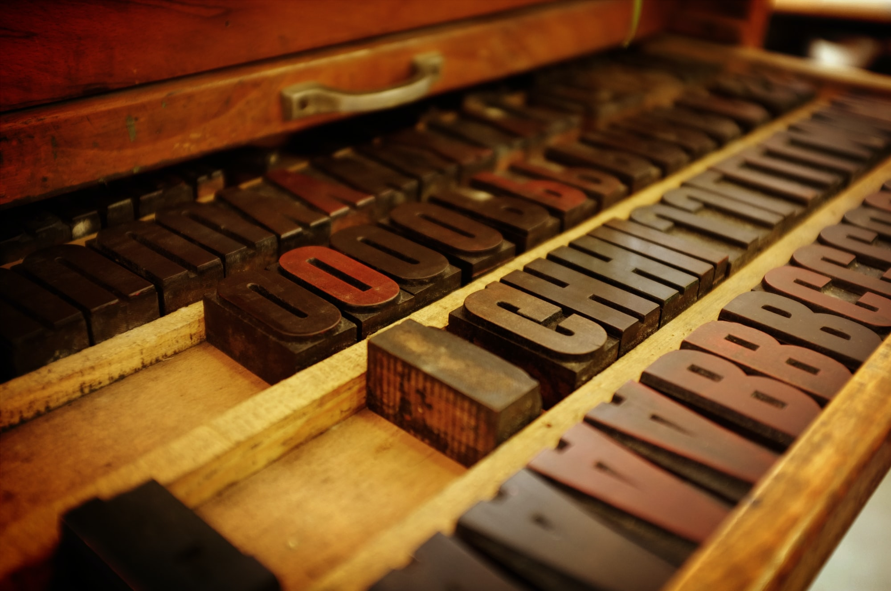

[TeX](https://www.tug.org/begin.html) is something I've known _about_ for years and years. It's one of those terms you heard about in the 90s if you were working with Unix systems. But I don't _know_ TeX. For Flip-a-Card, and other game publishing needs, I'm starting to think I should learn it.

What does the TeX language look like? Here's a sample. This isn't a complete document, just a fragment from a larger one.

```
% columnwidth is the width of one column, in this case, a third of the page. By putting a number in front of it, you can multiply it by that number 
% two columns is roughly 2.13. This stretches the invisible block across two columns.
\begin{mpage}{2.13\columnwidth}

 \hspace*{0mm}{\toptitle{The Game's Title}}

% a little extra space over what'd normally be provided
\vspace{3mm}

\textit{This is the game's tagline; it also stretches across two columns.}
```

So what's the benefit here? Unlike a typical GUI typesetting or layout app - InDesign, [Scribus](https://www.scribus.net/), etc. - you can build PDFs out of TeX documents on the command line. This means, of course, that you can create a workflow like what I need - "every time I do a git commit and git push, build a PDF of all my cards".

Crucially, if this pipeline is set up properly, _anyone_ can get a PDF of Flip-a-Card cards, including with custom cards they add, or changes to existing cards.

What's the value for stuff that isn't a bunch of cards? In short, re-usability. The fragment above came from a blank TeX template that could be repurposed for any number of one-page RPGs. All that changes is the text and maybe some of the layout. While I could clone Scribus files, TeX both gives me more visibility into what I'm actually cloning, and makes it much easier to separate some things (like font choices) from others (how to style subheaders).

So overall I'm looking forward to learning TeX and building a Flip-a-Card pipeline to use it. Once that's done, I'll be able to publish new games to itch.io more easily.


    