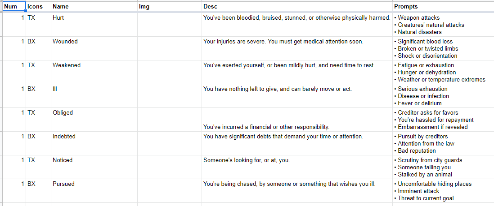
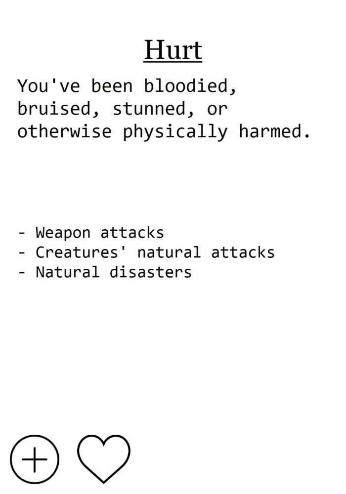
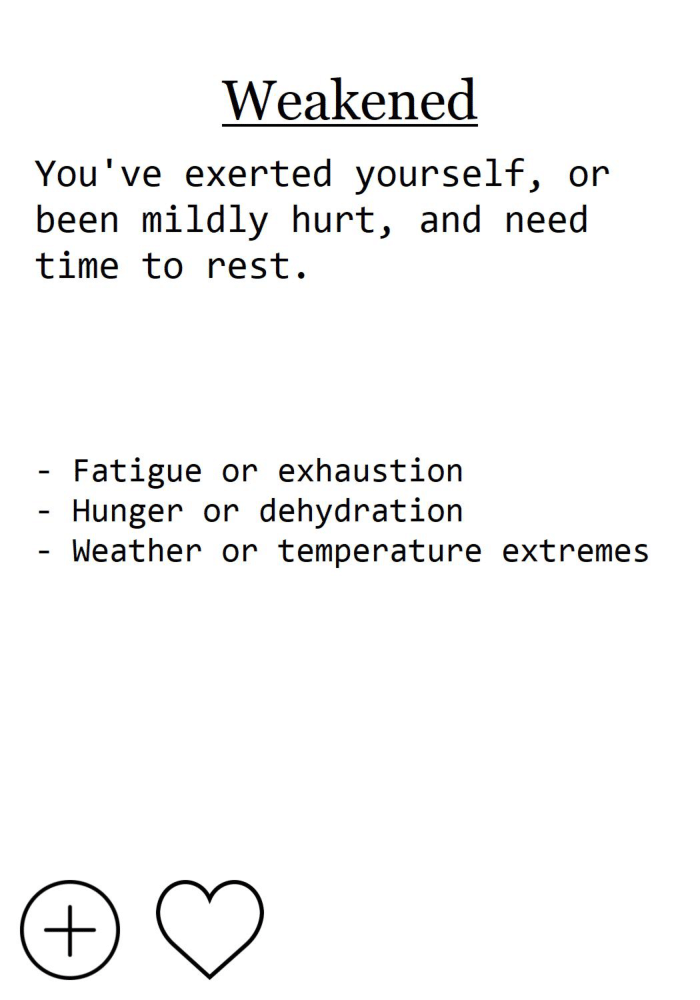
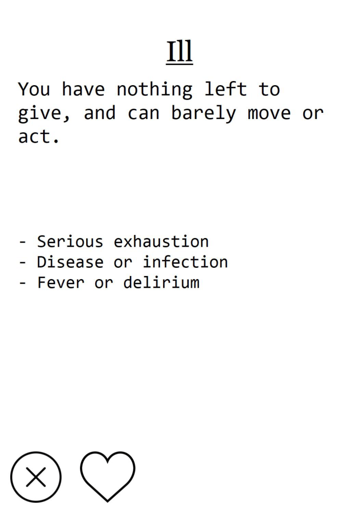
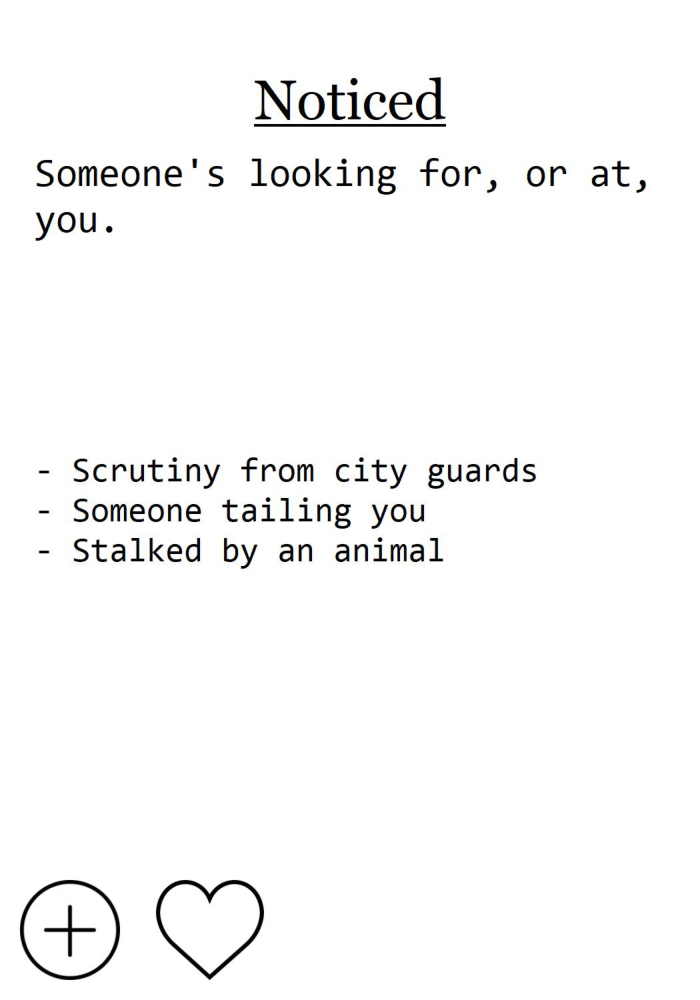
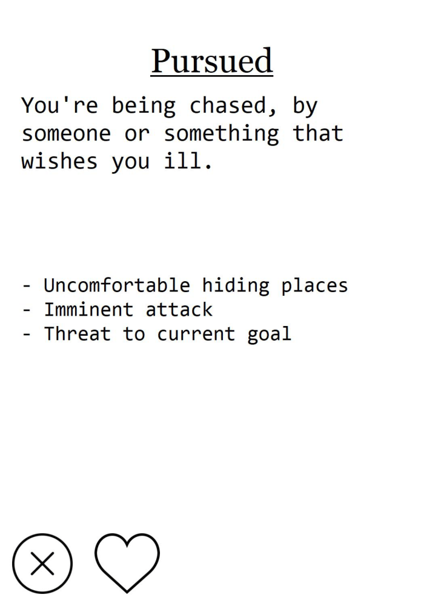

I found the free [nanDECK](http://www.nand.it/nandeck/) software (and tipped via PayPal) after some searching. I also found [this](https://www.dylanwolf.com/2014/08/08/prototyping-a-card-game-with-nandeck-part-1/) three-part series by Dylan Wolf, who put a lot more time into this than I did. That time investment, plus nanDECK's own fantastic manual, got me up and running very quickly.

I started with a Google Sheet document for some condition cards, found [here](https://drive.google.com/open?id=1UtVEvYOGJw5yFUugdXLwpXIJ3qEorw5V1rS81YkKj3Y). Alt-enter and copy-pasting the Unicode bullet character let me do quick and easy multi-line text, although nanDECK does support HTML.



The cards are given in front-back-front-back order, for reasons I'll get to in a moment. In addition to these columns, there's a "custom rules" column I haven't used yet.

Now on to the nanDECK script. I created this in the program itself, although it's just a text file

```
[all]=1-{(name)}
[standardfont]=Consolas
CARDSIZE=8.89,12.7
PAGE=8.89,12.7,PORTRAIT,HVEO,#FFFFFF,[all]
LINKMULTI = num
LINK = cards.xlsx
FONT = Georgia, 20, U, #000000
TEXT = , [name], 0, 0, 100%, 20%
IMAGE = , [img], 0, 20%, 100%, 40%, 0, P
FONT = [standardfont], 14, , #000000
TEXT = , [desc], 5%, 15%, 90%, 30%, left, wordwrap
FONT = [standardfont], 12, , #000000
TEXT = , [prompts], 5%, 45%, 90%, 38%, left, wordwrap
ICON = , T, plus.svg
ICON = , B, error.svg
ICON = , X, like-1.svg
ICONS = , [icons], 0%, 83%, 40%, 20%, 20%, 10%, 0, PN
```

The [all] macro, CARDSIZE, and PAGE all came courtesy of Dylan. The rest started from nanDECK's own manual, with some adaptions.

Icons made by [Smashicons](https://www.flaticon.com/authors/smashicons) on flaticon.com, specifically [this](https://www.flaticon.com/packs/essential-set-2) set. The icons are free to use with attribution.

I used the SVG version of the icons to avoid artifacting on resize. To do this, I also had to install [Inkscape](https://inkscape.org/), and update the Config section of nanDECK with the path to the Inkscape executable.

The resulting PDF can be found [here](https://drive.google.com/open?id=1oklvUHcNk3W8opVDMIla2qJCK9vRlK8D).












An important goal of this process is to make cards that don't look too good. If that's surprising, it's because I want to encourage people to create cards at their own table, and if they compare their hand-written custom cards to the "official ones", I want them to look pretty similar.

The next goal is to tweak this layout, and write a comprehensive deck of cards. I don't know when I'll be able to playtest this game again, but I feel like my earlier goals for this game are now much easier to meet.


    