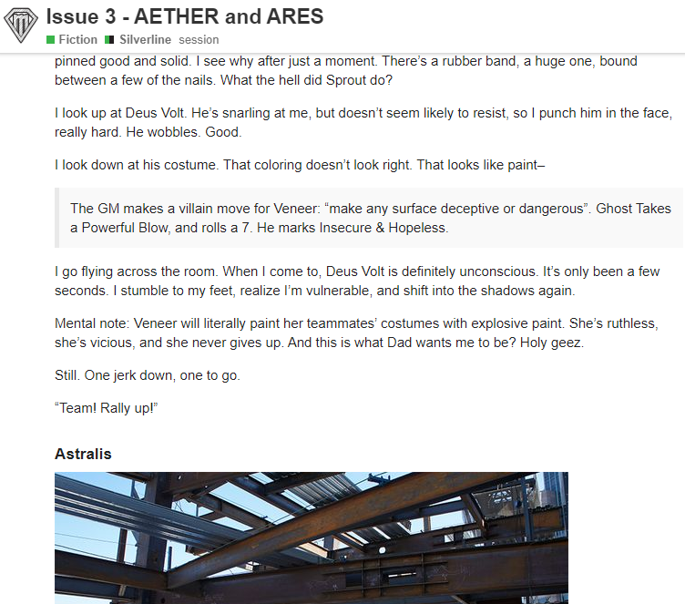

    

What does the process look like for creating the Silverline stories?

As of issue 3, I've been outlining the script first. The outline for issue 3 can be found [here](https://docs.google.com/document/d/1I7GfRH8HqJNPm7KdMVKs74NjRt32A8mLYkcocSO4n5o/edit?usp=sharing).

The end of the process looks like this:

Click on the link to read the story:

https://forum.menagerie.team/t/issue-3-aether-and-ares/796

The final product has the following:

* Prose, written in sections that follow a single hero's POV
* Blockquoted sections explaining game rules, listing the outcome of moves, and so on
* Occasional images to give a sense of context

I don't have a rule for how much stuff should be in a given issue, only that each issue should feel like it's got enough action and drama to be worth reading.

    